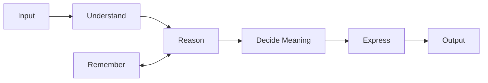
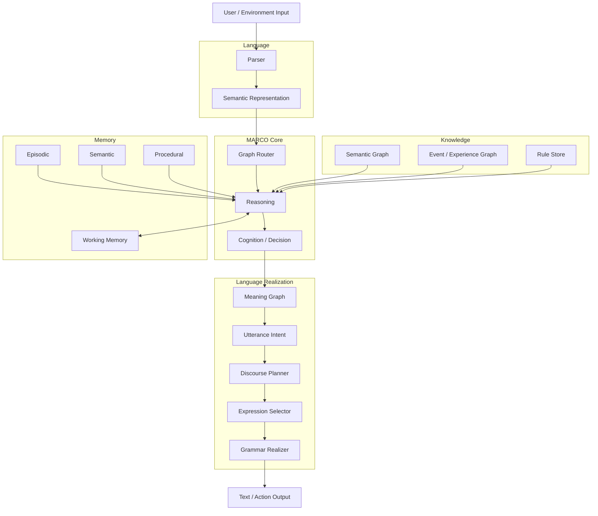
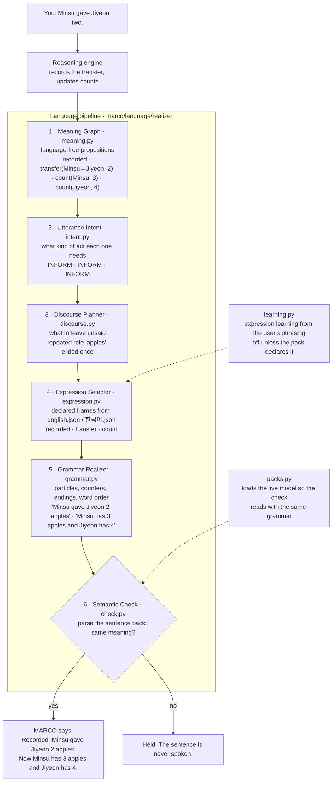

# Marco

**A knowledge-graph dialogue engine. It picks its answers from sentences people
wrote into its graphs, carries values along edges people drew, and says it does
not know when no graph holds an answer.**

There is no text generator. A character encoder scores the utterance against a
router index to pick a graph, then against that graph's nodes; the reply is an
authored template with values filled in. A value can be
new: here `40000` appears in no graph. The two numbers came from the user, the
formula `{원 = 총액 / 인원}` was written by a person, and the engine only
evaluated it.

```
> 밥값 나눠야 하는데                      (I need to split the bill)
  정산을 도와드리죠. 얼마 나왔고 몇 분이신지부터 알려 주세요.
> 12만원 나왔어                          (it came to 120,000 won)
  12만원 니까 얼마 나왔는지 안다. 몇 분이서 나누세요?
> 3명이야                                (three of us)
  3명이야 니까 몇 명인지 안다. 그러면 한 사람 40000원 입니다.
```

Reproduce: `printf '밥값 나눠야 하는데\n12만원 나왔어\n3명이야\n' | python engine.py graphs/graph_정산_나눠내기.kg`.
Proof: `tests/test_grounded_routing.py::test_dialogue_keeps_a_grounded_session_for_follow_up_values`
and `tests/test_mco_package.py::test_multi_turn_run` assert the `40000` answer;
`python engine.py --check` asserts that the value is empty before the head count
arrives and `40000.0` after (engine.py:4482-4488).

## Documents

| Document | What it covers |
| --- | --- |
| [docs/README.md](docs/README.md) | Index of every documentation folder |
| [docs/architecture/marco.md](docs/architecture/marco.md) | Package `marco` |
| [docs/architecture/marco.language.md](docs/architecture/marco.language.md) | Package `marco.language` |
| [docs/architecture/marco.language.realizer.md](docs/architecture/marco.language.realizer.md) | Package `marco.language.realizer`, the language seam |
| [docs/architecture/mco.md](docs/architecture/mco.md) | Package `mco`, the public API |
| [docs/architecture/mco.backends.md](docs/architecture/mco.backends.md) | Package `mco.backends` |
| [docs/en/pipelines.md](docs/en/pipelines.md) | The ten named pipelines, Aisthesis to Hypomnema, and what each is today |
| [docs/architecture/pipeline-names.md](docs/architecture/pipeline-names.md) | The canonical naming reference for those pipelines |
| [docs/architecture/structure-audit.md](docs/architecture/structure-audit.md) | Structure audit at `6195040`: every root file, the import graph, the target layout |
| [docs/mco/README.md](docs/mco/README.md) | `mco` user guide |
| [docs/ko/2026-09-22-freeze-decision.md](docs/ko/2026-09-22-freeze-decision.md) | What is frozen, the MARCO 1 gate, the goal queue |
| [docs/ko/dialogue-gate-2026-09-22/README.md](docs/ko/dialogue-gate-2026-09-22/README.md) | The frozen 52-dialogue gate set and its scorer |

`python tools/doc_facts.py packages` prints the number of packages under
`marco/` and `mco/` without a document carrying the five template headings. It
prints `0` at this commit.

---

## MARCO 1: what it can do today

MARCO 1 is **not released**. The [freeze decision](docs/ko/2026-09-22-freeze-decision.md)
fixed its gate before implementation. Conditions 1, 3 and 4 hold; condition 2,
the accuracy on unseen dialogues, fails, and it alone decides the release.

| # | Gate condition | State | Proof |
| --- | --- | --- | --- |
| 1 | The fixed 7-step dialogue passes in Korean and English with the verbatim phrasings | **passes** in both packs. The Korean turns are the roadmap §12 sentences verbatim; the English turns are their translation. The checks are on recorded state, status and evidence, not on wording | `tests/test_repair_and_english.py::test_seven_step_dialogue_runs_in_each_language`, `::test_seven_step_dialogue_runs_through_the_ui_turn_handler` (both parametrized `english`, `한국어`) |
| 2 | 50+ unseen multi-turn dialogues score 90% or better on answerable questions; a hold is not a correct answer | **fails: 3 of 108 answerable turns (2.8%)**; 98 needed. 105 holds, 0 wrong. Korean 0 of 54, English 3 of 54 | [docs/ko/dialogue-gate-2026-09-22/baseline.json](docs/ko/dialogue-gate-2026-09-22/baseline.json) `gate`, recorded at `4adc504` |
| 3 | No confident answer without evidence, no use of retracted evidence | 0 and 0 in the baseline run. With 3 answers given, this says little yet | same file, `violations` |
| 4 | Sample count, composition and the full failure list are published | 52 dialogues (26 Korean, 26 English), 340 turns, 108 answerable; the failure list is in the file | same file, `dataset` and `failures`; [gate README](docs/ko/dialogue-gate-2026-09-22/README.md) |

The frozen set is scored once per round by the owner, never during development,
so this README cites the recorded baseline and does not re-run it.

The gate's second half, *creates its sentences instead of picking them*, is
built: a six-layer language pipeline composes every state-dialogue reply from a
language-free meaning and holds any sentence that fails its own semantic check
([How MARCO speaks](#how-marco-speaks-the-language-pipeline), goal W1, merged
2026-09-23). On the frozen set, 339 of 340 replies are composed and the one
other is held by the semantic check; none is picked from a list (gate condition 5,
`docs/ko/dialogue-gate-2026-09-22/composition-after-w2.json`).

### Not in this release

These areas are frozen until MARCO 1 ships. Nothing here is part of MARCO 1.

| Area | State in this repository |
| --- | --- |
| POLO (host permission boundary, workflows) | no `polo/` package exists |
| MCO binary format (native `.mco`, overlay, snapshot, consolidation) | not written. `mco/` is a parked API shell whose `.mco` files are a compatibility ZIP ([mco](docs/architecture/mco.md)) |
| Autonomous planning (re-planning, tool making, self-modification, a general planner) | not written. `goal_runtime.py` keeps its existing registered tools |
| ALMA advancement (persona and social features, new ALMA modules) | not written. The existing ALMA 0.1 research loop stays and its tests run ([below](#alma-01-research-loop-not-in-this-release)) |
| The five-phase repository refactor | not run. Only `marco/` and `marco/language/` (the realizer) exist |

---

## Measured at `78bd062`

Every number below was printed by the command next to it, in a checkout of
`78bd062` without gitignored files (the generated law knowledge graph
`data/법지식/지식그래프.json` is absent). Python 3.13.9 (anaconda, printed by the runtime command) on macOS,
character encoder (`KG_ENCODER=문자`, the default).

**Knowledge and code** — `python tools/doc_facts.py counts`

| | Value |
| --- | --- |
| Graph files `graphs/*.kg` | 904 (0 fail to parse) |
| Nodes | 6,982: 3,685 concepts, 735 axioms, 2,562 instances |
| Argument edges (`[논증]`) | 6,263 |
| Null-class entries (`[무관]`) | 1,249 |
| Concept-network edges written in graphs (`[개념망]`) | 60 |
| Root `.py` files | 61, 32,394 lines; `engine.py` alone 6,075 |
| Package `.py` files (`marco/`, `mco/`) | 18, 2,315 lines |
| Test files `tests/test_*.py` | 79 |

**Tests** — `python -m pytest tests -q -n 12 --dist loadfile -p no:cacheprovider --basetemp=/tmp/d1-pytest`

| passed | failed | skipped | time |
| --- | --- | --- | --- |
| 848 | 2 | 8 | 246.65 s |

| Failing test | Cause |
| --- | --- |
| `tests/test_dialogue_gate.py::test_f1_3_no_full_sentence_shared_with_head` | one sentence of a frozen gate dialogue also appears in `tests/test_language_seam.py`, which the `s2-minimal` merge added. The F1.3 overlap check catches it |
| `tests/test_alma_integrated_reproduction.py::test_fixed_alma_life_reproduction_has_no_wrong_checks` | asserts that process RSS is unsupported; macOS reports it. Machine-dependent, also in the audit baseline |

**Self-checks** — each passes at this commit

| Command | Result | Time |
| --- | --- | --- |
| `python engine.py --check` | `selfcheck ok` | 160.6 s |
| `python engine.py --regress` | `일치 6/6 (100.0%)`, the six cases of `cases/사건_회귀.json` | 0.3 s |
| `python encoder.py --check` | `인코더 selfcheck ok` | |
| `python hangul.py` | `자가검사 ok` | |

**Routing** — `python routing_benchmark.py --답` (192 s)

| | Value | Meaning |
| --- | --- | --- |
| Out-of-domain refusal | **24 / 24** | questions no graph covers are refused (`data/benchmarks/라우팅_밖.json`) |
| Routed to the source graph | 2,812 / 6,906 (40.7%) | each node's last phrasing is held out of the index and asked; overlapping graphs split the credit |
| Chosen graph gave a verdict other than unknown | 5,255 / 6,906 (76.1%) | **not answer accuracy**: the verdict is not compared with an expected answer |

**Runtime** — `python tools/doc_facts.py runtime`

The command runs the probe twice in fresh processes and reports the second, so
the on-disk index and vector caches are warm. It times `engine.answer` on 70
fixed questions: the 24 out-of-domain questions and the first instance phrasing
of every 20th graph file.

| | Value |
| --- | --- |
| Graphs in the router index | 891 |
| Start-up: import `engine` | 10.5 ms |
| Start-up: build the router index from its cache | 778.8 ms |
| First turn (the engine loads the rest lazily) | 157.8 ms |
| **Turn latency**, turns 2–70: median / p95 / max | **31.9** / 40.8 / 58.8 ms |
| **Peak resident memory** | **136.6 MB** |
| `torch` imported | no |
| Third-party modules the engine loaded | `numpy` only |

---

## Compared with other models, same frozen exams

The two frozen exams, 52 unseen dialogues and 114 reasoning problems, were
given to other models on this laptop and scored by one text extractor applied
identically to every model, MARCO included. Full method, fairness notes and
per-turn buckets: [docs/ko/model-comparison-2026-09-24/](docs/ko/model-comparison-2026-09-24/README.md).

| Model | Params | Unseen dialogue turns correct | Wrong | Invented answers where nothing was given | Reasoning questions correct | Reasoning wrong | Median turn | Resident memory |
| --- | --- | --- | --- | --- | --- | --- | --- | --- |
| MARCO | none learned | 21 / 108 | 1 | **0 / 26** | 148 / 156 | **0** | **27 ms** | 505 MB |
| Qwen2.5-7B-Instruct, 4-bit | 7.6 B | **75 / 108** | 25 | 5 / 26 | 88 / 156 | 22 | 749 ms | 5.2 GB |
| GPT-2 | 124 M | 1 / 108 | 51 | 9 / 26 | 10 / 156 | 82 | 468 ms | 398 MB |
| Always hold | 0 | 0 / 108 | 0 | 0 / 26 | 10 / 156 | 0 | 0 ms | 17 MB |

Read it as two columns that trade against each other today. The 7B model
understands three and a half times more unseen phrasings than MARCO, and pays
for it with 25 wrong answers, 5 invented ones on turns where the information was
never given, and 22 wrong reasoning answers. MARCO understands less and is never
wrong on what it understood, never invents, and answers in 27 ms without a GPU.
Closing the first column is the MARCO 1 gate; the other columns are the reason
the project exists. Qwen answered 28 Korean turns in Chinese; those count as
holds, and the report gives its hand-read score too.

## Capabilities, each with its proof

A claim is listed only if a test or a self-check asserts it. Pytest nodes are in
`tests/`; "`--check` L*n*" is an assertion at that line of `engine.py` run by
`python engine.py --check`.

| Capability | Proof |
| --- | --- |
| Multi-turn: facts given across turns accumulate to one computed answer | `test_grounded_routing.py::test_dialogue_keeps_a_grounded_session_for_follow_up_values`; `test_mco_package.py::test_multi_turn_run`; `--check` L4482-4488 |
| A formula with a missing operand yields no value; division by zero yields no value | `--check` L4485, L4489-4491 |
| Formulas are parsed by a whitelisted grammar; `__import__(...)` evaluates to nothing | `--check` L4493-4494 |
| A number is carried from the user's words to another node (`{등}`, `{등 <- node}`); no number, no value | `--check` L4457-4476 |
| Out-of-domain questions get `unknown`, never an unconfirmed graph's answer | `test_grounded_routing.py::test_out_of_scope_benchmark_never_uses_an_unconfirmed_graph_prompt` (every question of `data/benchmarks/라우팅_밖.json`); `test_mco_package.py::test_unknown_is_declined_offline`; `test_agi_minimum_knowledge.py::test_out_of_scope_realtime_request_is_not_invented` |
| Verdicts `인정` (accept), `B2` (the null class wins) and `미지` (unknown) | `test_short_evidence_question.py` lines 12 and 18; `test_grounded_routing.py` line 12 |
| Verdicts `A` (ask back), `B1` (evidence given, nothing reaches the claim) and `C` | `--check` L4966, L5529-5536 |
| Trap question: overtaking the runner in 2nd place leaves you 2nd | `test_geometric_matching.py::test_explicit_evidence_precedes_goal_gate_but_generic_question_does_not` |
| At most two graph bodies stay loaded (LRU); the oldest is dropped | `--check` L5417-5423 |
| Short index lines cannot win long questions; short questions are also scored in reverse | `--check` L4584-4609 |
| The encoder is coverage-based: a node name inside a long question still scores high; digits are masked | `python encoder.py --check` (encoder.py:396 onward) |
| The character encoder is the default | `test_encoder_default.py::test_default_encoder_is_the_local_character_runtime` |
| No third-party package on the default dialogue path; `torch` not imported | `test_lightweight_runtime.py::test_the_default_path_pulls_in_no_third_party_package` (the state dialogue); `tools/doc_facts.py runtime` (the graph path) |
| `포함:` merges another graph's concepts, axioms and edges; relation names are translated by role | `test_learning_question_flow.py::test_materializing_graph_also_materializes_its_includes`; `--check` L4825-4833 |
| Learning: an unknown phrase is asked back among the evidence that still reaches an unfilled requirement; "네" stores it as an alias of the existing node, "아니요" as a counter-example; the router index picks up learned aliases | `--check` L4629-4652, L5176-5242, L4522-4541 |
| Requirements are conjunctive: one piece of evidence cannot fill two requirements | `--check` L5025-5043 |
| Korean particle agreement (`은/는`, `이/가`, `을/를`, `으로/로`) | `python hangul.py` (hangul.py:587-605) |
| English is the declared default language pack; Korean is a second pack | `test_repair_and_english.py::test_english_is_the_one_declared_default` |
| Two language packs in one process keep separate declarations | `test_repair_and_english.py::test_two_packs_in_one_process_do_not_share_declarations` |
| State dialogue: ownership and transfers recorded, corrected, and explained, in Korean and English | the 7-step tests in the gate table above |
| Korean number words count in state questions (`서른둘` is 32; `서른두 개` in a question is computed locally) | `test_numeral_semantics.py::test_composed_numerals`, `::test_multiple_groups_native_and_sino_numbers_reach_engine_without_lookup` |
| Every answered state-dialogue turn passes through `marco.language.realize` exactly once | `test_language_seam.py` |
| The realizer composes each reply from a language-free meaning through intent, discourse, expression and grammar layers, in Korean and English | `tests/language/test_w1_r1_thin_slice.py`, `test_w1_r2_section12.py`, `test_w1_r6_two_languages.py` |
| A sentence whose parse does not match its meaning is held, never spoken; injected errors (swapped roles, changed number, dropped negation) are all caught | `tests/language/test_w1_r3_injected_errors.py`, `test_w1_r4_removal.py` |
| Known referents and repeated roles are left unsaid | `tests/language/test_w1_r5_discourse.py` |
| No sentence literal lives in realizer code; expression learning is off unless a pack declares it | `tests/language/test_w1_r8_literals.py`, `test_w1_r7_learning.py` |
| The `mco` API: load, run, sessions, `reason`, inspect, compile, benchmark, CLI | every test function of `test_mco_package.py`, listed per claim in [docs/architecture/mco.md](docs/architecture/mco.md) |

Other tested areas, not part of the MARCO 1 gate: words defined in conversation
(`test_explanation_learning.py`), approved web research answered locally after
restart (`test_learning_question_flow.py`), claims from text and PPTX documents
(`test_document_kg.py`), charts and tables from images (`test_document_visual.py`),
actions defined in plain language (`test_action_runtime.py`, `test_rule_learning.py`),
an approved action runs once (`test_goal_approval_once.py`), learned assets travel
in a `.kgpack` (`test_pack_model.py`).

---

## Architecture

MARCO decides *what* is true before it decides *how* to say it. Understanding,
reasoning and memory work on structures; only the last stage turns meaning into
words. That last stage is the language pipeline under `marco/language/realizer/`:
six layers from meaning to sentence, ending in a semantic check that reads the
sentence back before it is spoken ([How MARCO speaks](#how-marco-speaks-the-language-pipeline)).
Answers the graph engine routes from a graph's own text still pass through
unchanged until they carry a meaning.



The same pipeline, component by component:



Where each box lives today, the package the [structure audit](docs/architecture/structure-audit.md)
assigns it to, and the tests that exercise it. Only `marco/language/` and
`marco/language/realizer/` exist; every other package is a target.

| Component | Today | Target package | Tests |
| --- | --- | --- | --- |
| Parser | `relational_semantics.py` (`RelationalParser.parse`), `frame_induction.py`, `input_understanding.py` | `marco/language/` | `test_relational_transfer.py`, `test_frame_induction.py`, `test_input_understanding.py` |
| Semantic Representation | `semantic_parser.py` (validated state JSON), facts and events from the parser | `marco/language/` | `test_semantic_parser.py` |
| Graph Router | `engine.py` graph index, `pick_graph` | `marco/runtime/router.py` | `test_grounded_routing.py`, `test_evidence_routing.py`, `test_rare_word_routing.py` |
| Reasoning | `engine.py` judge, `graph_inference.py`, `reasoning_context.py`, `state_engine.py`, `action_runtime.py` | `marco/reasoning/` | `test_reasoning_context.py`, `test_state_engine.py`, `test_signed_inference.py`, `test_action_runtime.py` |
| Cognition / Decision | `engine.py` answer ranking and `utterance_plan`, graph activation, `goal_runtime.py` | `marco/cognition/` | `test_goal_runtime.py` |
| Semantic Graph | `graphs/*.kg`, concept net, `engine.py` reader | `marco/knowledge/` | `engine.py --check` |
| Event / Experience Graph | event ledger in `reasoning_context.py`, `experience_concepts.py` | `marco/reasoning/`, `marco/learning/` | `test_event_provenance.py`, `test_experience_concepts.py` |
| Rule Store | `axioms/*.json`, pack rules, `rule_learning.py`, `proof_chunking.py` | `axioms/`, `marco/learning/` | `test_rule_learning.py`, `test_proof_chunking.py` |
| Working Memory | `Session` activation, `explain.py` dialogue memory, ALMA working memory | `marco/cognition/`, `marco/memory/` | `test_alma_runtime.py` |
| Episodic / Semantic / Procedural | ALMA state (`alma_runtime.py`), replay ledger, learned action programs | `marco/memory/` | `test_alma_runtime.py`, `test_alma_cli.py` |
| Meaning Graph | `transitions` and proofs; `engine.py` `utterance_plan` | `marco/language/realizer/meaning.py` (planned) | none: no shared contract yet |
| Utterance Intent | the turn's `status`, passed to `realize` as `intent` | `marco/language/realizer/intent.py` (planned) | `test_language_seam.py` |
| Discourse Planner | `response_composer.py` (content selection only) | `marco/language/realizer/discourse.py` (planned) | `test_response_composer.py` |
| Expression Selector | pack phrasings, `affect_state.py` | `marco/language/realizer/expression.py` (planned) | `test_affect_state.py`, `test_expression_learning.py` |
| Grammar Realizer | `hangul.py` inflection and particles, `engine.py` `compose_line` | `marco/language/realizer/grammar.py` (planned) | `test_inflection.py`, `test_slot_particles.py`, `python hangul.py` |

The target layer rule: a package may import its own layer and the ones to its
left.

```text
language, perception → storage → knowledge → memory → reasoning → learning → host → cognition → runtime
                                                                        alma, polo, views → mco
```

**This rule does not hold yet.** `python tools/import_graph.py --targets docs/architecture/target-map.json`
reports, for the target layout, 346 target-level edges of which 12 point upward,
and one cycle of 9 packages. The tool reports; it does not fail the build. It
also lists the new `marco` package as having no layer in the target map.

---

## How the graph engine answers

### Why it does not invent answers

**1. The answer space is authored.** Replies come from `[대사]` templates whose
slots are filled with sentences already in the graph. There is no decoder.

**2. "Irrelevant" and "unknown" are different verdicts.**

| Verdict | Condition | Meaning |
|---|---|---|
| `인정` accept | evidence supports the claim | proven |
| `A` ask back | `A_MIN ≤ conf < OK_MIN` | "did you mean X?" |
| `근거없음` | a claim was made with no evidence given | "what are you basing that on?" |
| `B1` | evidence was given, but nothing reaches the claim | the evidence does not support it |
| `B2` reject | **a null-class node scored highest** | *positive* evidence of irrelevance |
| `미지` unknown | nothing scored above `A_MIN` | *absence* of evidence |

The judge also returns `C` and `수치미달` (a numeric condition not met)
(engine.py:1144 `_judge_raw`). The `[무관]` null class is what makes `B2`
possible: without it a graph cannot tell "off topic" from "I have no idea".

**3. Values are carried, never produced.** `{등}` captures a number from the
user's words; `{등 <- other_node}` moves it; `{원 = total / people}` evaluates a
formula a person wrote. A missing operand emits nothing, division by zero gives
no value, and the formula grammar is a whitelisted AST walk (`+ - * /`,
parentheses, node names, literals). Proof: the capability table above.

### Request lifecycle

```
                        user utterance
                              │
                ┌─────────────▼─────────────┐
                │  fragment split           │  sentence ends + Korean connective
                │  language detection       │  endings (-하여, -는데, -면서 …)
                └─────────────┬─────────────┘
                              │
                ┌─────────────▼─────────────┐
                │  ROUTER  (graph index)    │  one table of contents per graph,
                │  sparse dot product       │  always resident; built from each
                │                           │  file's text, bodies not loaded
                └─────────────┬─────────────┘
                              │
              below threshold │ above threshold
                    ┌─────────┴─────────┐
                    ▼                   ▼
              ┌──────────┐   ┌──────────────────┐
              │  미지     │   │  graph loader    │  LRU, 2 bodies max
              │ "unknown"│   │  (expands 포함:)  │
              └──────────┘   └────────┬─────────┘
                                      │
                     ┌────────────────▼────────────────┐
                     │            judge()              │
                     │  1. find ALL evidence           │  literal, digit- and
                     │     (concept-network expanded)  │  ending-tolerant
                     │  2. erase evidence, match claim │
                     │  3. compete against null class  │  → B2
                     │  4. read 근거관계 edge           │  when the utterance IS evidence
                     └────────────────┬────────────────┘
                                      │
                     ┌────────────────▼────────────────┐
                     │       session (multi-turn)      │
                     │  · evidence → requirement       │
                     │  · capture / carry / compute    │
                     │  · context-narrowed ask-back    │  → A → learn
                     └────────────────┬────────────────┘
                                      │
                     ┌────────────────▼────────────────┐
                     │  render: 대사 · 물음 · 되물음     │
                     │  Korean particle agreement       │  은/는 이/가 을/를 …
                     └────────────────┬────────────────┘
                                      ▼
                            answer + evidence path
```

| Tier | Residency |
|---|---|
| **Index** | always; read from each `.kg` file and cached by size and time, does not expand `포함:` |
| **Body** | only the graphs in use, LRU of 2 (`engine.load_graph`, engine.py:3267) |
| **File** | on disk |

### The encoder: coverage, not cosine

The default encoder has no neural network and no tokenizer. It hashes signed
character n-grams into a fixed vector (4,096 dimensions by default,
`KG_DIM`, encoder.py:38), with the two sides built asymmetrically so the dot
product measures *containment*: "what fraction of this index line appears in
the question?", not "how similar are these two strings?".

Three guards, each asserted by the self-checks in the capability table:

- **Short index lines cannot win long questions.** Otherwise a short polite
  phrase shares `-습니다` n-grams with unrelated sentences and captures them.
- **Short questions are also scored in reverse.** A short question has few
  n-grams and cannot cover a long line on its own.
- **Digits are masked on both sides.** `2등을 제쳤다` and `5등을 제쳤다` are the
  same evidence; magnitude is handled by numeric conditions.

A neural encoder (`KG_ENCODER=신경망`, needs `sentence-transformers`) is
optional. This README has no measurement of it at this commit.

---

## How MARCO speaks: the language pipeline

MARCO never picks a reply from a list. The reasoning engine produces a
language-free meaning, and six layers under `marco/language/realizer/` turn it
into a sentence. None of the layers can add a fact; the last one re-reads the
sentence with the pack's own parser and holds it if the meaning changed. The
trace below is the real one for the turn *Minsu gave Jiyeon two.*



The same meaning is said in Korean from the same plan, with the Korean pack's
particles, counters and endings: *민수가 지연에게 사과 2개를 줬습니다. 이제 민수
사과는 3개, 지연은 4개입니다.*

What the pipeline changed, same engine, realizer off and on:

| You | Template before | Composed now |
| --- | --- | --- |
| Minsu gave Jiyeon two. | Recorded in this conversation: Minsu apples 5 → 3, Jiyeon apples 2 → 4. | Recorded. Minsu gave Jiyeon 2 apples. Now Minsu has 3 apples and Jiyeon has 4. |
| How many does Jiyeon have now? | 4. | 4 apples. |
| Actually, the one given was one, not two. | I corrected the same event (no new event added): "Minsu gave Jiyeon two.", amount 2 → 1. Recomputed state: Minsu apples 5 → 4, Jiyeon apples 2 → 3. | I changed the amount in the same event "Minsu gave Jiyeon two." from 2 to 1. No new event was added. Now Minsu has 4 apples and Jiyeon has 3. |

Each layer's contract and tests: [docs/architecture/marco.language.realizer.md](docs/architecture/marco.language.realizer.md)
and `marco/language/W1-report.md`. Proofs are in the capabilities table above.

## Graph format (`.kg`)

```
역할: 정산 도우미                      role
목표: 몫을안다                         goal
임계값: 0.50 / 0.60                    A_MIN / OK_MIN
이름말: 문장                           render node names as sentences
전진관계: 확인함, 이어짐                ← relation NAMES are per-graph
부정관계: 어긋남
근거관계: 확인함

[개념]   concepts — states
몫을안다 {원 = 총액 / 인원}: "한 사람이 얼마 낼지 안다" | "밥값 나눠야 하는데"
총액 {원}:  "전체 금액을 안다"
인원 {명}:  "몇 명인지 안다"

[공리]   axioms — facts needing no evidence
신고기간은5월@국세청: "종합소득세 신고 기간은 5월입니다"

[사례]   instances — actions and evidence
*금액들음: "12만원" | "12만원 나왔어" | "12만원인데"
*인원들음: "3명이야" | "3명입니다" | "세 명이서 먹었어"

[무관]   null class — decoys and small talk; the basis for refusal
_잡담: "점심 뭐 먹지" | "날씨가 좋네요"

[논증]   argument edges ← this is the knowledge
금액들음 -확인함-> 총액
인원들음 -확인함-> 인원
총액 -이어짐-> 몫을안다
인원 -이어짐-> 몫을안다

[개념망] concept network — lexical widening, hyponym -상위-> hypernym
뺐어요 -상위-> 모았어요

[물음]   ask for a missing requirement instead of announcing it
인원: 몇 분이서 나누세요?

[되물음] what to say when unsure
총액: 금액 이야기인가요? 얼마 나왔는지 말씀해 주세요.

[대사]   per-verdict templates
인정: {ev} 니까 {claim}.
결론값: 그러면 한 사람 {값} 입니다.
```

The reader is `engine.read_kg` (engine.py:289). The authoring guide is
[docs/ko/그래프-저작-프롬프트.md](docs/ko/그래프-저작-프롬프트.md) (Korean) and
[docs/en/graph-authoring.md](docs/en/graph-authoring.md).

### Relation names are data, not code

The engine knows three roles; every graph names them itself.

| Role | Determines |
|---|---|
| `근거관계` | which instance nodes are **evidence** |
| `전진관계` into the goal | which concepts are **requirements** |
| `전진관계` between concepts | **reachability** |
| `부정관계` | counters and self-defeat |

Requirements are the concepts with a `전진관계` edge into the goal
(`engine.requirements`, engine.py:1343). They are conjunctive, and each needs
its own evidence (`--check` L5025-5043).

### Sharing knowledge across graphs

`포함:` merges another graph's concepts, argument edges and axioms, and also its
null class, templates, value rules, questions and ask-backs (engine.py:137
`_include`). Relation names are translated by role on import, so a graph using
`충족` can be included by one using `이어짐`. Proof: the capability table.

`python engine.py --dups` lists knowledge duplicated across graphs. It ignores
overlap inside a null class, which is a boundary, not redundancy.

---

## Learning

The graph engine learns one thing on its own, and only with a person's
confirmation: **that a phrase denotes an existing node.**

```
> 녹화 화면                                    (recorded footage)
  혹시 「나갈 길이 막혀 있었습니다」는 말씀입니까?
> 네                                           (yes)
  → graphs/graph.학습.jsonl  {"노드": "현장사진", "말": "녹화 화면"}
```

The ask-back narrows candidates to evidence that still reaches an unfilled
requirement. A "네" stores an alias; an "아니요" stores the phrase in the null
class. Learned aliases feed the router index, so a phrase learned in one
conversation routes in the next. Proof: `--check` L4629-4652, L5176-5242 and
L4522-4541.

The graph engine does not create nodes, edges or graphs. The proposal tools
(`--dups`, `--bridges`, `--edges`, `--suggest`) print candidates only; a person
decides. Two other paths do add knowledge, each after approval: approved web
sources are saved as facts (`test_learning_question_flow.py`), and ALMA adds
approved graph assets (`test_alma_runtime.py`).

---

## Quick start

Python 3.10 or newer (`requires-python` in `pyproject.toml`).

```bash
pip install numpy                       # the character encoder needs nothing else

python engine.py graphs/graph_정산_나눠내기.kg      # chat with one graph
python engine.py --route "밥값 나눠야 하는데"        # route across all graphs
python engine.py --diagnose graphs/graph_순위_추월.kg

python engine.py --check      # engine self-check
python engine.py --regress    # case regression
python routing_benchmark.py --답
python tools/doc_facts.py counts
python tools/doc_facts.py runtime
```

Graph-growing tools. All propose, none decide:

```bash
python engine.py --dups      # the same knowledge written into several graphs
python engine.py --bridges   # graphs worth linking
python engine.py --edges     # relation candidates from source text
python engine.py --suggest   # node candidates from source text
```

### Python package: `mco`

`mco` is the public API over this engine. It loads, runs, inspects, compiles and
benchmarks `.mco` models without importing MARCO's internal modules. It is
parked by the freeze decision, and its `.mco` file is a compatibility ZIP
around a `.kgpack`, not the frozen native format. User guide:
[docs/mco/README.md](docs/mco/README.md). Package document:
[docs/architecture/mco.md](docs/architecture/mco.md).

```bash
pip install -e .
mco compile . -o MARCO-1.mco --name MARCO-1
mco run MARCO-1.mco "12만원 나왔어" "3명이야"
```

At `78bd062` the compile packs 904 graphs and 52 assets, and the run ends with
`3명이야 니까 몇 명인지 안다. 그러면 한 사람 40000원 입니다.` and `status: answered`.
Proof: `test_mco_package.py::test_cli_inspect_run_compile`.

### ALMA 0.1 research loop (not in this release)

`alma_cli.py` is a small, resumable environment that reuses the event and proof
core. It keeps personal state outside portable `.kgpack` knowledge. ALMA
advancement is frozen; the existing loop stays and its tests run. Design record:
[docs/ko/alma-0.1.md](docs/ko/alma-0.1.md).

```bash
python alma_cli.py --state .nai/alma-state.json --identity demo --turn "민수 구슬은 8개 있다."
python alma_cli.py --state .nai/alma-state.json --identity demo --search "민수" --search-kinds event,log
python alma_cli.py --state .nai/alma-state.json --identity demo --project-state-at 2
python alma_cli.py --state .nai/alma-state.json --identity demo --backup-state .nai/alma-backup.json
python alma_cli.py --state .nai/alma-environment.json --identity demo --environment bench/alma_local_environment.json --step-budget 1
```

| Claim | Test in `tests/test_alma_cli.py` |
| --- | --- |
| The durable ledger is searchable by kind | `test_cli_exposes_durable_ledger_search` |
| A backup keeps a personal life separate from its original state | `test_cli_backup_keeps_personal_life_separate_from_its_original_state` |
| Personal state is restored from a pack in a clean working directory | `test_cli_restores_personal_state_from_a_pack_in_a_clean_working_directory` |
| The local environment starts and resumes | `test_cli_starts_and_resumes_the_local_environment` |
| A timed personal state is projected | `test_cli_projects_a_timed_personal_state` |
| A structured mental-event condition is evaluated | `test_cli_evaluates_a_structured_mental_event_condition` |
| A missing capability adapter returns `adapter_unavailable` instead of changing state | `test_alma_runtime.py` (the `adapter_unavailable` tests) |

---

## Layout

Code identifiers (file, function and variable names) are English. The knowledge
is Korean: `.kg` section headers, node names, verdicts and reply templates are
the product, and they stay as authored.

Most files sit at the repository root. Each belongs to one subsystem; the list
below is that assignment (audit A1). `engine.py` spans several subsystems; its
parts and line ranges are in audit A3.

```text
language          hangul · encoder · language_components · input_understanding
                  relational_semantics (parse) · frame_induction · semantic_parser
                  numeral_semantics · expression_graph · verbal_expression
                  passage_components · passage_classifier
  realizer        marco/language/realizer (realize seam) · response_composer · affect_state
                  output_contracts   (+ engine: compose_line)
perception        document_visual · document_vlm · document_objects · document_pose
storage           kgpack · kgbin · conversation_store · pack_model
knowledge         build · document_kg · dict_extract · purpose_graph · web_learn · local_definitions
                  (+ engine: .kg format, graph structure, node and evidence matching)
reasoning         graph_inference · reasoning_context · state_engine · action_runtime
                  situation_reasoner   (+ engine: judge; relational_semantics: answer)
learning          experience_concepts · rule_learning · proof_chunking · expression_learning
                  semantic_feedback · self_authoring   (+ engine: authoring suggestions)
host              act · goal_runtime (approval, tool execution)
cognition         goal_runtime (planning)   (+ engine: graph activation, turn meaning)
runtime           engine (entry, router, sessions, CLI) · explain · graph_dialogue · nai
                  views/kgpack_ui (app state)
shared            progress (progress bar; target marco.progress)
alma              alma_runtime · alma_environment · alma_cli
mco               mco/   public API over MARCO (parked)

bench             routing_benchmark · yardstick · intelligence_check · bench/
tools             alias_diag · cache_tool · self_learning · tools/
experiments       vision · codegen · autocoder · universal_agent

data              graphs/*.kg · legal/*.kg · cases/ · styles/ · axioms/ · data/
docs              docs/architecture/ · docs/mco/ · docs/en/ · docs/ko/ (design records, Korean)
tests             tests/ (pytest) · conftest (keeps flat `import engine` working)
```

Before adding a file, name the subsystem that owns it.

---

## Design principles

**Never invent.** Answers are selected from authored sentences; values are
carried from the user's own words; formulas, relations and questions are
written by people.

**Separate "unknown" from "irrelevant."** Merging them makes the system dismiss
valid arguments it simply does not cover.

**Machines propose, people confirm.** Every graph-growing tool prints
candidates only.

**Swap domains without touching the engine.** Relation vocabulary, phrasing and
follow-up questions live in graphs and data files.

**Stay light.** No `torch` on the default path. The measured cost is in the
runtime table above.

---

## Limits

- **Narrow knowledge.** The graphs are the whole world. Growth is human-paced.
- **Unseen phrasings.** 40.7% route to their source graph (routing table above).
  Part of the rest is overlap between related graphs; genuine misses remain.
- **The MARCO 1 gate fails.** 3 of 108 answerable turns in the frozen dialogues;
  most unseen follow-ups, corrections and referents are held, not answered.
- **Graph answers are in the graph's language.** English is the default pack of
  the state dialogue, but a `.kg` graph answers in the language of its own
  `[대사]`. All graphs are Korean except `graphs/graph_en_bill_split.kg`, which
  no test covers.
- **Korean number words in graph sessions.** A graph session's number reader
  (`engine.extract_numbers`, engine.py:1801) takes digits only:
  `extract_numbers("세 명이서 먹었어")` returns `[]`, so `세 명` carries no value
  there. State questions read number words (capability table).
- **No structural learning in the graph engine.** It learns aliases, not nodes
  or edges.

## License

- **Engine** (all code, packs, tests, benchmarks): the **MARCO Engine License 1.0**
  (`LICENSE`), which is the Apache License 2.0 plus one Additional Condition:
  a product that puts MARCO in front of end users must show, somewhere an end
  user can find it (about screen, docs page, footer, first-run text, or a
  credits reply in a text-only interface):

  > Powered by MARCO — Created by DoTaeIn,
  > Original project: https://github.com/DoTaeIn/Marco

  Personal use, research, evaluation, development, internal tools and plain
  redistribution do not trigger it. Everything else Apache 2.0 allows stays
  allowed, including commercial use. A white-label license without the
  attribution is available from the copyright holder.
- **Knowledge graphs** (`graphs/`, `legal/`, `axioms/`, every non-benchmark
  `.kg`): **CC BY 4.0** (`LICENSE-GRAPHS`). Knowledge stays accessible to
  everyone.
- Copies received under the plain Apache License 2.0 before 2026-09-24 remain
  under it; this license applies from that date on.
