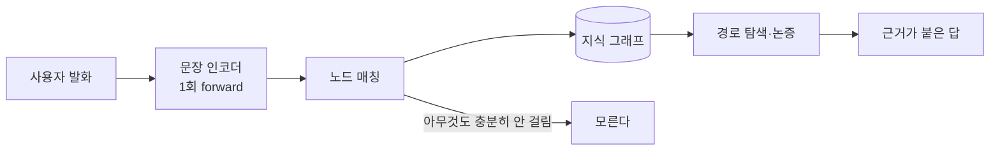
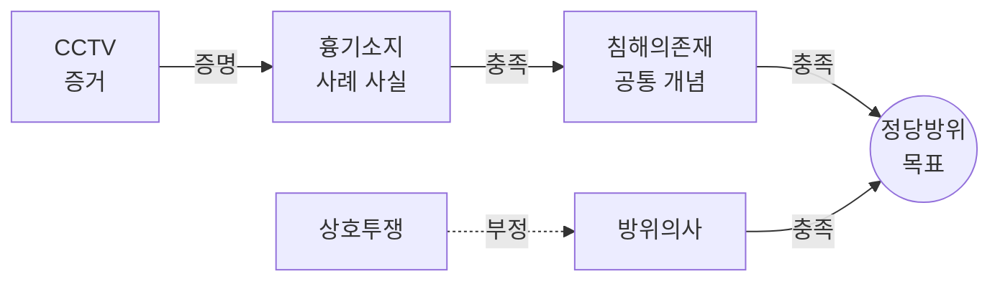
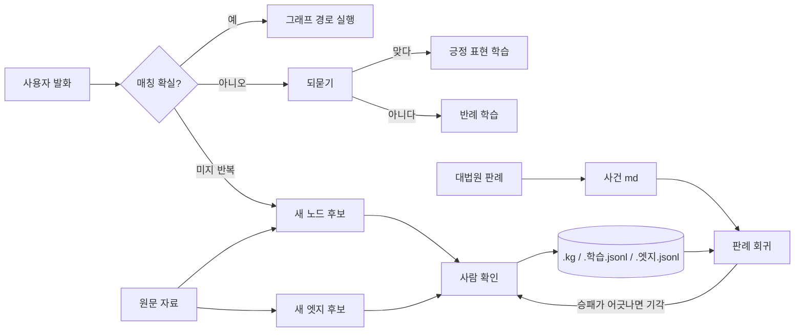

# Objection

**근거가 없으면 말하지 않는, 성장 가능한 지식 그래프 AI.**

Objection은 문서를 지식 그래프로 만들고, 사용자의 발화를 그래프 노드에 연결한 뒤,
`증명 → 충족 → 결론` 경로로 설명하거나 논증합니다. 답마다 근거 경로가 남고,
그래프에 없는 내용은 생성하지 않고 모른다고 답합니다.

[지식 그래프 열기](보기/지식그래프.html) · [개발자 문서](개발.md) ·
[그래프 작성법](그래프_README.md) · [설계 기록](설계.md) · [프로젝트 방향](방향.md)

## 어디까지 됐나

| | 상태 | 근거 |
|---|---|---|
| 생성 없이 논증 | **됨** | 토큰을 뽑지 않는다. 발화당 인코더 forward 1회 |
| 근거 없으면 "모른다" | **됨** | 널 클래스(B2)와 미지를 구분한다 |
| 도메인 교체 | **됨** | 그래프 **12종**, 엔진 코드 수정 0줄 |
| 실제 판결과 일치 | **6/6** | 대법원 판례 6건, 승 4 / 패 2 |
| 판례 법리 덮음 | **72.2%** | 판례 28건의 판결요지 문장 108개 중 78개 |
| 표현 학습(부르는 법) | **자동** | 되묻기 확인/부인이 파일로 쌓인다 |
| 노드·엣지 후보 찾기 | **자동** | 미지 발화 군집 + 원문 공기 |
| 목표 없는 답 고르기 | **54%** | 판례 문장 기준. 발췌 직접 검색으로 42%에서 올림 |
| 대화 맥락 | **대화 전체** | 창이 아니라 감쇠. 주어 없는 후속 질문도 받는다 |
| 여러 그래프 중 고르기 | **자동** | 그래프들의 그래프. `--route` |
| 말투·언어 | **데이터** | `말투/한국어.json` 을 바꾸면 언어가 바뀐다 |
| 자기 코드 이해 | **됨** | `graphify-out/`을 읽고 파일·줄 번호를 댑니다 |
| 절차 답변 | **부분** | 문서의 순서를 그대로 냅니다. 어느 절인지 고르는 정확도가 약합니다 |
| 잡담 거절 | **6/6** | 단어가 겹쳐도 딴 얘기면 모른다고 한다 |
| 오타 | **되묻는다** | 자모 하나 차이면 교정안을 묻고, 확인되면 기억한다 |
| 대화 맥락 저장 | **파일로** | 저장·재개·공유. 오타 기록도 함께 간다 |
| 검색 | **자료로만** | 위키백과에서 받아 `자료/` 에. 답으로 직행하지 않는다 |
| 램 | **평평하다** | 매니저가 최근 2개만. 설명 벡터 28.5MB 는 mmap |
| **엣지 방향 정하기** | **사람** | 구조 자질 81.6%, 부정 16/33. 라벨 170개 더 필요 |
| 판례 → 사건 md | **사람** | 판결문을 읽고 사실을 쪼개는 일 |

마지막 두 줄이 남은 병목입니다. 나머지는 기계가 후보를 내고 기계가 채점합니다.

```bash
python engine.py --check     # 전체 자체 검사
python engine.py --regress   # 판례 6건 회귀
```

## 핵심 아이디어

일반적인 LLM은 다음 토큰을 생성합니다. Objection은 생성하지 않고 **고릅니다.**



- 신경망은 [인코더.py](인코더.py)에만 있습니다.
- 추론은 CPU가 기본이며 자기회귀 생성 루프가 없습니다.
- 도메인 지식은 코드가 아니라 `.kg` 파일에 있습니다.
- 그래프가 바뀌어도 엔진 코드는 바뀌지 않습니다.
- 환각 대신 남는 위험은 **발화를 잘못된 노드에 매핑하는 오류**이며, 임계값·널 클래스·되묻기로 관리합니다.

## 지식 그래프

관계는 세 종류입니다.

| 관계 | 의미 | 예 |
|---|---|---|
| `증명` | 증거가 사실을 뒷받침 | `CCTV → 흉기소지` |
| `충족` | 사실·개념이 상위 요건을 채움 | `흉기소지 → 침해의존재` |
| `부정` | 사실·개념이 상대 요건을 무너뜨림 | `상호투쟁 → 방위의사` |



실제 그래프는 [인터랙티브 시각화](보기/지식그래프.html)에서 탐색할 수 있습니다.
그래프 선택, 관계 필터, 노드 검색, 휠 노드 간격 조절, 캔버스·노드 드래그,
목표까지의 최단 근거 경로 강조를 지원합니다.

화면에 나오는 그래프는 **엔진이 실제로 쓰는 것과 같습니다.** `포함:`으로 빌려온
법리를 풀고, 목표와 이어지지 않는 다른 죄명을 걸러낸 뒤 그립니다. 노드·엣지 수가
`load()`와 정확히 일치합니다.

근거 경로는 **전진 관계(`증명`/`충족`)만** 탑니다. `부정`까지 타면
`침해의종료 → 침해의현재성 → 정당방위`가 정당방위의 근거처럼 보이는데,
그 노드는 결론을 무너뜨리는 쪽이라 뜻이 정반대입니다. 전진 경로가 없는 노드는
무엇을 부정하는지 대신 표시합니다.

시각화를 다시 만들려면:

```bash
python 보기/지식그래프_시각화.py
```

## 학습과 성장

가중치를 온라인으로 바꾸는 대신, 확인된 지식을 읽을 수 있고 되돌릴 수 있는 파일에 쌓습니다.



- **표현 학습:** 되묻기에 확인된 말투를 `.학습.jsonl`에 저장합니다.
- **반례 학습:** “아니다”라는 답도 버리지 않고 해당 노드의 반례로 저장합니다.
- **노드 제안:** 반복되는 미지 발화를 묶고, 원문에 있는 이름만 후보로 냅니다.
- **엣지 제안:** 원문에서 함께 등장하는 기존 노드 쌍을 찾습니다.
- **방향 라벨:** 사람이 `증명/충족/부정/관계 없음`을 확인해 `.엣지.jsonl`에 축적합니다.
- **판례 회귀:** 새 엣지를 원본에 쓰기 전에 실제 판결 6건의 승패 일치율을 검사합니다.
- **판례 수집:** 법제처 API에서 참조조문 기준으로 판례를 받아 채점 데이터로 씁니다.

사람이 확인하는 자리는 하나뿐입니다. 나머지는 기계가 후보를 내고 기계가 채점합니다.
사람 판단이 필요한 이유는 **원문이 관계의 방향을 말해주지 않기 때문**입니다 —
자세한 측정은 [방향.md](방향.md)에 있습니다.

모든 학습 파일은 원본 그래프에 덧칠하는 방식이므로 파일을 지우면 학습 전으로 돌아갑니다.

## 검증 결과

현재 정당방위 판례 회귀 세트는 대법원 결론과 **6/6 일치**합니다.

| 판례 | 기대 | 엔진 |
|---|---:|---:|
| 대표이사 어깨 흔듦 | 인정 | 승소 |
| 위법 체포 저항 | 인정 | 승소 |
| 손목 제압 | 인정 | 승소 |
| 식당 싸움 방어 | 인정 | 승소 |
| 침대 위 과도 | 부정 | 이길 수 없음 |
| 이혼소송 중 남편 | 부정 | 이길 수 없음 |

```bash
python engine.py --regress
python engine.py --regress 상호투쟁 충족 방위의사  # 엣지를 임시로 얹어 비교
```

임시 엣지는 원본 `.kg`를 수정하지 않습니다. 기대 승패가 하나라도 깨지면 종료코드 `1`입니다.

회귀는 두 단계로 봅니다.

1. **구조** — 모든 요건에 증거가 닿고, 증거를 하나씩 배정해도 빈 칸이 없는가.
2. **실제 대국** — 이길 수 있다고 판정한 사건을 자동 논증으로 한 판 둬서 정말 이기는가.

2번이 필요한 이유는 구조가 멀쩡해도 매칭이 깨지면 아무도 못 이기는 그래프가
되기 때문입니다. 실제로 이 검사를 붙이자마자 `match_evidence`가 짧은 증거명을
먼저 고르는 버그가 잡혔습니다(`피해근로자진술`이라고 말해도 `근로자진술`로 매칭).
자동 논증은 그래프에서 유도하므로, 그래프를 고쳐도 시험 발화가 낡지 않습니다.

### 판례 문장 덮음률

승패와 별개로, 판결요지 문장이 그래프 노드에 걸리는 비율도 잽니다.

```bash
python 수집/법제처.py --판례 "형법 제21조" 정당방위 400   # LAW_OC 환경변수 필요
python engine.py --score 그래프/graph.kg 수집/판례/판례_형법제21조.jsonl
```

```text
판례 28건 · 판결요지 문장 108개
  그래프가 덮은 문장: 78 (72.2%)
```

안 걸린 문장은 미지 로그로 갑니다. 게임 세션 발화가 아니라 대법원 문장이므로
`--suggest`가 내는 노드 후보의 질이 달라집니다.

## 지원 도메인

엔진을 수정하지 않고 그래프만 교체합니다.

| 그래프 | 목표 |
|---|---|
| 법정 | 정당방위 성립 여부 |
| 부당해고 | 구제신청 인용 여부 |
| 저작권 | 침해 성립 여부 |
| 개인정보 | 유출 배상책임 |
| 음주운전 | 유죄 성립 여부 |
| 명예훼손 | 유죄 성립 여부 |
| 보험금 | 지급 여부 |
| 의료 | 진단 논증 |
| 연구 | 연구 결론 검토 |
| 코드 리뷰 | 성능 회귀 원인 규명 |
| 대출 | 심사 결론 |
| 인과 | 원인 경로 설명 |

적합한 문제의 모양은 하나입니다. 결론 노드가 있고, 고유한 증거가 있으며,
주장이 명제이고, 관계를 `증명/충족/부정`으로 나타낼 수 있어야 합니다.

## 설치

Python 3.10 이상을 권장합니다.

```bash
pip install numpy sentence-transformers
```

기본 인코더는 `jhgan/ko-sroberta-multitask`이며 최초 실행 때 모델을 내려받습니다.
기본 장치는 CPU입니다. 필요할 때만 `KG_DEVICE`를 바꿉니다.

```bash
# Windows PowerShell
$env:KG_DEVICE = "cpu"
python engine.py --check
```

## 빠른 시작

```bash
# 자체 검사
python engine.py --check

# 정당방위 그래프 대화
python engine.py 그래프/graph.kg --verdict

# 다른 도메인으로 교체
python engine.py 그래프/graph_의료.kg

# 사건 Markdown을 KG로 컴파일
python engine.py --case 사건_대표이사어깨흔듦.md

# 구조·증거 배정 진단
python engine.py --diagnose 사건_대표이사어깨흔듦.kg
```

## 그래프 성장 도구

```bash
python engine.py --route "가슴 통증에 ST분절이 상승했습니다"   # 어느 그래프인지 고른다
python engine.py --learn 사건_편의점강도.kg              # 되묻기에서 배운 표현
python 설명.py   --draw 자료/법지식/지식그래프.json        # 그래프를 mermaid 로
python 설명.py   <그래프> --대화 대화.json                # 맥락을 저장하며 대화
python 설명.py   --score 자료/법지식/지식그래프.json    # 목표 없는 모드 채점
python 설명.py   --절차 개발.md README.md "PR 전에 뭘 해야 해"   # 순서 있는 답
python engine.py --suggest   그래프/graph.kg 자료/     # 반복되는 미지 발화 → 노드 후보
python engine.py --relations 그래프/graph.kg 자료/     # 원문 표지 → 의미 관계 후보 (종류까지)
python engine.py --edges     그래프/graph.kg 자료/     # 원문 공기 → 논증 엣지 후보
python engine.py --label   그래프/graph.kg 자료/       # 엣지 방향 라벨 수집
python engine.py --label --report 그래프/graph.kg      # 라벨 현황
python engine.py --mine 그래프/graph.kg 자료/법지식/법령_형법.txt
python engine.py --tune 그래프/graph.kg 발화_샘플.json
python engine.py --score 그래프/graph.kg 수집/판례/판례_형법제21조.jsonl
```

판례·법령 수집은 법제처 공동활용 API를 씁니다. `open.law.go.kr`에서 발급받은
OC 값을 `LAW_OC` 환경변수에 넣어야 합니다.

```bash
python 수집/법제처.py 형법 민법                      # 법령 원문
python 수집/법제처.py --판례 "형법 제21조" 정당방위 400  # 참조조문 기준 판례
python 수집/위키.py 정당방위 명예훼손                     # 위키백과 (키 불필요)
```

본문 검색만으로는 그 조문과 무관한 판례가 딸려오므로, 받은 뒤 참조조문으로
거릅니다(정당방위 400건 중 28건).

## 구조

```text
engine.py              논증·판정·학습·진단·회귀 엔진
인코더.py              문장 → 정규화 벡터
설명.py                그래프 경로 기반 설명 엔진
짓기.py                문서 → 지식 그래프 저작 도구
그래프/*.kg            도메인 그래프
법리/*.kg              공유 법리 계층
사건_*.md / *.kg       판례 원문 모델과 컴파일 결과
자료/                  저작 근거가 되는 원문
수집/                  법령·판례 수집기
보기/                  웹 UI와 지식 그래프 시각화
graphify-out/           코드 구조 인덱스 (238 노드, 450 엣지)
```

Graphify가 찾은 코드의 중심 노드는 `_selfcheck()`, `judge()`, `load()`,
`reachable()`, `_vec()`입니다. 즉 이 프로젝트의 실제 중심도
**검증 → 판정 → 그래프 로딩 → 경로 탐색 → 문장 매칭** 순서로 드러납니다.

## 한계

- **자유 대화**는 원래 "답 공간을 열거할 수 없어서" 못 한다고 적었는데, 재보니
  틀렸습니다. 발화 공간과 개념 공간을 뭉갠 것이었습니다 — 엔진은 발화를 열거하지
  않고 노드를 열거하며, 개념은 요리에서도 법에서도 포화합니다. 실제로 막는 것은
  **관계 어휘**였습니다. 설명 그래프의 관계가 `설명함`·`같은조문` 뿐이면 둘 다
  "같이 나온다"는 뜻이라 답할 수 없습니다. 김치찌개 문서에 "돼지고기 목살"이라고
  적혀 있는데도 "그건 그래프에 없는 이야기입니다"가 나왔습니다.
  `재료`·`이유`·`시점`·`대체`를 넣으니 엔진을 한 줄도 안 고치고 답했습니다.
  여전히 못 하는 것은 **창작**과 목표 없는 잡담입니다.
- 순서와 시간 계획을 직접 다루지 않습니다.
- 그래프 내용은 지어내지 않지만 발화가 잘못된 심볼에 매핑될 수 있습니다.
- 자동 엣지 방향 판정은 아직 신뢰할 수준이 아닙니다. 현재 라벨 192건에서
  `충족/부정` 이름 임베딩 분류는 79.4%로, 전부 `충족`이라고 찍는 76.6%보다 조금 낫습니다.
- **원문 대목은 방향 예측에 도움이 안 됩니다.** 대목을 자질로 넣어봤지만 부정 15건 중
  0건을 잡았고 정확도가 그대로였습니다. 조문은 요건을 나열하지 논증하지 않기 때문입니다.
  `--edges`가 보여주는 대목은 사람이 읽을 근거이지 기계의 자질이 아닙니다.
- 판례 회귀는 6건으로 작습니다. 사건이 늘어날수록 엣지 자동 검증이 강해집니다.
- 회귀는 **판정이 뒤집힐 때만** 잡습니다. 막힌 요건을 2개에서 1개로 줄이는 엣지는
  여전히 지므로 통과합니다. 부분적 악영향까지 재려면 막힌 요건 수를 점수로 써야 합니다.
- 판례를 사건 md로 옮기는 일은 아직 사람이 판결문을 읽고 사실을 쪼개야 합니다.
- 검색은 답하지 않습니다. 받은 글은 `자료/`에 놓이고, 사람이 확인해 그래프가
  되어야 근거가 됩니다. 검색 결과를 곧바로 답으로 내보내면 영수증 보장이 깨집니다.
- 창작과 목표 없는 잡담은 여전히 못 합니다. 무엇이 좋은 답인지 잴 자가 없습니다.
  다만 **대화에 대한 잡담**("아까 뭐 물어봤지")은 대화 기록이 근거라 답합니다.
- **진짜 병목은 노드 어휘입니다.** 관계를 뽑는 실험을 세 번 했는데 세 번 다 같은
  곳에서 막혔습니다: 개념망으로 방향을 맞히려니 양끝이 다 덮인 엣지가 141개 중
  4개였고, 원문 대목이 도움이 안 된 것도, 법률 표지가 60%나 걸리는데 후보가
  6개뿐이었던 것도 전부 **그래프 노드가 원문의 실체를 안 덮어서**입니다.
  `--relations`로 죄명·형벌을 노드로 둔 그래프를 물리면 바로 걸립니다
  (`상해 -죄형-> 징역`). 그래서 `--suggest`/`--mine`을 먼저 돌려 노드 어휘를
  원문에 맞추는 것이 나머지 모든 도구의 전제입니다.

## 설계 원칙

> 범용성을 답 생성에서 얻지 않고, 그래프 교체와 성장 루프에서 얻는다.

GPU는 저작 시점에 빌릴 수 있지만 실행 시점의 결론은 항상 그래프가 결정합니다.
새로운 주장을 받아들이려면 원문, 라벨, 회귀 결과 중 하나가 근거로 남아야 합니다.
