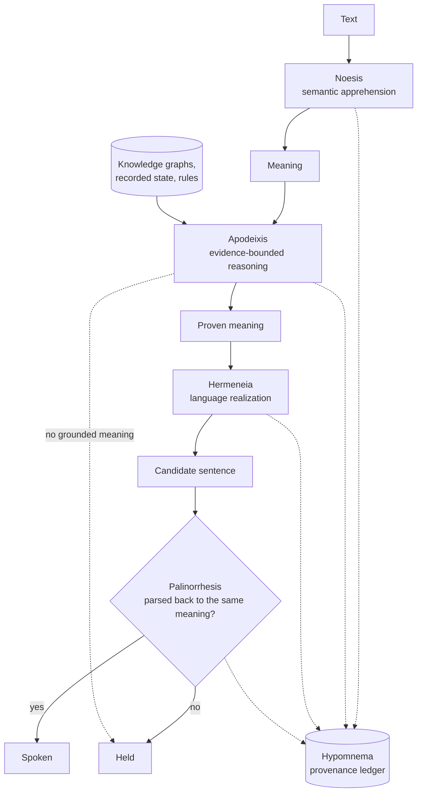
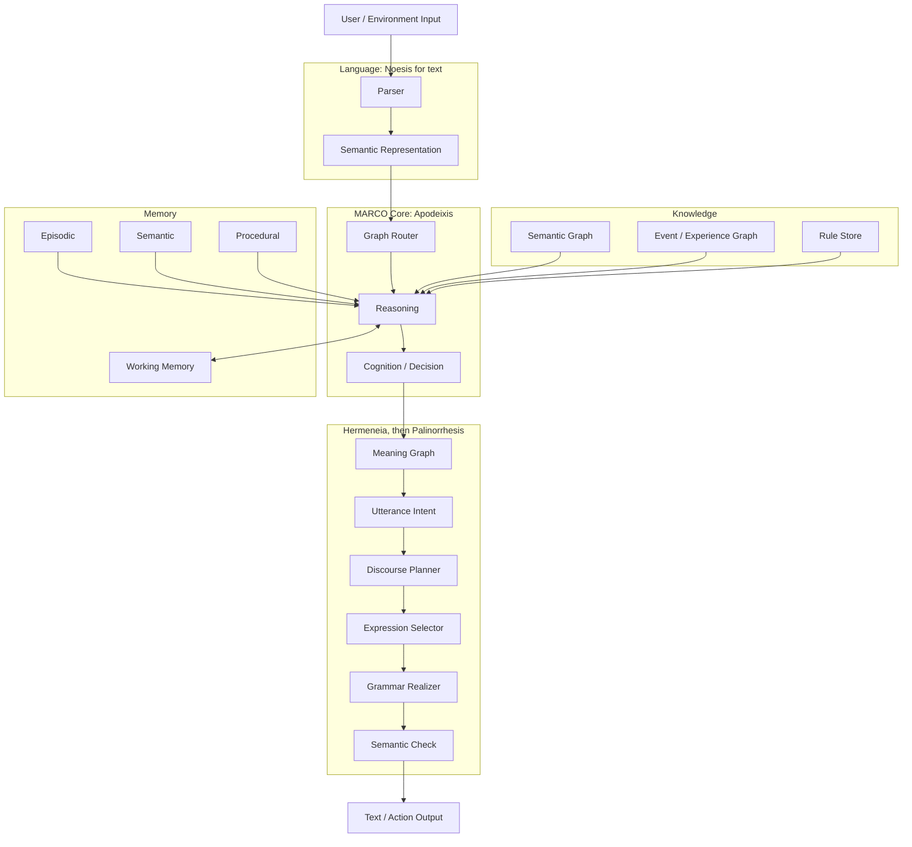
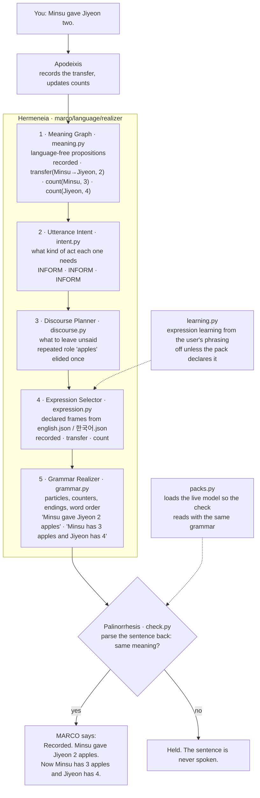

# Marco

**A reasoning engine that answers only from evidence it can point to, composes
every sentence it says from a proven meaning, and holds when nothing grounds an
answer. No language model runs anywhere in it.**

A turn goes through four named stages. **Noesis**, MARCO's semantic
apprehension, reads the sentence into structure: who holds what, how many, what
changed hands. **Apodeixis**, its evidence-bounded reasoning pipeline, derives
the answer from the recorded statements and declared rules, or finds that
nothing supports one. **Hermeneia**, its language realization pipeline, composes
the reply from that meaning, and **Palinorrhesis**, speak only after semantic
return, parses the candidate back with the same language pack and lets it out
only if it returns the same meaning. When no grounded meaning exists there is no
path to a sentence at all, so the turn is held. **Hypomnema**, the provenance
ledger, can record every turn as a graph of events that an answer's "why" walks
back. All ten pipeline names and the six structural names are explained in
[The names of MARCO](docs/en/pipelines.md).

```
> Minsu has five apples, and Jiyeon has two.
  Recorded. Jiyeon has 2 apples.
> Minsu gave Jiyeon two.
  Recorded. Minsu gave Jiyeon 2 apples. Now Minsu has 3 apples and Jiyeon has 4.
> How many does Jiyeon have now?
  4 apples.
> Where is that person?
  This conversation never stated the location of Jiyeon. So I did not answer.
> Actually, the one given was one, not two.
  I changed the amount in the same event "Minsu gave Jiyeon two." from 2 to 1. No new event was added. Now Minsu has 4 apples and Jiyeon has 3.
```

Every reply above was composed from a meaning; none is a stored sentence with
blanks. The first reply leaves out Minsu's five, a fact the user had just typed
in full, and repeats Jiyeon's, because "two" had to be read as two apples (the
discourse planner's known-facts rule). The same plan speaks Korean through the
Korean pack: *반영했습니다. 민수가 지연에게 사과
2개를 줬습니다. 이제 민수 사과는 3개, 지연은 4개입니다.*

Reproduce: `printf 'Minsu has five apples, and Jiyeon has two.\nMinsu gave Jiyeon two.\nHow many does Jiyeon have now?\nWhere is that person?\nActually, the one given was one, not two.\n' | mco run MARCO-1.mco`
after `mco compile . -o MARCO-1.mco --name MARCO-1` (run at `5f321a3`). Proof:
`tests/test_repair_and_english.py::test_seven_step_dialogue_runs_through_the_ui_turn_handler`
checks the recorded state, status and evidence of this dialogue in both
languages; `tests/test_composition_gate.py::test_the_live_realizer_is_seen_composing_the_seven_step_dialogue`
checks that each reply is composed.

**Composed, never picked.** On the frozen exam of 52 unseen dialogues, 340 of
340 spoken replies were composed from a meaning and 0 passed through as stored
text (gate condition 5, `docs/ko/dialogue-gate-2026-09-22/composition-after-w3.json`).
The older part of MARCO, the knowledge-graph engine over 904 authored `.kg`
graphs, is different: its answers are the lines the graph's author wrote, with
values carried along the graph's edges, and they pass through the realizer
unchanged (its "unknown" replies are composed). [How the graph engine
answers](#how-the-graph-engine-answers) shows that path.

## Documents

| Document | What it covers |
| --- | --- |
| [docs/README.md](docs/README.md) | Index of every document under `docs/`, one line each |
| [docs/en/pipelines.md](docs/en/pipelines.md) | The names of MARCO: the ten pipeline names and the six structural names, each with what exists today and what is only planned |
| [docs/architecture/naming.md](docs/architecture/naming.md) | The canonical naming reference: pipelines, reserved names, structural concepts, phrasing rules |
| [docs/architecture/marco.md](docs/architecture/marco.md) | Package `marco` |
| [docs/architecture/marco.language.md](docs/architecture/marco.language.md) | Package `marco.language` |
| [docs/architecture/marco.language.realizer.md](docs/architecture/marco.language.realizer.md) | Package `marco.language.realizer`: Hermeneia and its semantic check |
| [docs/architecture/marco.trace.md](docs/architecture/marco.trace.md) | Package `marco.trace`: Hypomnema, the provenance ledger ([measurements](docs/architecture/trace-ledger.md)) |
| [docs/architecture/mco.md](docs/architecture/mco.md) | Package `mco`, the public API |
| [docs/architecture/mco.backends.md](docs/architecture/mco.backends.md) | Package `mco.backends` |
| [docs/architecture/structure-audit.md](docs/architecture/structure-audit.md) | Structure audit at `6195040`: every root file, the import graph, the target layout |
| [docs/mco/README.md](docs/mco/README.md) | `mco` user guide, also the PyPI page |
| [docs/releases/](docs/releases/2026-09-24-marco-1-preview-1.md) | Release notes: [MARCO 1 · Preview 1](docs/releases/2026-09-24-marco-1-preview-1.md), [mco 0.1.0](docs/releases/2026-09-24-mco-0.1.0.md) |
| [docs/ko/2026-09-22-freeze-decision.md](docs/ko/2026-09-22-freeze-decision.md) | What is frozen, the MARCO 1 gate, the goal queue |
| [docs/ko/2026-09-24-roadmap-after-marco1.md](docs/ko/2026-09-24-roadmap-after-marco1.md) | What comes after the gate: perception, affect, deliberation, NERO |
| [docs/ko/dialogue-gate-2026-09-22/README.md](docs/ko/dialogue-gate-2026-09-22/README.md) | The frozen 52-dialogue gate set, its scorer and its recorded runs |
| [docs/ko/reasoning-gate-2026-09-24/README.md](docs/ko/reasoning-gate-2026-09-24/README.md) | The frozen reasoning set and the composition gate |

`python tools/doc_facts.py packages` prints the number of packages under
`marco/` and `mco/` without a document carrying the five template headings, and
`python tools/doc_facts.py index` the number of documents under `docs/` that
[docs/README.md](docs/README.md) does not link. Both print `0` at this commit.

---

## MARCO 1: what it can do today

MARCO 1 is **not released**. The [freeze decision](docs/ko/2026-09-22-freeze-decision.md)
fixed its gate before implementation, and conditions 5 and 6 were added on
2026-09-24. Conditions 1, 3, 4, 5 and 6 hold. Condition 2, accuracy on unseen
dialogues, fails, and it alone decides the release.

**Where the numbers come from.** The frozen exams are scored once per round by
the owner and never run during development, so this README runs no exam. Every
exam number in this section is read from a recorded report file, named next to
it, and `python tools/doc_facts.py frozen` prints all of them from those files
(it reads, it does not re-run). The latest run is the one after realizer
round 3, recorded with code `ead6302`.

| # | Gate condition | State | Source |
| --- | --- | --- | --- |
| 1 | The fixed 7-step dialogue passes in Korean and English with the verbatim phrasings | **met** in both packs. The Korean turns are the roadmap §12 sentences verbatim, the English turns their translation; the checks are on recorded state, status and evidence, not on wording | `tests/test_repair_and_english.py::test_seven_step_dialogue_runs_in_each_language`, `::test_seven_step_dialogue_runs_through_the_ui_turn_handler` (both parametrized `english`, `한국어`) |
| 2 | 50+ unseen multi-turn dialogues score 90% or better on answerable questions; a hold is not a correct answer | **not met: 21 of 108 answerable turns (19.4%)**; 98 needed. 87 holds, 0 wrong, 0 unverifiable. Korean 10 of 54, English 11 of 54 | [after-w3.json](docs/ko/dialogue-gate-2026-09-22/after-w3.json) `gate`, `by_language` |
| 3 | No confident answer without evidence, no use of retracted evidence | **met**: 0 and 0 | same file, `violations` |
| 4 | Sample count, composition and the full failure list are published | 52 dialogues (26 Korean, 26 English), 340 turns, 108 answerable; every failure is listed in the file | same file, `dataset`, `failures`; [gate README](docs/ko/dialogue-gate-2026-09-22/README.md) |
| 5 | Composed, never picked: every spoken reply composed by the realizer from a meaning | **met**: 340 of 340 composed, 0 passed through, 0 held by the check; 170 of 170 in each language | [composition-after-w3.json](docs/ko/dialogue-gate-2026-09-22/composition-after-w3.json) `total`, `by_language` |
| 6 | Reasons: on 100+ frozen structured problems, 95% or better correct among parsed problems, 0 wrong, at most 10% unparsed | **met**: 108 of 111 parsed problems (97.3%), 0 wrong questions, 3 of 114 problems unparsed (2.6%). By question: 148 of 151 parsed (98.0%), 3 held, 5 unparsed | [reasoning after-w3.json](docs/ko/reasoning-gate-2026-09-24/after-w3.json) `gate`, `questions` |

The other labels of the dialogue exam, reported apart as the gate requires
(same file, `other_labels`):

| Turns labelled | Right | Held | Wrong |
| --- | --- | --- | --- |
| statement, to be recorded | 82 of 150 | 66 | 1 (and 1 unverifiable) |
| missing premise, to be held naming what is missing | 4 of 20 | 16 | 0 |
| ambiguous referent, every candidate named | 7 of 12 | 5 | 0 |
| unsupported request, declined | 6 of 6 | 0 | 0 |
| correction, the same event revised | 3 of 18 | 12 | 3 |
| why, every evidence turn cited | 0 of 26 | 26 | 0 |

Gate condition 2 across the recorded runs, each printed by
`python tools/doc_facts.py frozen --run <name>` from the file of that name in
the same folder: baseline 3 of 108 (`baseline`, code `4adc504`), understanding
round 1 19 of 108 (`round1`, `a8388e9`), round 2 21 (`round2`, `494f599`),
round 3 21 (`round3`, `60d796b`), after realizer round 3 21 (`after-w3`,
`ead6302`). Every development set so far scored far higher than the exam: the
owner read the failing turns and found natural adult language (zero and vague
counts, lend and hand back, titles, relational nouns, first person, places as
holders, referent repairs) where every development set had been template
output. Understanding round 4, running now, builds its development data from
that kind of language. A statement MARCO does not read also blocks every later
question that depends on it, which is why 87 of the 108 are holds rather than
wrong answers.

### Not in this release

These areas are frozen until MARCO 1 ships, or scheduled after it. Nothing here
is part of MARCO 1.

| Area | State in this repository |
| --- | --- |
| POLO (host permission boundary, workflows) and Bouleusis, deliberation | no `polo/` package exists |
| MCO binary format (native `.mco`, overlay, snapshot, consolidation) | not written. `mco` 0.1.0 is on PyPI as the API over a compatibility ZIP around a `.kgpack` ([mco](docs/architecture/mco.md), [release notes](docs/releases/2026-09-24-mco-0.1.0.md)) |
| Autonomous planning (re-planning, tool making, self-modification, a general planner) | not written. `goal_runtime.py` keeps its existing registered tools |
| ALMA advancement (persona and social features, new ALMA modules) | not written. The existing ALMA 0.1 research loop stays and its tests run ([below](#alma-01-research-loop-not-in-this-release)) |
| Aisthesis, SOMA's sensory perception; Pathognosis, ALMA's affect interpretation; deliberation budgets; NERO, the compute layer | scheduled after the gate in the [roadmap after MARCO 1](docs/ko/2026-09-24-roadmap-after-marco1.md); no code |
| The repository refactor | partly scheduled. Goal S4 moves the whole-file root modules into packages between understanding rounds 4 and 5, on the owner's go ([Layout](#layout)); splitting the seven large files stays frozen. Packages today: `marco`, `marco.language`, `marco.language.realizer`, `marco.trace`, `mco`, `mco.backends` |

---

## Measured at `5f321a3`

Every number below was printed by the command next to it, in a checkout of
`5f321a3` without gitignored files (the generated law knowledge graph
`data/법지식/지식그래프.json` and the definitions corpus `data/위키/정의문.jsonl`
are absent). Python
3.13.9 (anaconda) on macOS, character encoder (`KG_ENCODER=문자`, the default).
Other test runs shared the machine, so the times are upper bounds. The graph
engine records which graphs it used in the gitignored `그래프쓰임.json` at the
root and reads it back to break routing ties; the runtime, self-check and
routing commands ran in that order from a checkout without it, and the tests
ran without it.

**Knowledge and code** — `python tools/doc_facts.py counts`

| | Value |
| --- | --- |
| Graph files `graphs/*.kg` | 904 (0 fail to parse) |
| Nodes | 6,982: 3,685 concepts, 735 axioms, 2,562 instances |
| Argument edges (`[논증]`) | 6,263 |
| Null-class entries (`[무관]`) | 1,249 |
| Concept-network edges written in graphs (`[개념망]`) | 60 |
| Root `.py` files | 61, 34,798 lines; `engine.py` alone 6,117 |
| Package `.py` files (`marco/`, `mco/`) | 36, 7,024 lines |
| Test files | 86 in `tests/test_*.py`; 102 with the subfolders `tests/language/` and `tests/trace/` |

**Tests** — `KG_ENCODER=문자 python -m pytest -q` (parallel by default, `pytest.ini`)

Run at `6938364`, which is `5f321a3` plus documentation and `tools/doc_facts.py`
with its test, in the checkout described above.

| passed | failed | skipped | time |
| --- | --- | --- | --- |
| 1,510 | 1 | 8 | 421.46 s |

| Failing test | Cause |
| --- | --- |
| `tests/test_alma_integrated_reproduction.py::test_fixed_alma_life_reproduction_has_no_wrong_checks` | asserts that process RSS is unsupported; macOS reports it. Machine-dependent, known on `main` |

A run on the same checkout with a `그래프쓰임.json` left behind by earlier engine
commands also failed `tests/test_general_knowledge_coverage.py::test_recent_domain_questions_route_to_their_graphs`:
the log's usage bonus broke a routing tie the other way.

**Self-checks** — each passes at this commit

| Command | Result | Time |
| --- | --- | --- |
| `python engine.py --check` | `selfcheck ok` | 214.3 s |
| `python engine.py --regress` | `일치 6/6 (100.0%)`, the six cases of `cases/사건_회귀.json` | 0.2 s |
| `python encoder.py --check` | `인코더 selfcheck ok` | 0.1 s |
| `python hangul.py` | `자가검사 ok` | |

**Routing** — `python routing_benchmark.py --답` (266.7 s)

| | Value | Meaning |
| --- | --- | --- |
| Out-of-domain refusal | **24 / 24** | questions no graph covers are refused (`data/benchmarks/라우팅_밖.json`) |
| Routed to the source graph | 2,810 / 6,906 (40.7%) | each node's last phrasing is held out of the index and asked; overlapping graphs split the credit |
| Chosen graph gave a verdict other than unknown | 5,250 / 6,906 (76.0%) | **not answer accuracy**: the verdict is not compared with an expected answer |

**Runtime** — `python tools/doc_facts.py runtime`

The command runs the probe twice in fresh processes and reports the second, so
the on-disk index and vector caches are warm. It times `engine.answer`, the
graph route, on 70 fixed questions: the 24 out-of-domain questions and the
first instance phrasing of every 20th graph file.

| | Value |
| --- | --- |
| Graphs in the router index | 891 |
| Start-up: import `engine` | 12.8 ms |
| Start-up: build the router index from its cache | 864.6 ms |
| First turn (the engine loads the rest lazily) | 208.4 ms |
| **Turn latency**, turns 2–70: median / p95 / max | **41.0** / 54.4 / 73.0 ms |
| **Peak resident memory** | **139.0 MB** |
| `torch` imported | no |
| Third-party modules the engine loaded | `numpy` only |

**Layer rule** — `python tools/import_graph.py --targets docs/architecture/target-map.json`

The target layout's rule, a package imports only its own layer and those to
its left, **does not hold yet**: 379 target-level edges, 28 of them upward (6 at
module top level, the rest inside functions), and one cycle of 10 packages. The
tool reports; it does not fail the build.

---

## Compared with other models, same frozen exams

The two frozen exams, 52 unseen dialogues and 114 reasoning problems, were
given to other models on this laptop and scored by one text extractor applied
identically to every model, MARCO included (goal C1, run with code `ce7d73b`,
whose MARCO product code is the round-2 code). The numbers are from
`docs/ko/model-comparison-2026-09-24/{marco,qwen,gpt2,always_hold}.json`, and
`python tools/doc_facts.py frozen` prints them in its last block. Method,
fairness notes and per-turn buckets:
[docs/ko/model-comparison-2026-09-24/](docs/ko/model-comparison-2026-09-24/README.md).

| Model | Params | Unseen dialogue turns correct | Wrong | Invented answers where nothing was given | Reasoning questions correct | Reasoning wrong | Median turn | Peak memory |
| --- | --- | --- | --- | --- | --- | --- | --- | --- |
| MARCO | none learned | 21 / 108 | 1 | **0 / 26** | 148 / 156 | **0** | **27 ms** | 505 MB |
| Qwen2.5-7B-Instruct, 4-bit | 7.6 B | **75 / 108** | 25 | 5 / 26 | 88 / 156 | 22 | 749 ms | 5,219 MB |
| GPT-2 | 124 M | 1 / 108 | 51 | 9 / 26 | 10 / 156 | 82 | 468 ms | 398 MB |
| Always hold | 0 | 0 / 108 | 0 | 0 / 26 | 10 / 156 | 0 | 0 ms | 17 MB |

Read it as two columns that trade against each other today. The 7B model
understands three and a half times more unseen phrasings than MARCO, and pays
for it with 25 wrong answers, 5 invented ones on turns where the information was
never given, and 22 wrong reasoning answers. MARCO understands less, is almost
never wrong on what it understood (the one wrong answer here is from the
round-2 code; the gate's own scorer counts 0 wrong from round 3 on), never
invents, and answers in 27 ms without a GPU. Closing the first column is the
MARCO 1 gate; the other columns are the reason the project exists. Qwen
answered 28 Korean turns in Chinese; those count as holds, and the report gives
its hand-read score too. The text scorer has no "unparsed" bucket, so its
reasoning column is over all 156 questions, not the 151 parsed ones of gate
condition 6.

## Capabilities, each with its proof

A claim is listed only if a test or a self-check asserts it. Pytest nodes are in
`tests/`; "`--check` L*n*" is an assertion at that line of `engine.py` run by
`python engine.py --check` (line numbers at `5f321a3`).

**The state dialogue (MARCO 1)**

| Capability | Proof |
| --- | --- |
| Ownership and transfers recorded, corrected in place, and explained, in Korean and English | `test_repair_and_english.py::test_seven_step_dialogue_runs_in_each_language`, `::test_seven_step_dialogue_runs_through_the_ui_turn_handler` |
| English is the declared default language pack; Korean is a second pack; two packs in one process keep separate declarations | `test_repair_and_english.py::test_english_is_the_one_declared_default`, `::test_two_packs_in_one_process_do_not_share_declarations` |
| Korean number words count in state questions (`서른둘` is 32; `서른두 개` in a question is computed locally) | `test_numeral_semantics.py::test_composed_numerals`, `::test_multiple_groups_native_and_sino_numbers_reach_engine_without_lookup` |
| Every answered turn, and every graph-engine answer, passes through `marco.language.realize` exactly once | `test_language_seam.py::test_every_answered_turn_passes_through_realize_once`; `language/test_w1_engine_seam.py` |
| Hermeneia composes each reply from a language-free meaning through intent, discourse, expression and grammar layers, in both languages: the seven-step dialogue, the twenty recorded phrasings, every comparison and time kind | `language/test_w3_realizer_r3.py::test_the_seven_step_the_twenty_phrasings_and_these_kinds_are_all_composed`, `::test_every_comparison_and_time_kind_is_composed`; `language/test_w1_r6_two_languages.py` |
| Palinorrhesis: a sentence whose parse does not match its meaning is never spoken; injected swapped roles, changed numbers and dropped negation are all caught, and every clause is checked | `language/test_w1_r3_injected_errors.py`, `language/test_w1_r4_removal.py` |
| Holds, clarifications and refusals are composed in both languages; a held answer stays a hold | `language/test_w2_realizer_r2.py::test_every_hold_clarify_and_refusal_plan_is_composed_in_both_languages`; `language/test_w3_realizer_r3.py::test_a_held_answer_is_a_hold_with_the_realizers_reason` |
| "Why" is answered in words, with rule ids kept in the trace; the bare 왜? works like the long form | `language/test_w2_realizer_r2.py::test_why_says_its_rules_in_words_and_keeps_the_ids_in_the_trace`, `::test_the_bare_why_works_like_the_long_form` |
| Known referents and repeated roles are left unsaid | `language/test_w1_r5_discourse.py` |
| No sentence literal lives in realizer code; expression learning is off unless a pack declares it | `language/test_w1_r8_literals.py`, `language/test_w1_r7_learning.py` |
| The composition gate's classifier gives 0 composed to a realizer that passes everything through | `test_composition_gate.py::test_f2_6_a_realizer_that_passes_everything_through_scores_zero_composed` |
| Hypomnema: each turn recorded as an event graph in which every event but the input has a parent; an answer's why chain reaches its inputs; a correction supersedes and withdraws, never edits; recording twice gives the same events | `trace/test_trace_turns.py::test_every_event_but_the_input_has_a_parent_and_each_turn_one_output`, `::test_the_why_chain_reaches_the_inputs_an_output_rests_on`, `::test_a_correction_supersedes_and_withdraws_never_edits`, `::test_recording_twice_gives_the_same_events_once_ids_and_times_are_masked` |
| The trace driver refuses the frozen exam folders before reading them | `trace/test_trace_turns.py::test_the_frozen_exam_sets_are_refused_before_they_are_touched` |
| No third-party package on the default state-dialogue path; `torch` not imported | `test_lightweight_runtime.py::test_the_default_path_pulls_in_no_third_party_package` |

**The graph engine**

| Capability | Proof |
| --- | --- |
| Multi-turn: facts given across turns accumulate to one computed answer | `test_grounded_routing.py::test_dialogue_keeps_a_grounded_session_for_follow_up_values`; `test_mco_package.py::test_multi_turn_run`; `--check` L4524-4530 |
| A formula with a missing operand yields no value; division by zero yields no value | `--check` L4527, L4531-4533 |
| Formulas are parsed by a whitelisted grammar; `__import__(...)` evaluates to nothing | `--check` L4535-4536 |
| A number is carried from the user's words to another node (`{등}`, `{등 <- node}`); no number, no value | `--check` L4499-4518 |
| Out-of-domain questions get `unknown`, never an unconfirmed graph's answer | `test_grounded_routing.py::test_out_of_scope_benchmark_never_uses_an_unconfirmed_graph_prompt` (every question of `data/benchmarks/라우팅_밖.json`); `test_mco_package.py::test_unknown_is_declined_offline`; `test_agi_minimum_knowledge.py::test_out_of_scope_realtime_request_is_not_invented` |
| Verdicts `인정` (accept), `B2` (the null class wins) and `미지` (unknown) | `test_short_evidence_question.py` lines 12 and 18; `test_grounded_routing.py` line 12 |
| Verdicts `A` (ask back), `B1` (evidence given, nothing reaches the claim) and `C` | `--check` L5008, L5571-5578 |
| Trap question: overtaking the runner in 2nd place leaves you 2nd | `test_geometric_matching.py::test_explicit_evidence_precedes_goal_gate_but_generic_question_does_not` |
| At most two graph bodies stay loaded (LRU); the oldest is dropped | `--check` L5459-5465 |
| Short index lines cannot win long questions; short questions are also scored in reverse | `--check` L4626-4651 |
| The encoder is coverage-based: a node name inside a long question still scores high; digits are masked | `python encoder.py --check` (encoder.py:396 onward) |
| The character encoder is the default | `test_encoder_default.py::test_default_encoder_is_the_local_character_runtime` |
| `포함:` merges another graph's concepts, axioms and edges; relation names are translated by role | `test_learning_question_flow.py::test_materializing_graph_also_materializes_its_includes`; `--check` L4867-4875 |
| Learning: an unknown phrase is asked back among the evidence that still reaches an unfilled requirement; "네" stores it as an alias of the existing node, "아니요" as a counter-example; the router index picks up learned aliases | `--check` L4671-4694, L5218-5284, L4564-4583 |
| Requirements are conjunctive: one piece of evidence cannot fill two requirements | `--check` L5067-5085 |
| Korean particle agreement (`은/는`, `이/가`, `을/를`, `으로/로`) | `python hangul.py` (hangul.py:593-611) |
| The `mco` API: load, run, sessions, `reason`, inspect, compile, benchmark, CLI | every test function of `test_mco_package.py`, listed per claim in [docs/architecture/mco.md](docs/architecture/mco.md) |

Other tested areas, not part of the MARCO 1 gate: words defined in conversation
(`test_explanation_learning.py`), approved web research answered locally after
restart (`test_learning_question_flow.py`), claims from text and PPTX documents
(`test_document_kg.py`), charts and tables from images (`test_document_visual.py`),
actions defined in plain language (`test_action_runtime.py`, `test_rule_learning.py`),
an approved action runs once (`test_goal_approval_once.py`), learned assets travel
in a `.kgpack` (`test_pack_model.py`).

---

## Architecture

MARCO decides *what* is true before it decides *how* to say it. Noesis and
Apodeixis work on structures; only Hermeneia turns meaning into words, and
Palinorrhesis decides whether those words may leave. The names are concepts,
not files: [The names of MARCO](docs/en/pipelines.md) says for each one what
exists today and what is only planned, and [naming.md](docs/architecture/naming.md)
fixes them.



The same pipeline, component by component:



Where each box lives today, the package the [structure audit](docs/architecture/structure-audit.md)
assigns it to, and the tests that exercise it. The packages that exist are
`marco`, `marco.language`, `marco.language.realizer` and `marco.trace`; every
other target package is created by goal S4 ([Layout](#layout)).

| Component | Today | Target package | Tests |
| --- | --- | --- | --- |
| Parser | `relational_semantics.py` (`RelationalParser.parse`), `frame_induction.py`, `input_understanding.py` | `marco/language/` | `test_relational_transfer.py`, `test_frame_induction.py`, `test_input_understanding.py` |
| Semantic Representation | `semantic_parser.py` (validated state JSON), facts and events from the parser | `marco/language/` | `test_semantic_parser.py` |
| Graph Router | `engine.py` graph index, `pick_graph` | `marco/runtime/router.py` | `test_grounded_routing.py`, `test_evidence_routing.py`, `test_rare_word_routing.py` |
| Reasoning | `engine.py` judge, `graph_inference.py`, `reasoning_context.py`, `state_engine.py`, `action_runtime.py` | `marco/reasoning/` | `test_reasoning_context.py`, `test_state_engine.py`, `test_signed_inference.py`, `test_action_runtime.py` |
| Cognition / Decision | `engine.py` answer ranking and `utterance_plan`, graph activation, `goal_runtime.py` | `marco/cognition/` | `test_goal_runtime.py` |
| Semantic Graph | `graphs/*.kg`, concept net, `engine.py` reader | `marco/knowledge/` | `engine.py --check` |
| Event / Experience Graph | event ledger in `reasoning_context.py`, `experience_concepts.py`; the provenance ledger `marco/trace/` (Hypomnema) | `marco/reasoning/`, `marco/learning/`; `marco/trace/` exists | `test_event_provenance.py`, `test_experience_concepts.py`, `tests/trace/` |
| Rule Store | `axioms/*.json`, pack rules, `rule_learning.py`, `proof_chunking.py` | `axioms/`, `marco/learning/` | `test_rule_learning.py`, `test_proof_chunking.py` |
| Working Memory | `Session` activation, `explain.py` dialogue memory, ALMA working memory | `marco/cognition/`, `marco/memory/` | `test_alma_runtime.py` |
| Episodic / Semantic / Procedural | ALMA state (`alma_runtime.py`), replay ledger, learned action programs | `marco/memory/` | `test_alma_runtime.py`, `test_alma_cli.py` |
| Meaning Graph | `marco/language/realizer/meaning.py`, built from the turn's language-free `meaning` block | exists | `language/test_w1_r1_thin_slice.py` |
| Utterance Intent | `marco/language/realizer/intent.py`, the declared turn plans | exists | `language/test_w2_realizer_r2.py` |
| Discourse Planner | `marco/language/realizer/discourse.py`; `response_composer.py` still selects content for the graph engine | exists | `language/test_w1_r5_discourse.py`, `test_response_composer.py` |
| Expression Selector | `marco/language/realizer/expression.py`, `learning.py`; `affect_state.py` | exists; `affect_state.py` moves in S4 | `language/test_w1_r7_learning.py`, `test_affect_state.py` |
| Grammar Realizer | `marco/language/realizer/grammar.py` over `hangul.py`; `engine.py` `compose_line` for graph lines | exists | `language/test_w1_r6_two_languages.py`, `test_inflection.py`, `python hangul.py` |
| Semantic Check | `marco/language/realizer/check.py` | exists | `language/test_w1_r3_injected_errors.py` |

The target layer rule: a package may import its own layer and the ones to its
left. It does not hold yet (measured above).

```text
language, perception → storage → knowledge → memory → reasoning → learning → host → cognition → runtime
                                                                        alma, polo, views → mco
```

---

## How the graph engine answers

This is the older of MARCO's two answering paths: a router over 904 authored
`.kg` graphs, each with its own evidence, requirements and reply lines. Its
answers are the graph's own lines; what it computes is the values in them.

```
> 밥값 나눠야 하는데                      (I need to split the bill)
  정산을 도와드리죠. 얼마 나왔고 몇 분이신지부터 알려 주세요.
> 12만원 나왔어                          (it came to 120,000 won)
  12만원 니까 얼마 나왔는지 안다. 몇 분이서 나누세요?
> 3명이야                                (three of us)
  3명이야 니까 몇 명인지 안다. 그러면 한 사람 40000원 입니다.
```

`40000` appears in no graph. The two numbers came from the user, the formula
`{원 = 총액 / 인원}` was written by a person, and the engine only evaluated it.
Reproduce: `printf '밥값 나눠야 하는데\n12만원 나왔어\n3명이야\n' | python engine.py graphs/graph_정산_나눠내기.kg`
(output above, at `5f321a3`). Proof: `tests/test_grounded_routing.py::test_dialogue_keeps_a_grounded_session_for_follow_up_values`
and `tests/test_mco_package.py::test_multi_turn_run` assert the `40000` answer;
`python engine.py --check` asserts that the value is empty before the head count
arrives and `40000.0` after (engine.py:4524-4530).

### Why it does not invent answers

**1. The answer space is authored.** Replies come from `[대사]` templates whose
slots are filled with sentences already in the graph. There is no decoder.

**2. "Irrelevant" and "unknown" are different verdicts.**

| Verdict | Condition | Meaning |
|---|---|---|
| `인정` accept | evidence supports the claim | proven |
| `A` ask back | `A_MIN ≤ conf < OK_MIN` | "did you mean X?" |
| `근거없음` | a claim was made with no evidence given | "what are you basing that on?" |
| `B1` | evidence was given, but nothing reaches the claim | the evidence does not support it |
| `B2` reject | **a null-class node scored highest** | *positive* evidence of irrelevance |
| `미지` unknown | nothing scored above `A_MIN` | *absence* of evidence |

The judge also returns `C` and `수치미달` (a numeric condition not met)
(engine.py:1158 `_judge_raw`). The `[무관]` null class is what makes `B2`
possible: without it a graph cannot tell "off topic" from "I have no idea".

**3. Values are carried, never produced.** `{등}` captures a number from the
user's words; `{등 <- other_node}` moves it; `{원 = total / people}` evaluates a
formula a person wrote. A missing operand emits nothing, division by zero gives
no value, and the formula grammar is a whitelisted AST walk (`+ - * /`,
parentheses, node names, literals). Proof: the capability table above.

### Request lifecycle

```
                        user utterance
                              │
                ┌─────────────▼─────────────┐
                │  fragment split           │  sentence ends + Korean connective
                │  language detection       │  endings (-하여, -는데, -면서 …)
                └─────────────┬─────────────┘
                              │
                ┌─────────────▼─────────────┐
                │  ROUTER  (graph index)    │  one table of contents per graph,
                │  sparse dot product       │  always resident; built from each
                │                           │  file's text, bodies not loaded
                └─────────────┬─────────────┘
                              │
              below threshold │ above threshold
                    ┌─────────┴─────────┐
                    ▼                   ▼
              ┌──────────┐   ┌──────────────────┐
              │  미지     │   │  graph loader    │  LRU, 2 bodies max
              │ "unknown"│   │  (expands 포함:)  │
              └──────────┘   └────────┬─────────┘
                                      │
                     ┌────────────────▼────────────────┐
                     │            judge()              │
                     │  1. find ALL evidence           │  literal, digit- and
                     │     (concept-network expanded)  │  ending-tolerant
                     │  2. erase evidence, match claim │
                     │  3. compete against null class  │  → B2
                     │  4. read 근거관계 edge           │  when the utterance IS evidence
                     └────────────────┬────────────────┘
                                      │
                     ┌────────────────▼────────────────┐
                     │       session (multi-turn)      │
                     │  · evidence → requirement       │
                     │  · capture / carry / compute    │
                     │  · context-narrowed ask-back    │  → A → learn
                     └────────────────┬────────────────┘
                                      │
                     ┌────────────────▼────────────────┐
                     │  render: 대사 · 물음 · 되물음     │
                     │  Korean particle agreement       │  은/는 이/가 을/를 …
                     └────────────────┬────────────────┘
                                      ▼
                     realize(): graph lines pass through unchanged,
                     "unknown" and hold replies are composed
                                      ▼
                            answer + evidence path
```

| Tier | Residency |
|---|---|
| **Index** | always; read from each `.kg` file and cached by size and time, does not expand `포함:` |
| **Body** | only the graphs in use, LRU of 2 (`engine.load_graph`, engine.py:3281) |
| **File** | on disk |

### The encoder: coverage, not cosine

The default encoder has no neural network and no tokenizer. It hashes signed
character n-grams into a fixed vector (4,096 dimensions by default,
`KG_DIM`, encoder.py:38), with the two sides built asymmetrically so the dot
product measures *containment*: "what fraction of this index line appears in
the question?", not "how similar are these two strings?".

Three guards, each asserted by the self-checks in the capability table:

- **Short index lines cannot win long questions.** Otherwise a short polite
  phrase shares `-습니다` n-grams with unrelated sentences and captures them.
- **Short questions are also scored in reverse.** A short question has few
  n-grams and cannot cover a long line on its own.
- **Digits are masked on both sides.** `2등을 제쳤다` and `5등을 제쳤다` are the
  same evidence; magnitude is handled by numeric conditions.

A neural encoder (`KG_ENCODER=신경망`, needs `sentence-transformers`) is
optional. This README has no measurement of it at this commit.

---

## How MARCO speaks: Hermeneia and Palinorrhesis

MARCO never picks a reply of the state dialogue from a list. Apodeixis produces
a language-free meaning; **Hermeneia**, the language realization pipeline, turns
it into a candidate sentence through five layers under
`marco/language/realizer/`; **Palinorrhesis**, the contract to speak only after
semantic return, reads the candidate back with the pack's own parser and holds
it if the meaning changed. That read-back is **Palintrosemia**, the semantic
round trip: five independent readers check numbers, negation, quotations, the
clause said in full, and ellipsis. None of the layers can add a fact, and a
meaning with no plan, or a clause that fails the round trip, has no path to
speech: **Aporrhemia**, structural abstention. The whole contract, and why it
needed names of its own, is in [The names of MARCO](docs/en/pipelines.md#palinorrhesis-speak-only-after-semantic-return).
The trace below is the real one for the turn *Minsu gave Jiyeon two.*, read
from the realizer's report at `5f321a3` (`marco.language.realizer.last_report()`).



The same meaning is said in Korean from the same plan, with the Korean pack's
particles, counters and endings: *반영했습니다. 민수가 지연에게 사과 2개를
줬습니다. 이제 민수 사과는 3개, 지연은 4개입니다.*

What the pipeline changed, same engine, realizer off and on (the right column
reproduced at `5f321a3`):

| You | Template before | Composed now |
| --- | --- | --- |
| Minsu gave Jiyeon two. | Recorded in this conversation: Minsu apples 5 → 3, Jiyeon apples 2 → 4. | Recorded. Minsu gave Jiyeon 2 apples. Now Minsu has 3 apples and Jiyeon has 4. |
| How many does Jiyeon have now? | 4. | 4 apples. |
| Actually, the one given was one, not two. | I corrected the same event (no new event added): "Minsu gave Jiyeon two.", amount 2 → 1. Recomputed state: Minsu apples 5 → 4, Jiyeon apples 2 → 3. | I changed the amount in the same event "Minsu gave Jiyeon two." from 2 to 1. No new event was added. Now Minsu has 4 apples and Jiyeon has 3. |

The correction row is Doxolysis, retraction that propagates, in small: the
earlier amount is withdrawn, not overwritten, and the counts that rested on it
are recomputed. Each layer's contract and tests:
[docs/architecture/marco.language.realizer.md](docs/architecture/marco.language.realizer.md)
and `marco/language/W1-report.md`. Proofs are in the capabilities table above.

## Graph format (`.kg`)

```
역할: 정산 도우미                      role
목표: 몫을안다                         goal
임계값: 0.50 / 0.60                    A_MIN / OK_MIN
이름말: 문장                           render node names as sentences
전진관계: 확인함, 이어짐                ← relation NAMES are per-graph
부정관계: 어긋남
근거관계: 확인함

[개념]   concepts — states
몫을안다 {원 = 총액 / 인원}: "한 사람이 얼마 낼지 안다" | "밥값 나눠야 하는데"
총액 {원}:  "전체 금액을 안다"
인원 {명}:  "몇 명인지 안다"

[공리]   axioms — facts needing no evidence
신고기간은5월@국세청: "종합소득세 신고 기간은 5월입니다"

[사례]   instances — actions and evidence
*금액들음: "12만원" | "12만원 나왔어" | "12만원인데"
*인원들음: "3명이야" | "3명입니다" | "세 명이서 먹었어"

[무관]   null class — decoys and small talk; the basis for refusal
_잡담: "점심 뭐 먹지" | "날씨가 좋네요"

[논증]   argument edges ← this is the knowledge
금액들음 -확인함-> 총액
인원들음 -확인함-> 인원
총액 -이어짐-> 몫을안다
인원 -이어짐-> 몫을안다

[개념망] concept network — lexical widening, hyponym -상위-> hypernym
뺐어요 -상위-> 모았어요

[물음]   ask for a missing requirement instead of announcing it
인원: 몇 분이서 나누세요?

[되물음] what to say when unsure
총액: 금액 이야기인가요? 얼마 나왔는지 말씀해 주세요.

[대사]   per-verdict templates
인정: {ev} 니까 {claim}.
결론값: 그러면 한 사람 {값} 입니다.
```

The reader is `engine.read_kg` (engine.py:303). The authoring guide is
[docs/ko/그래프-저작-프롬프트.md](docs/ko/그래프-저작-프롬프트.md) (Korean) and
[docs/en/graph-authoring.md](docs/en/graph-authoring.md).

### Relation names are data, not code

The engine knows three roles; every graph names them itself.

| Role | Determines |
|---|---|
| `근거관계` | which instance nodes are **evidence** |
| `전진관계` into the goal | which concepts are **requirements** |
| `전진관계` between concepts | **reachability** |
| `부정관계` | counters and self-defeat |

Requirements are the concepts with a `전진관계` edge into the goal
(`engine.requirements`, engine.py:1357). They are conjunctive, and each needs
its own evidence (`--check` L5067-5085).

### Sharing knowledge across graphs

`포함:` merges another graph's concepts, argument edges and axioms, and also its
null class, templates, value rules, questions and ask-backs (engine.py:151
`_include`). Relation names are translated by role on import, so a graph using
`충족` can be included by one using `이어짐`. Proof: the capability table.

`python engine.py --dups` lists knowledge duplicated across graphs. It ignores
overlap inside a null class, which is a boundary, not redundancy.

---

## Learning

The graph engine learns one thing on its own, and only with a person's
confirmation: **that a phrase denotes an existing node.** It is one of the
narrow doors of Katalepsis, MARCO's knowledge admission: a candidate becomes
knowledge only after a person approves it.

```
> 녹화 화면                                    (recorded footage)
  혹시 「나갈 길이 막혀 있었습니다」는 말씀입니까?
> 네                                           (yes)
  → graphs/graph.학습.jsonl  {"노드": "현장사진", "말": "녹화 화면"}
```

The ask-back narrows candidates to evidence that still reaches an unfilled
requirement. A "네" stores an alias; an "아니요" stores the phrase in the null
class. Learned aliases feed the router index, so a phrase learned in one
conversation routes in the next. Proof: `--check` L4671-4694, L5218-5284 and
L4564-4583.

The graph engine does not create nodes, edges or graphs. The proposal tools
(`--dups`, `--bridges`, `--edges`, `--suggest`) print candidates only; a person
decides. Two other paths do add knowledge, each after approval: approved web
sources are saved as facts (`test_learning_question_flow.py`), and ALMA adds
approved graph assets (`test_alma_runtime.py`).

---

## Quick start

### The `mco` package, from PyPI

`mco` 0.1.0 is on PyPI: the public API and CLI over MARCO models, with no
dependencies of its own. Running a model also needs the backend's dependencies
and a MARCO checkout, since the engine itself is not packaged. The preview
model is attached to the GitHub pre-release *MARCO 1 · Preview 1*. Full guide,
the same steps: [docs/mco/README.md](docs/mco/README.md).

```bash
pip install mco                   # the API and CLI; enough for mco inspect
pip install "mco[marco]"          # adds numpy and pillow, to run a model
git clone https://github.com/DoTaeIn/Marco
export MCO_MARCO_ROOT=$PWD/Marco   # where mco finds the engine
curl -LO https://github.com/DoTaeIn/Marco/releases/download/Marco/MARCO-1-preview.mco
mco inspect MARCO-1-preview.mco
mco run MARCO-1-preview.mco "12만원 나왔어" "3명이야"
```

Release notes: [mco 0.1.0](docs/releases/2026-09-24-mco-0.1.0.md) (what the
package is, what it needs, what it cannot do yet, the license) and
[MARCO 1 · Preview 1](docs/releases/2026-09-24-marco-1-preview-1.md) (the model
file: 27,200,481 bytes, build `ff8db40`).

### From a checkout

Python 3.10 or newer (`requires-python` in `pyproject.toml`).

```bash
pip install -e ".[marco]"            # mco, numpy and pillow; the graph engine loads only numpy

mco compile . -o MARCO-1.mco --name MARCO-1       # English is the model's language
mco run MARCO-1.mco                               # a conversation on stdin

python engine.py graphs/graph_정산_나눠내기.kg      # chat with one graph
python engine.py --route "밥값 나눠야 하는데"        # route across all graphs
python engine.py --diagnose graphs/graph_순위_추월.kg

python engine.py --check      # engine self-check
python engine.py --regress    # case regression
python routing_benchmark.py --답
python tools/doc_facts.py counts
python tools/doc_facts.py runtime
python tools/doc_facts.py frozen       # the recorded frozen-exam numbers
python -m marco.trace --help           # record, why, pretty, stats, cost
```

At `5f321a3`, `mco compile . -o MARCO-1.mco --name MARCO-1` packs 904 graphs and
52 assets into 1,569,871 bytes, and `mco inspect` reports `format mco-compat v0`,
languages `styles/english.json, styles/한국어.json`. Proof of the compile and run
path: `test_mco_package.py::test_cli_inspect_run_compile`.

Graph-growing tools. All propose, none decide:

```bash
python engine.py --dups      # the same knowledge written into several graphs
python engine.py --bridges   # graphs worth linking
python engine.py --edges     # relation candidates from source text
python engine.py --suggest   # node candidates from source text
```

### ALMA 0.1 research loop (not in this release)

`alma_cli.py` is a small, resumable environment that reuses the event and proof
core. It keeps personal state outside portable `.kgpack` knowledge. ALMA
advancement is frozen; the existing loop stays and its tests run. Design record:
[docs/ko/alma-0.1.md](docs/ko/alma-0.1.md).

```bash
python alma_cli.py --state .nai/alma-state.json --identity demo --turn "민수 구슬은 8개 있다."
python alma_cli.py --state .nai/alma-state.json --identity demo --search "민수" --search-kinds event,log
python alma_cli.py --state .nai/alma-state.json --identity demo --project-state-at 2
python alma_cli.py --state .nai/alma-state.json --identity demo --backup-state .nai/alma-backup.json
python alma_cli.py --state .nai/alma-environment.json --identity demo --environment bench/alma_local_environment.json --step-budget 1
```

| Claim | Test in `tests/test_alma_cli.py` |
| --- | --- |
| The durable ledger is searchable by kind | `test_cli_exposes_durable_ledger_search` |
| A backup keeps a personal life separate from its original state | `test_cli_backup_keeps_personal_life_separate_from_its_original_state` |
| Personal state is restored from a pack in a clean working directory | `test_cli_restores_personal_state_from_a_pack_in_a_clean_working_directory` |
| The local environment starts and resumes | `test_cli_starts_and_resumes_the_local_environment` |
| A timed personal state is projected | `test_cli_projects_a_timed_personal_state` |
| A structured mental-event condition is evaluated | `test_cli_evaluates_a_structured_mental_event_condition` |
| A missing capability adapter returns `adapter_unavailable` instead of changing state | `test_alma_runtime.py` (the `adapter_unavailable` tests) |

---

## Layout

Code identifiers (file, function and variable names) are English. The knowledge
is Korean: `.kg` section headers, node names, verdicts and reply templates are
the product, and they stay as authored.

**The root is about to change.** Most code still sits at the repository root:
61 `.py` files. Goal S4 ([file moves](docs/ko/2026-09-24-file-moves-goal.md))
moves 53 of them into packages between understanding rounds 4 and 5, on the
owner's go, rewriting every reference in the same commit and leaving no
compatibility shims; 8 stay. `python tools/doc_facts.py layout` prints this
split from `docs/architecture/target-map.json`, and the tree below is its
output at `5f321a3`, old file name → new module name where the name changes.
After S4 a flat `import engine` still works for the seven split files that
stay; everything else is imported by its package path.

```text
stays at the root in S4           engine · relational_semantics · language_components · encoder
(split later; frozen until          pack_model · purpose_graph · goal_runtime · conftest
 MARCO 1)

moves in S4 (53 files)
  marco/                          progress
  marco/language/                 hangul · frame_induction → frames · input_understanding → understanding
                                  numeral_semantics → numerals · semantic_parser → representation
                                  expression_graph + verbal_expression → arithmetic
                                  passage_classifier + passage_components → passages
  marco/language/realizer/        affect_state → affect · output_contracts → contracts
                                  response_composer → discourse (a module the realizer already has)
  marco/perception/               document_visual → visual · document_vlm → vlm
                                  document_objects → objects · document_pose → pose
  marco/storage/                  kgpack · kgbin · conversation_store → conversations
  marco/knowledge/                local_definitions → definitions
  marco/knowledge/ingest/         build → text · document_kg → documents · dict_extract → dictionary
                                  web_learn → web
  marco/reasoning/                graph_inference → inference · reasoning_context → context
                                  action_runtime → actions · situation_reasoner + state_engine → state
  marco/learning/                 experience_concepts → concepts · rule_learning → rules
                                  proof_chunking → chunking · expression_learning → expressions
                                  semantic_feedback → feedback · self_authoring → authoring
  marco/host/                     act
  marco/runtime/                  explain · graph_dialogue · nai → conversation
  alma/                           alma_runtime → runtime · alma_environment → environment · alma_cli → cli
  bench/                          routing_benchmark · yardstick · intelligence_check
  tools/                          alias_diag · cache_tool · self_learning
  experiments/                    vision · codegen · autocoder · universal_agent

  with them (S4 goal):            raw_data.txt, algorithms/ → experiments/ · document_vision.swift
                                  → marco/perception/ · graphify-out/ → data/ · .vec_*.npz caches
                                  → .marco/cache/

packages already                  marco/ · marco/language/ · marco/language/realizer/ · marco/trace/
                                  mco/ · mco/backends/
script folders already            views/ (kgpack_ui, stays) · bench/ · tools/ · tests/ · collectors/

data, does not move               graphs/*.kg · legal/*.kg · cases/ · styles/ · axioms/ · data/
docs                              docs/architecture/ · docs/mco/ · docs/en/ · docs/releases/ · docs/requests/
                                  docs/ko/ (design records and goals, Korean)
```

Three targets are named by two files each and one names a module the realizer
already has (`layout` lists them under "targets named by more than one file"
and "targets that already exist as a module"); S4 has to merge or rename there.
Until S4 runs, each root file belongs to the subsystem its target names, and
`engine.py`'s parts and line ranges are in the structure audit, A3. Before adding
a file, name the package that owns it.

---

## Design principles

The seven rules MARCO keeps, from the owner's design note on perception,
reasoning and emotion (§24 of
[2026-09-24-perception-reasoning-emotion-philosophy.md](docs/ko/2026-09-24-perception-reasoning-emotion-philosophy.md)):

1. Never settle a fact without evidence.
2. Keep observation and fact apart.
3. Keep inference and sensory perception apart.
4. Every conclusion has an evidential path.
5. Unknown is a normal result.
6. Keep assumed, observed, inferred and verified apart.
7. A generative model never decides a reasoning result.

The rest of that note calls the character encoder, neural perception, OCR and
speech recognition implementation choices: allowed as sensors whose output is
an unverified observation with its source. MARCO 1 keeps the stricter rule of
no language model in the runtime, because on text a language model would be a
decider, not a sensor.

The eight principles of the adaptive-intelligence design (§57 of
[2026-09-24-adaptive-intelligence-design.md](docs/ko/2026-09-24-adaptive-intelligence-design.md)),
for the self-repair, research, capability and persona work scheduled after the
gate:

1. Unknown is not the end.
2. Search results are evidence, not truth.
3. Tool descriptions are declarations, not guaranteed behavior.
4. Prompt state must not silently overwrite persistent knowledge.
5. A persona prompt is a seed, not a permanent script.
6. Age is a developmental prior, not an emotion selector.
7. Local success does not automatically become global knowledge.
8. All important changes keep provenance and revision history.

NERO's rule, for the compute layer ([2026-09-24-nero-compute-design.md](docs/ko/2026-09-24-nero-compute-design.md) §2):
code may be split by backend, intelligence may not; a CPU proof and a GPU proof
of the same question are the same proof.

---

## Limits

- **The MARCO 1 gate fails.** 21 of 108 answerable turns on the frozen unseen
  dialogues; most unseen statements, follow-ups, corrections and referents are
  held, not answered, and every "why" turn of the exam is held
  (`docs/ko/dialogue-gate-2026-09-22/after-w3.json`).
- **Narrow knowledge.** The graphs and the declared packs are the whole world.
  Growth is human-paced.
- **Unseen phrasings on the graph route.** 40.7% route to their source graph
  (routing table above). Part of the rest is overlap between related graphs;
  genuine misses remain.
- **Graph answers are authored, and in the graph's language.** A `.kg` graph's
  answer is its author's line, passed through the realizer unchanged. English is
  the default pack of the state dialogue, but all graphs are Korean except
  `graphs/graph_en_bill_split.kg`, which no test covers.
- **Korean number words in graph sessions.** A graph session's number reader
  (`engine.extract_numbers`, engine.py:1815) takes digits only:
  `extract_numbers("세 명이서 먹었어")` returns `[]`, so `세 명` carries no value
  there. State questions read number words (capability table).
- **No structural learning in the graph engine.** It learns aliases, not nodes
  or edges.
- **The provenance ledger records from the outside.** `marco.trace` builds each
  turn's events from what the turn returns; emission from inside the engine is
  understanding round 5 (request L1-1).

## License

- **Engine** (all code, packs, tests, benchmarks): the **MARCO Engine License 1.0**
  (`LICENSE`), which is the Apache License 2.0 plus one Additional Condition:
  a product that puts MARCO in front of end users must show, somewhere an end
  user can find it (about screen, docs page, footer, first-run text, or a
  credits reply in a text-only interface):

  > Powered by MARCO — Created by DoTaeIn,
  > Original project: https://github.com/DoTaeIn/Marco

  Personal use, research, evaluation, development, internal tools and plain
  redistribution do not trigger it. Everything else Apache 2.0 allows stays
  allowed, including commercial use. A white-label license without the
  attribution is available from the copyright holder. The `mco` package on
  PyPI carries the same license.
- **Knowledge graphs** (`graphs/`, `legal/`, `axioms/`, every non-benchmark
  `.kg`): **CC BY 4.0** (`LICENSE-GRAPHS`). Knowledge stays accessible to
  everyone.
- Copies received under the plain Apache License 2.0 before 2026-09-24 remain
  under it; this license applies from that date on.
