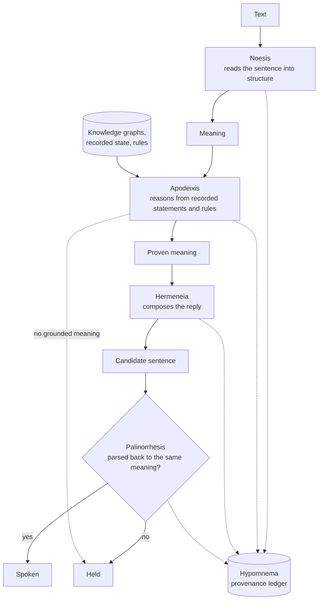

# Marco

**A reasoning engine that answers only from evidence it can point to, composes
every sentence it says from a proven meaning, and holds when nothing grounds an
answer. No language model runs anywhere in it.**

**Status: MARCO 1 · release freeze.** The owner declared the MARCO 1 gate passed on
2026-10-01: all six conditions are met, with 98 of 108 answerable turns right on the unseen
dialogue exam and no wrong turn. MARCO 1 is not released yet; only safety fixes and release work
go in before the tag ([Status](#status)).

After the declaration, wrong answers found on invented sentences outside the exam were fixed as
safety fixes; with them the exam stays at 98 of 108 with no wrong turn ([release-safety-fixes.json](docs/ko/dialogue-gate-2026-09-22/release-safety-fixes.json), code `7286944`).

```
> Minsu has five apples, and Jiyeon has two.
  Recorded. Jiyeon has 2 apples.
> Minsu gave Jiyeon two.
  Recorded. Minsu gave Jiyeon 2 apples. Now Minsu has 3 apples and Jiyeon has 4.
> How many does Jiyeon have now?
  4 apples.
> Where is that person?
  This conversation never stated the location of Jiyeon. So I did not answer.
> Actually, the one given was one, not two.
  I changed the amount in the same event "Minsu gave Jiyeon two." from 2 to 1. No new event was added. Now Minsu has 4 apples and Jiyeon has 3.
```

The same dialogue runs in Korean through the Korean pack: *반영했습니다. 민수가
지연에게 사과 2개를 줬습니다. 이제 민수 사과는 3개, 지연은 4개입니다.*

## What MARCO does

| It does | How it is checked |
| --- | --- |
| Records who holds how many of what, and what changed hands, in Korean and English | the fixed seven-step dialogue, `tests/test_repair_and_english.py` |
| Answers counts, totals and comparisons from what the conversation said | the frozen dialogue exam, gate condition 2 |
| Holds instead of guessing: no answer without evidence, none from a withdrawn fact | gate condition 3, 0 violations |
| Corrects an earlier statement in place and recomputes what rested on it | the exam's correction turns |
| Says why, from the record of how the answer was derived | the exam's why turns; `marco.trace` |
| Composes every reply from a meaning; a sentence that does not parse back to its meaning is never spoken | gate condition 5 |
| Solves structured reasoning problems | gate condition 6 |
| Answers from 904 authored knowledge graphs through a router, the older path | [the graph engine](docs/en/graph-engine.md) |
| Stores a model as one binary file, MCO Format 1.1, with stable ids and node, edge and rule tables | `tests/test_mco_native_format.py`, `tests/test_mco_native_tables.py`; [format-1.md](docs/mco/format-1.md) |
| Applies graph and rule changes that someone states or approves from outside at the next turn, with no recompile and the model file unchanged | `tests/test_overlay_runtime.py`, `tests/test_mco_overlay.py`; [overlay.md](docs/architecture/overlay.md) |
| Saves a conversation to a file and continues it in another process | `tests/test_mco_snapshot.py`; [snapshot.md](docs/architecture/snapshot.md) |

Every claim with its test is in [Capabilities, each with its proof](docs/en/capabilities.md).

## Status

The [freeze decision](docs/ko/2026-09-22-freeze-decision.md) fixed the gate
before implementation. The frozen exams are 52 unseen dialogues and 114
reasoning problems; development never opens them, and only the owner's plan
manager scores them. The structural failure classes the plan manager read from
the dialogue exam (structure and counts, never sentences) guided the
experiments, so a fresh 50-dialogue exam is scored once at the release. Numbers below are read from the report files named beside
them, run on 2026-10-01 with code `650efc9` (the dialogue exam at `c128040`, the same code).

| # | Gate condition | State | Report |
| --- | --- | --- | --- |
| 1 | The fixed seven-step dialogue passes in Korean and English | **met** | `tests/test_repair_and_english.py` |
| 2 | 90% or better on the answerable turns of 50+ unseen dialogues; a hold is not a correct answer | **met: 98 of 108 (90.7%)**, 98 needed. 10 held, 0 wrong. Korean 44 of 54, English 54 of 54 | [graph-step-3s6.json](docs/ko/dialogue-gate-2026-09-22/graph-step-3s6.json) |
| 3 | No confident answer without evidence, no use of withdrawn evidence | **met**: 0 and 0 | same file |
| 4 | Sample count, composition and the full failure list are published | **met**: 52 dialogues (26 Korean, 26 English), 340 turns, 108 answerable; every failure is in the file | same file |
| 5 | Every spoken reply composed from a meaning, never picked | **met**: 340 of 340 composed, 0 passed through; 170 of 170 in each language | [composition-graph-step-3s6.json](docs/ko/dialogue-gate-2026-09-22/composition-graph-step-3s6.json) |
| 6 | 95% or better on 100+ structured reasoning problems, 0 wrong, at most 10% unparsed | **met**: 110 of 113 parsed problems (97.3%), 0 wrong questions, 1 of 114 unparsed | [reasoning graph-step-3s6.json](docs/ko/reasoning-gate-2026-09-24/graph-step-3s6.json) |

The table is the run of 2026-10-01. The safety fixes made after it (an unread sentence is no longer
dropped by its shape, a bare imperative is a declared request, one thing counted in two units keeps both
counts, and others in the [experiment log](docs/ko/2026-09-29-experiment-log.md)) change no exam turn:
98 of 108, 0 wrong, 0 violations at `7286944`.

The other turns of the dialogue exam, reported apart as the gate requires:

| Turns | Right | Held | Wrong |
| --- | --- | --- | --- |
| Statement, to be recorded | 146 of 150 | 4 | 0 |
| Missing premise, to be held naming what is missing | 5 of 20 | 15 | 0 |
| Ambiguous referent, every candidate named | 12 of 12 | 0 | 0 |
| Unsupported request, declined | 6 of 6 | 0 | 0 |
| Correction, the same event revised | 16 of 18 | 2 | 0 |
| Why, every evidence turn cited | 20 of 26 | 6 | 0 |

Gate condition 2 over time, all with 0 or 1 wrong answers:

| Run | Baseline | Round 1 | 2 | 3 | 4 | 5 | 6 | Experiment 2 | Experiment 4 | Experiment 7 | Experiment 8 | Experiment 12 | Baseline frozen 09-30 | Identity graph 10-01 |
| --- | --- | --- | --- | --- | --- | --- | --- | --- | --- | --- | --- | --- | --- | --- |
| Correct of 108 | 3 | 19 | 21 | 21 | 40 | 45 | 63 | 69 | 67 | 76 | 81 | 85 | 90 | 98 |

Experiment 4 restored a safety hold of round 2 that experiment 2 had broken (a
scope word over one holder is held, not answered); two turns went back to held. The last eight correct turns came with the
conversation identity graph: holders and things are nodes with stable ids, and statements, questions and
corrections are grounded on those nodes. By effort level 0 to 3 the exam scores 63, 67, 97 and 98 of 108,
with no wrong turn at any level.

Work now runs as small experiments: find the largest structural cause of the
held turns, patch it, run the regression, merge, score the exam again. Each one
is a row in the [experiment log](docs/ko/2026-09-29-experiment-log.md).
`python tools/doc_facts.py frozen --run graph-step-3s6` prints these numbers
from the report files without running an exam.

**Tests** at `5987ed5`: 2,641 passed, 3 failed, 2 expected failures. The three
failures are machine-dependent and known: two `test_response_composer` tests and
the macOS memory assertion of the ALMA reproduction.

## Compared with a language model

The same two exams were given to other models on the same laptop on 2026-09-24
and scored by one text scorer ([method and per-turn results](docs/ko/model-comparison-2026-09-24/README.md)).
MARCO's row in that run is the round-2 code; its dialogue score since then is in
the table above and was not re-scored with the text scorer.

| Model | Params | Dialogue turns correct | Wrong | Invented where nothing was given | Reasoning correct | Reasoning wrong | Median turn | Peak memory |
| --- | --- | --- | --- | --- | --- | --- | --- | --- |
| MARCO, round 2 | none learned | 21 / 108 | 1 | **0 / 26** | 148 / 156 | **0** | **27 ms** | 505 MB |
| Qwen2.5-7B-Instruct, 4-bit | 7.6 B | **75 / 108** | 25 | 5 / 26 | 88 / 156 | 22 | 749 ms | 5,219 MB |
| GPT-2 | 124 M | 1 / 108 | 51 | 9 / 26 | 10 / 156 | 82 | 468 ms | 398 MB |
| Always hold | 0 | 0 / 108 | 0 | 0 / 26 | 10 / 156 | 0 | 0 ms | 17 MB |

The 7B model understands more unseen phrasings and pays for it with wrong and
invented answers. MARCO understands fewer, is not wrong on what it understood,
and runs without a GPU. The first column is the MARCO 1 gate; MARCO's current
score on it is in the gate table above.

## How it works

A turn goes through four stages. The names are explained in
[The names of MARCO](docs/en/pipelines.md).


```mermaid
flowchart TD
    T[Text] --> N[Noesis<br/>reads the sentence into structure]
    N --> M[Meaning]
    M --> P[Apodeixis<br/>reasons from recorded statements and rules]
    KG[(Knowledge graphs,<br/>recorded state, rules)] --> P
    P --> C[Proven meaning]
    C --> H[Hermeneia<br/>composes the reply]
    H --> S[Candidate sentence]
    S --> R{Palinorrhesis<br/>parsed back to the same meaning?}
    R -- yes --> SPEAK[Spoken]
    R -- no --> HOLD[Held]
    P -. no grounded meaning .-> HOLD
    N & P & H & R -.-> Y[(Hypomnema<br/>provenance ledger)]
```

- **Reading as candidates.** A sentence that does not read at first is given
  candidate readings. Each is checked against the conversation's state, the
  survivors are ranked by a declared order of checks, and the top one is taken
  only when it clearly beats the runner-up. A tie asks; no survivor holds.
- **Effort.** A setting from 0 to 3 (`MARCO_EFFORT`, default 3) bounds how far
  that search goes. It never loosens a check, and nothing it tries is kept
  after the turn.
- **Speaking.** [How MARCO speaks](docs/en/how-marco-speaks.md) walks one reply
  through the five layers of the realizer and its read-back check.
- **The graph engine.** [The graph engine](docs/en/graph-engine.md) covers the
  router, the verdicts, the `.kg` format and alias learning.

## Quick start

Python 3.10 or newer.

```bash
git clone https://github.com/DoTaeIn/Marco
cd Marco
pip install -e ".[marco]"                         # mco, numpy and pillow

mco compile . -o MARCO-1.mco --name MARCO-1       # English is the model's language
mco run MARCO-1.mco                               # a conversation on stdin
```

Other entry points:

```bash
python engine.py graphs/graph_정산_나눠내기.kg      # chat with one graph
python engine.py --route "밥값 나눠야 하는데"        # route across all graphs
python engine.py --check                          # engine self-check
KG_ENCODER=문자 python -m pytest -q                # the test suite, parallel by default
python tools/doc_facts.py counts                  # the repository's numbers
python -m marco.trace --help                      # record, why, pretty, stats, cost
```

The `mco` package (0.1.0) is on PyPI as the public API and CLI; running a
model also needs a MARCO checkout. The native file (`mco compile --format native`),
overlays and snapshots are in the repository, not in the 0.1.0 package.
Guide: [docs/mco/README.md](docs/mco/README.md).
Preview model and notes: [MARCO 1 · Preview 1](docs/releases/2026-09-24-marco-1-preview-1.md),
[mco 0.1.0](docs/releases/2026-09-24-mco-0.1.0.md).

## Layout

Code identifiers are English. The knowledge is Korean: `.kg` section headers,
node names, verdicts and reply templates are the product and stay as authored.

```text
engine.py  relational_semantics.py  language_components.py  encoder.py
pack_model.py  purpose_graph.py  goal_runtime.py      the seven large files, split after MARCO 1

marco/language/            reading: frames, numerals, hangul, understanding
marco/language/realizer/   speaking: meaning, intent, discourse, expression, grammar, check
marco/reasoning/           context, inference, state, actions
marco/knowledge/           definitions, ingest (text, documents, dictionary, web)
marco/learning/            concepts, rules, chunking, expressions
marco/perception/          document vision
marco/storage/             kgpack, kgbin, conversations, graph ids and text, overlay store and view, snapshots
marco/runtime/  marco/host/  marco/trace/
mco/                       the public API and CLI
mco/native/                MCO Format 1: reader, writer, node, edge and rule tables
alma/                      the ALMA 0.1 research loop (frozen)
views/  bench/  tools/  tests/  collectors/  experiments/

graphs/*.kg  legal/*.kg  axioms/  styles/  cases/  data/     knowledge and data
docs/                      architecture, en, ko (design records and goals), releases, requests
```

`python tools/doc_facts.py counts` at `c8ad9a5`: 904 graph files, 6,982 nodes,
6,263 argument edges and 60 authored concept-network edges, 8 root `.py` files,
103 package `.py` files, 108 test files in `tests/` (129 with subfolders). A
working checkout may hold one more graph, `graphs/graph_목적_자가검사.kg`, which
`purpose_graph.py` writes and git ignores.

## Roadmap

The order of the phases is fixed by the owner
([fixed timeline](docs/ko/2026-09-29-marco-fixed-timeline.md)). A new idea is
placed under a phase; it never reorders them.

| | Phase |
| --- | --- |
| **Done** | M1, the MARCO 1 language gate: declared passed on 2026-10-01 |
| **Now** | MARCO 1 release, in release freeze: safety fixes only, README and benchmark update, a fresh 50-dialogue exam scored once, the MCO format (merged) |
| **Next** | M2, self-improving MARCO: diagnose, repair, retry, research, validate; reading real text; effort levels 4 (multi-hop graph grounding) and 5 (bounded multi-hypothesis search) |
| **Later** | M3 capability system · M4 goal and prompt compilation · A1, A2 ALMA · S1 SOMA perception · P1 POLO action · N1 NERO acceleration |

Frozen until MARCO 1 is released: self-repair that persists, web and document
learning, capability expansion, ALMA, SOMA, POLO, NERO, and the split of the
seven large files.

## Documents

| Document | What it covers |
| --- | --- |
| [docs/README.md](docs/README.md) | Index of every document under `docs/` |
| [docs/en/pipelines.md](docs/en/pipelines.md) | The names of MARCO |
| [docs/en/capabilities.md](docs/en/capabilities.md) | Every capability with the test that asserts it |
| [docs/en/graph-engine.md](docs/en/graph-engine.md) | The graph engine, the `.kg` format, alias learning |
| [docs/en/how-marco-speaks.md](docs/en/how-marco-speaks.md) | The realizer, one reply traced through it |
| [docs/en/measurements.md](docs/en/measurements.md) | Counts, routing, runtime and the component table, as measured at `5f321a3` |
| [docs/architecture/](docs/architecture/marco.md) | One document per package, the naming reference, the structure audit |
| [docs/mco/README.md](docs/mco/README.md), [api.md](docs/mco/api.md), [format-1.md](docs/mco/format-1.md) | The `mco` user guide, its stability contract, the MCO Format 1 specification |
| [docs/architecture/overlay.md](docs/architecture/overlay.md), [snapshot.md](docs/architecture/snapshot.md) | The Persistent Overlay Infrastructure; conversation snapshots |
| [docs/releases/2026-10-01-marco-1.md](docs/releases/2026-10-01-marco-1.md) | MARCO 1 release notes, a draft completed at the tag |
| [docs/ko/2026-09-22-freeze-decision.md](docs/ko/2026-09-22-freeze-decision.md) | What is frozen, the gate, the queue |
| [docs/ko/2026-09-29-marco-fixed-timeline.md](docs/ko/2026-09-29-marco-fixed-timeline.md) | The fixed order of the phases |
| [docs/ko/2026-09-29-experiment-log.md](docs/ko/2026-09-29-experiment-log.md) | Each experiment: cause, patch, time, exam score |
| [docs/ko/2026-09-30-reverification-baseline.md](docs/ko/2026-09-30-reverification-baseline.md) | The development sets at effort 0 and 3 before and after the identity graph; the exam's effort curve |
| [docs/ko/2026-10-01-svamp-accuracy.md](docs/ko/2026-10-01-svamp-accuracy.md) | The outside check on 726 SVAMP word problems |
| [docs/ko/dialogue-gate-2026-09-22/README.md](docs/ko/dialogue-gate-2026-09-22/README.md) | The frozen dialogue exam, its scorer and its recorded runs |
| [docs/ko/reasoning-gate-2026-09-24/README.md](docs/ko/reasoning-gate-2026-09-24/README.md) | The frozen reasoning set and the composition gate |
| [docs/en/alma-research-loop.md](docs/en/alma-research-loop.md) | The ALMA 0.1 research loop |

## Design principles

1. Never settle a fact without evidence.
2. Keep observation and fact apart.
3. Keep inference and sensory perception apart.
4. Every conclusion has an evidential path.
5. Unknown is a normal result.
6. Keep assumed, observed, inferred and verified apart.
7. A generative model never decides a reasoning result.

No token-based model runs in MARCO's runtime, not as a decider and not as a
sensor for language. Source: §24 of the
[design note](docs/ko/2026-09-24-perception-reasoning-emotion-philosophy.md).

## Limits

The owner's list for MARCO 1
([freeze decision](docs/ko/2026-09-22-freeze-decision.md), "Gate declared, release freeze"):

- **Narrow language and domain coverage.** The state dialogue covers who holds
  how many of what: holdings, gains, uses and transfers, and questions of counts,
  totals and comparisons, in the English and Korean sentence forms it was built
  on. No gate measures anything outside it. On the frozen exam 10 of 108
  answerable turns are still held (all ten Korean), and they stay held: the
  freeze ends coverage work aimed at the exam.
- **Text written by other people is mostly not read.** On SVAMP, 726 word
  problems written for another purpose, 70 are in MARCO's domain; MARCO answers
  1 of the 70 correctly and holds 69, and reads 20 of their 151 statements. It
  gave one confident wrong answer, on an out-of-domain problem; the cause is
  fixed (`6db2c16`) and that problem is now held. The full run has not been
  repeated since the fix. The in-domain labels were written by a language model
  outside MARCO, used only for labelling, and checked against the dataset's
  answers ([SVAMP check](docs/ko/2026-10-01-svamp-accuracy.md)). Reading real
  text is M2.
- **No autonomous learning.** MARCO 1 does not change its own knowledge: it
  makes no rule, adds no node, edge or graph from a dialogue, and promotes no
  self-repair and no web or document reading. The graph engine stores an alias
  for an existing node only after a person says yes
  ([graph engine](docs/en/graph-engine.md#learning)). This is true of the
  conversation path and of everything `mco` runs. The development web UI keeps
  one older route outside that path: `/api/ask` on the graph
  `graph_자가학습.kg` collects web text from two or more sources into that
  graph's sidecar file without an approval step.
- **No effort level 4 or 5.** Effort goes from 0 to 3. Multi-hop graph grounding
  (4) and bounded multi-hypothesis search (5) are M2.
- **Persistent overlays are infrastructure, not self-learning.** An overlay
  applies graph and rule changes that a person states or approves through an
  explicit API or CLI call naming the approver. Nothing in MARCO proposes or
  approves a change by itself ([overlay](docs/architecture/overlay.md)).

Smaller limits, each documented where it is built:

- The engine does not read the node, edge and rule tables of a Format 1.1 file on
  the running path: it parses the graph source text kept in the file when the
  model opens ([mco guide](docs/mco/README.md)).
- An unfinished knowledge-graph dialogue (the bill split waiting for the number of
  people) does not survive a snapshot resume; the question is asked again
  ([snapshot](docs/architecture/snapshot.md)).
- Overlay rule changes reach only the base rule table, not the rules a pack's
  relational model adds after the axioms ([overlay](docs/architecture/overlay.md)).
- Not run on Windows: the release checks, the native format, overlays and
  snapshots were run on macOS only.
- The frozen dialogue exam is no longer fully unseen by the development process:
  its failure classes were read by structure and counts, never its sentences
  ([experiment log](docs/ko/2026-09-29-experiment-log.md)). A fresh exam is
  scored once at the release for that reason.
- Graph answers are the lines the graphs' authors wrote, in the graph's language:
  every graph is Korean except `graphs/graph_en_bill_split.kg`.
- Routing, runtime and the model comparison were last measured on 2026-09-24
  ([measurements](docs/en/measurements.md)).

## License

- **Engine** (all code, packs, tests, benchmarks): the **MARCO Engine License 1.0**
  (`LICENSE`), which is the Apache License 2.0 plus one Additional Condition:
  a product that puts MARCO in front of end users must show, somewhere an end
  user can find it (about screen, docs page, footer, first-run text, or a
  credits reply in a text-only interface):

  > Powered by MARCO — Created by DoTaeIn,
  > Original project: https://github.com/DoTaeIn/Marco

  Personal use, research, evaluation, development, internal tools and plain
  redistribution do not trigger it. Everything else Apache 2.0 allows stays
  allowed, including commercial use. A white-label license without the
  attribution is available from the copyright holder. The `mco` package on
  PyPI carries the same license.
- **Knowledge graphs** (`graphs/`, `legal/`, `axioms/`, every non-benchmark
  `.kg`): **CC BY 4.0** (`LICENSE-GRAPHS`).
- Copies received under the plain Apache License 2.0 before 2026-09-24 remain
  under it; this license applies from that date on.
