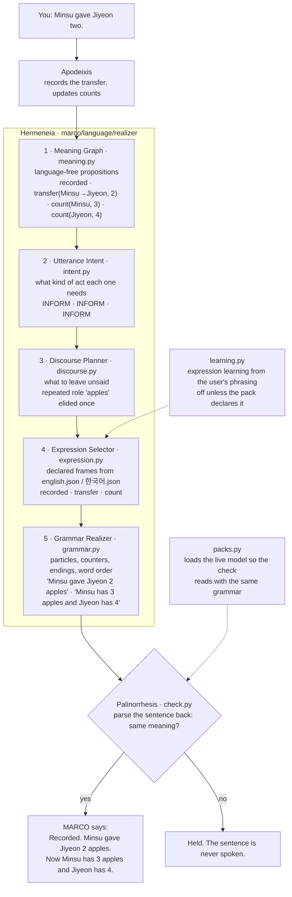

# How MARCO speaks: Hermeneia and Palinorrhesis

> Moved out of the root README on 2026-09-29, unchanged. Numbers and `engine.py` line
> numbers are as measured at `5f321a3` unless a line says otherwise; the root README
> carries the current gate numbers.

MARCO never picks a reply of the state dialogue from a list. Apodeixis produces
a language-free meaning; **Hermeneia**, the language realization pipeline, turns
it into a candidate sentence through five layers under
`marco/language/realizer/`; **Palinorrhesis**, the contract to speak only after
semantic return, reads the candidate back with the pack's own parser and holds
it if the meaning changed. That read-back is **Palintrosemia**, the semantic
round trip: five independent readers check numbers, negation, quotations, the
clause said in full, and ellipsis. None of the layers can add a fact, and a
meaning with no plan, or a clause that fails the round trip, has no path to
speech: **Aporrhemia**, structural abstention. The whole contract, and why it
needed names of its own, is in [The names of MARCO](pipelines.md#palinorrhesis-speak-only-after-semantic-return).
The trace below is the real one for the turn *Minsu gave Jiyeon two.*, read
from the realizer's report at `5f321a3` (`marco.language.realizer.last_report()`).

The same meaning is said in Korean from the same plan, with the Korean pack's
particles, counters and endings: *반영했습니다. 민수가 지연에게 사과 2개를
줬습니다. 이제 민수 사과는 3개, 지연은 4개입니다.*

What the pipeline changed, same engine, realizer off and on (the right column
reproduced at `5f321a3`):

| You | Template before | Composed now |
| --- | --- | --- |
| Minsu gave Jiyeon two. | Recorded in this conversation: Minsu apples 5 → 3, Jiyeon apples 2 → 4. | Recorded. Minsu gave Jiyeon 2 apples. Now Minsu has 3 apples and Jiyeon has 4. |
| How many does Jiyeon have now? | 4. | 4 apples. |
| Actually, the one given was one, not two. | I corrected the same event (no new event added): "Minsu gave Jiyeon two.", amount 2 → 1. Recomputed state: Minsu apples 5 → 4, Jiyeon apples 2 → 3. | I changed the amount in the same event "Minsu gave Jiyeon two." from 2 to 1. No new event was added. Now Minsu has 4 apples and Jiyeon has 3. |

The correction row is Doxolysis, retraction that propagates, in small: the
earlier amount is withdrawn, not overwritten, and the counts that rested on it
are recomputed. Each layer's contract and tests:
[docs/architecture/marco.language.realizer.md](../architecture/marco.language.realizer.md)
and `marco/language/W1-report.md`. Proofs are in the capabilities table above.
