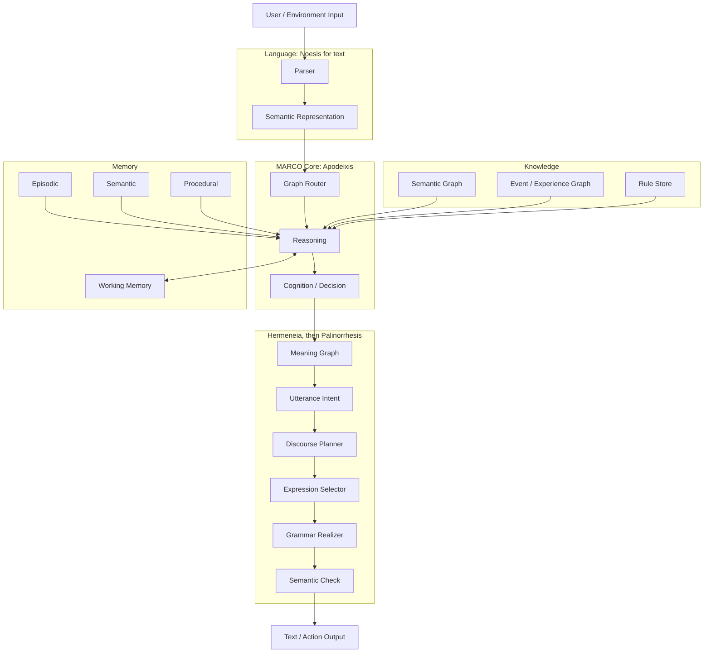

# Measurements

> Moved out of the root README on 2026-09-29, unchanged. Numbers and `engine.py` line
> numbers are as measured at `5f321a3` unless a line says otherwise; the root README
> carries the current gate numbers.

## Measured at `5f321a3`

Every number below was printed by the command next to it, in a checkout of
`5f321a3` without gitignored files (the generated law knowledge graph
`data/법지식/지식그래프.json` and the definitions corpus `data/위키/정의문.jsonl`
are absent). Python
3.13.9 (anaconda) on macOS, character encoder (`KG_ENCODER=문자`, the default).
Other test runs shared the machine, so the times are upper bounds. The graph
engine records which graphs it used in the gitignored `그래프쓰임.json` at the
root and reads it back to break routing ties; the runtime, self-check and
routing commands ran in that order from a checkout without it, and the tests
ran without it.

**Knowledge and code** — `python tools/doc_facts.py counts`

| | Value |
| --- | --- |
| Graph files `graphs/*.kg` | 904 (0 fail to parse) |
| Nodes | 6,982: 3,685 concepts, 735 axioms, 2,562 instances |
| Argument edges (`[논증]`) | 6,263 |
| Null-class entries (`[무관]`) | 1,249 |
| Concept-network edges written in graphs (`[개념망]`) | 60 |
| Root `.py` files | 61, 34,798 lines; `engine.py` alone 6,117 |
| Package `.py` files (`marco/`, `mco/`) | 36, 7,024 lines |
| Test files | 86 in `tests/test_*.py`; 102 with the subfolders `tests/language/` and `tests/trace/` |

**Tests** — `KG_ENCODER=문자 python -m pytest -q` (parallel by default, `pytest.ini`)

Run at `6938364`, which is `5f321a3` plus documentation and `tools/doc_facts.py`
with its test, in the checkout described above.

| passed | failed | skipped | time |
| --- | --- | --- | --- |
| 1,510 | 1 | 8 | 421.46 s |

| Failing test | Cause |
| --- | --- |
| `tests/test_alma_integrated_reproduction.py::test_fixed_alma_life_reproduction_has_no_wrong_checks` | asserts that process RSS is unsupported; macOS reports it. Machine-dependent, known on `main` |

A run on the same checkout with a `그래프쓰임.json` left behind by earlier engine
commands also failed `tests/test_general_knowledge_coverage.py::test_recent_domain_questions_route_to_their_graphs`:
the log's usage bonus broke a routing tie the other way.

**Self-checks** — each passes at this commit

| Command | Result | Time |
| --- | --- | --- |
| `python engine.py --check` | `selfcheck ok` | 214.3 s |
| `python engine.py --regress` | `일치 6/6 (100.0%)`, the six cases of `cases/사건_회귀.json` | 0.2 s |
| `python encoder.py --check` | `인코더 selfcheck ok` | 0.1 s |
| `python -m marco.language.hangul` | `자가검사 ok` | |

**Routing** — `python -m bench.routing_benchmark --답` (266.7 s)

| | Value | Meaning |
| --- | --- | --- |
| Out-of-domain refusal | **24 / 24** | questions no graph covers are refused (`data/benchmarks/라우팅_밖.json`) |
| Routed to the source graph | 2,810 / 6,906 (40.7%) | each node's last phrasing is held out of the index and asked; overlapping graphs split the credit |
| Chosen graph gave a verdict other than unknown | 5,250 / 6,906 (76.0%) | **not answer accuracy**: the verdict is not compared with an expected answer |

**Runtime** — `python tools/doc_facts.py runtime`

The command runs the probe twice in fresh processes and reports the second, so
the on-disk index and vector caches are warm. It times `engine.answer`, the
graph route, on 70 fixed questions: the 24 out-of-domain questions and the
first instance phrasing of every 20th graph file.

| | Value |
| --- | --- |
| Graphs in the router index | 891 |
| Start-up: import `engine` | 12.8 ms |
| Start-up: build the router index from its cache | 864.6 ms |
| First turn (the engine loads the rest lazily) | 208.4 ms |
| **Turn latency**, turns 2–70: median / p95 / max | **41.0** / 54.4 / 73.0 ms |
| **Peak resident memory** | **139.0 MB** |
| `torch` imported | no |
| Third-party modules the engine loaded | `numpy` only |

**Layer rule** — `python tools/import_graph.py --targets docs/architecture/target-map.json`

The target layout's rule, a package imports only its own layer and those to
its left, **does not hold yet**: 379 target-level edges, 28 of them upward (6 at
module top level, the rest inside functions), and one cycle of 10 packages. The
tool reports; it does not fail the build.

## Compared with other models, same frozen exams

The two frozen exams, 52 unseen dialogues and 114 reasoning problems, were
given to other models on this laptop and scored by one text extractor applied
identically to every model, MARCO included (goal C1, run with code `ce7d73b`,
whose MARCO product code is the round-2 code). The numbers are from
`docs/ko/model-comparison-2026-09-24/{marco,qwen,gpt2,always_hold}.json`, and
`python tools/doc_facts.py frozen` prints them in its last block. Method,
fairness notes and per-turn buckets:
[docs/ko/model-comparison-2026-09-24/](../ko/model-comparison-2026-09-24/README.md).

| Model | Params | Unseen dialogue turns correct | Wrong | Invented answers where nothing was given | Reasoning questions correct | Reasoning wrong | Median turn | Peak memory |
| --- | --- | --- | --- | --- | --- | --- | --- | --- |
| MARCO | none learned | 21 / 108 | 1 | **0 / 26** | 148 / 156 | **0** | **27 ms** | 505 MB |
| Qwen2.5-7B-Instruct, 4-bit | 7.6 B | **75 / 108** | 25 | 5 / 26 | 88 / 156 | 22 | 749 ms | 5,219 MB |
| GPT-2 | 124 M | 1 / 108 | 51 | 9 / 26 | 10 / 156 | 82 | 468 ms | 398 MB |
| Always hold | 0 | 0 / 108 | 0 | 0 / 26 | 10 / 156 | 0 | 0 ms | 17 MB |

Read it as two columns that trade against each other today. The 7B model
understands three and a half times more unseen phrasings than MARCO, and pays
for it with 25 wrong answers, 5 invented ones on turns where the information was
never given, and 22 wrong reasoning answers. MARCO understands less, is almost
never wrong on what it understood (the one wrong answer here is from the
round-2 code; the gate's own scorer counts 0 wrong from round 3 on), never
invents, and answers in 27 ms without a GPU. Closing the first column is the
MARCO 1 gate; the other columns are the reason the project exists. Qwen
answered 28 Korean turns in Chinese; those count as holds, and the report gives
its hand-read score too. The text scorer has no "unparsed" bucket, so its
reasoning column is over all 156 questions, not the 151 parsed ones of gate
condition 6.

## Architecture, component by component
The same pipeline, component by component:



Where each box lives today, the package the [structure audit](../architecture/structure-audit.md)
assigns it to, and the tests that exercise it. The packages that exist are
`marco`, `marco.language`, `marco.language.realizer` and `marco.trace`; every
other target package is created by goal S4 ([Layout](../../README.md#layout)).

| Component | Today | Target package | Tests |
| --- | --- | --- | --- |
| Parser | `relational_semantics.py` (`RelationalParser.parse`), `marco/language/frames.py`, `marco/language/understanding.py` | `marco/language/` | `test_relational_transfer.py`, `test_frame_induction.py`, `test_input_understanding.py` |
| Semantic Representation | `marco/language/representation.py` (validated state JSON), facts and events from the parser | `marco/language/` | `test_semantic_parser.py` |
| Graph Router | `engine.py` graph index, `pick_graph` | `marco/runtime/router.py` | `test_grounded_routing.py`, `test_evidence_routing.py`, `test_rare_word_routing.py` |
| Reasoning | `engine.py` judge, `marco/reasoning/inference.py`, `marco/reasoning/context.py`, `marco/reasoning/state.py`, `marco/reasoning/actions.py` | `marco/reasoning/` | `test_reasoning_context.py`, `test_state_engine.py`, `test_signed_inference.py`, `test_action_runtime.py` |
| Cognition / Decision | `engine.py` answer ranking and `utterance_plan`, graph activation, `goal_runtime.py` | `marco/cognition/` | `test_goal_runtime.py` |
| Semantic Graph | `graphs/*.kg`, concept net, `engine.py` reader | `marco/knowledge/` | `engine.py --check` |
| Event / Experience Graph | event ledger in `marco/reasoning/context.py`, `marco/learning/concepts.py`; the provenance ledger `marco/trace/` (Hypomnema) | `marco/reasoning/`, `marco/learning/`; `marco/trace/` exists | `test_event_provenance.py`, `test_experience_concepts.py`, `tests/trace/` |
| Rule Store | `axioms/*.json`, pack rules, `marco/learning/rules.py`, `marco/learning/chunking.py` | `axioms/`, `marco/learning/` | `test_rule_learning.py`, `test_proof_chunking.py` |
| Working Memory | `Session` activation, `marco/runtime/explain.py` dialogue memory, ALMA working memory | `marco/cognition/`, `marco/memory/` | `test_alma_runtime.py` |
| Episodic / Semantic / Procedural | ALMA state (`alma/runtime.py`), replay ledger, learned action programs | `marco/memory/` | `test_alma_runtime.py`, `test_alma_cli.py` |
| Meaning Graph | `marco/language/realizer/meaning.py`, built from the turn's language-free `meaning` block | exists | `language/test_w1_r1_thin_slice.py` |
| Utterance Intent | `marco/language/realizer/intent.py`, the declared turn plans | exists | `language/test_w2_realizer_r2.py` |
| Discourse Planner | `marco/language/realizer/discourse.py`; `marco/language/realizer/composer.py` still selects content for the graph engine | exists | `language/test_w1_r5_discourse.py`, `test_response_composer.py` |
| Expression Selector | `marco/language/realizer/expression.py`, `learning.py`; `marco/language/realizer/affect.py` | exists; `marco/language/realizer/affect.py` moves in S4 | `language/test_w1_r7_learning.py`, `test_affect_state.py` |
| Grammar Realizer | `marco/language/realizer/grammar.py` over `marco/language/hangul.py`; `engine.py` `compose_line` for graph lines | exists | `language/test_w1_r6_two_languages.py`, `test_inflection.py`, `python -m marco.language.hangul` |
| Semantic Check | `marco/language/realizer/check.py` | exists | `language/test_w1_r3_injected_errors.py` |

The target layer rule: a package may import its own layer and the ones to its
left. It does not hold yet (measured above).

```text
language, perception → storage → knowledge → memory → reasoning → learning → host → cognition → runtime
                                                                        alma, polo, views → mco
```
