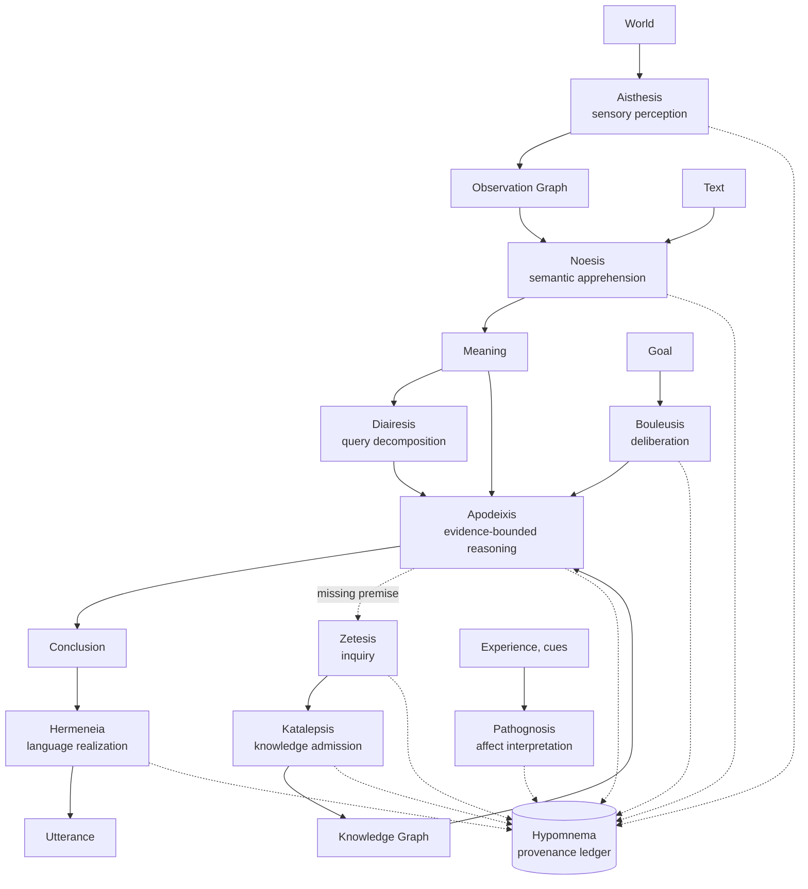
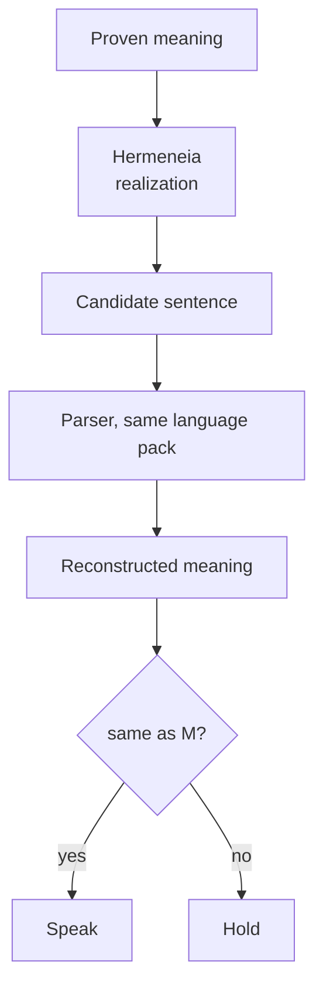

# The names of MARCO: ten pipelines and six structural concepts

*2026-09-24. Two reference documents fix these names:
[pipeline-names.md](../architecture/pipeline-names.md) for the processes and
[structural-concepts.md](../architecture/structural-concepts.md) for the
properties that emerge from how those processes are constrained. This article
explains both to a reader, and says for each name what exists in the
repository today and what is only planned.*

MARCO is not one path from a question to an answer. It is a family of
processes that sense, understand, divide, prove, deliberate, search, admit,
speak, feel by inference, and remember why. Each of those processes now has a
name of its own. The second half of this article names something else: not
what the processes do, but the rules that bind them together, such as the rule
that a sentence may not leave the system until it has been read back into the
meaning it came from. Those rules are where MARCO differs most from a model
that generates text, and they were the hardest things to talk about before
they had names. The names are Greek, chosen from the vocabulary of classical
philosophy, and they name the process, not the file that implements it today.
A module can move to a new package, a class can disappear in a refactor, and
the name stays. That is the whole point of naming them.

The ten names, in one table:

| Name | What it does | In plain words |
| --- | --- | --- |
| **Aisthesis** | sensory perception (SOMA) | raw signal to measurable observations |
| **Noesis** | semantic apprehension | observations or text to meaning: entities, relations, events |
| **Diairesis** | query decomposition | one utterance to its several explicit questions |
| **Apodeixis** | evidence-bounded reasoning | premises, evidence and rules to a justified conclusion |
| **Bouleusis** | deliberation | a goal to possible actions and subgoals |
| **Zetesis** | inquiry | a knowledge gap to evidence found |
| **Katalepsis** | knowledge admission | a candidate to accepted knowledge, or not |
| **Hermeneia** | language realization | meaning to a sentence a person can read |
| **Hypomnema** | provenance ledger | the record of events, causes, evidence and reasoning |
| **Pathognosis** | affect interpretation | events and cues to an affect hypothesis |

Reading rule: the first time a name appears in a paper or a document, give it
with its plain description, "Apodeixis, MARCO's evidence-bounded reasoning
pipeline". After that, the name alone.

## The core chain

Four of the ten form the spine of the system. The world enters through
Aisthesis, becomes intelligible through Noesis, is justified through
Apodeixis, and is expressed through Hermeneia. Everything epistemically
important along the way is written into Hypomnema.

Two loops hang off the spine. When Apodeixis finds that a premise it needs is
not known, Zetesis goes looking, and whatever it brings back must pass
Katalepsis before it counts as knowledge. When something has to be done rather
than concluded, Bouleusis decides what to attempt, and its observations feed
back into Apodeixis. Pathognosis stands to the side: it derives affect from
what happened, and never injects it.

## Where each pipeline stands today

Status words used below: **built** means it runs on `main` and has a measured
number; **partly** means a first version exists but the named pipeline is
larger; **planned** means a design and a date in the roadmap, no code. The
dates come from [the freeze decision](../ko/2026-09-22-freeze-decision.md) and
[the roadmap after MARCO 1](../ko/2026-09-24-roadmap-after-marco1.md).

### Aisthesis, sensory perception

*Greek αἴσθησις: sensation, perception.*

Aisthesis is the pipeline of SOMA, the body of the MARCO family. It turns raw
signals into observations that can be reproduced: pixels into edges, regions,
tracked entities and spatial relations; a waveform into energy, onsets and
acoustic segments; sensor values into measurements and state changes. Its
output goes into an Observation Graph and carries its source, time,
confidence, the operator that produced it, and its uncertainty.

The narrow definition is deliberate. Aisthesis does not "understand the
world". It records what can be observed, and nothing it records is yet a fact.

**Today: partly.** The repository has document perception for charts and
tables from images, objects, pose, and a vision-language hypothesis path, each
proven by its own test. The full SOMA pipeline, non-neural blocks-and-hand
vision into an Observation Graph, is scheduled for the weeks after MARCO 1
passes its gate.

### Noesis, semantic apprehension

*Greek νόησις: apprehension by the intellect.*

Noesis makes meaning out of what Aisthesis observed or out of the characters
and clauses of a sentence. From an observation that entity 17 moved from A to
B it may form the hypothesis that entity 17 is a ball, or that the movement
was a transfer. From a sentence it builds the same kind of structure: who
holds what, how many, what changed hands. Text is one input among others; the
internal language of the system is the graph, not the sentence.

**Today: built, and the weakest link.** The parsing side of the engine is
Noesis for text: frame induction, language components, relational semantics,
the state engine. Four understanding rounds have worked on it. On the frozen
52-dialogue exam it answers 21 of 108 answerable questions, with 0 wrong, and
records 82 of 150 statements. Almost every miss is a statement it did not
read, which then blocks every later question. Round 4, running now, builds its
development data from natural adult language instead of templates because
that is what the exam turned out to be.

### Diairesis, query decomposition

*Greek διαίρεσις: division.*

A person often asks several things at once: what TCP is, what UDP is, and how
they differ. Diairesis divides one utterance into the explicit questions the
person asked, so each can be answered in order. It only divides; it never adds
a question the person did not ask. That is the line between Diairesis and
Bouleusis, and it matters for traceability: user goals and system-made goals
must never become indistinguishable.

**Today: planned.** Multi-query is one parser class queued for understanding
round 5. Every question is still answered one at a time.

### Apodeixis, evidence-bounded reasoning

*Greek ἀπόδειξις: demonstration, proof.*

This is the central pipeline. Apodeixis takes premises, retrieves evidence,
applies rules, checks alternatives and contradictions, and produces a
conclusion that can be traced to its parents. It keeps observed, reported,
hypothesized, inferred, verified, contradicted, withdrawn and unknown apart,
and it would rather say unknown than guess. MARCO does not merely output a
conclusion; it performs Apodeixis over explicit evidence, and every important
conclusion has a reconstructible evidential path.

**Today: built.** The reasoning context carries the state of a conversation
through its transitions and verifies each answer; Horn inference runs over
the graphs; the engine judges candidate answers against a threshold. On the
frozen reasoning exam it gets 148 of 151 parsed questions right with 0 wrong.
On the frozen dialogues it gives 0 confident answers without evidence and
uses retracted evidence 0 times. Those two zeros are the gate condition that
Apodeixis exists to meet.

### Bouleusis, deliberation

*Greek βούλευσις: deliberation, counsel.*

Apodeixis asks what follows from what is known. Bouleusis asks what should be
attempted next: the requirements of a goal, the possible actions and
subgoals, their preconditions, and a choice. Any subgoal the system makes for
itself is labelled as generated, with its parent goal and its reason, so it
can always be told apart from what the person asked for.

**Today: partly, and frozen.** The goal runtime executes a fixed set of
registered tools, each approved once by a person. Re-planning, tool making
and a general planner are frozen until MARCO 1 ships. Declared deliberation
budgets, low, medium and high, measured against accuracy on the reasoning
exam, are in the roadmap for the weeks after the gate.

### Zetesis, inquiry

*Greek ζήτησις: inquiry, search.*

Zetesis starts where Apodeixis or Bouleusis stops for lack of a premise. It
turns the gap into a research need, seeks evidence, and returns a candidate
with its provenance. It never writes into trusted knowledge itself.

**Today: partly.** Approved web research is answered locally: a person
approves a source, and the answer from it is kept. The self-driven
knowledge-gap loop, where a missing premise itself triggers the search, is a
later stage of the roadmap.

### Katalepsis, knowledge admission

*Greek κατάληψις: a grasp secure enough to count as knowledge.*

Katalepsis is the door between "I found something" and "MARCO now uses this".
A candidate is checked against its source, against what is already known,
and against the rules and policies, and where required a person approves it.
Only then does it enter the knowledge graph or its overlay. This is the
mechanism behind MARCO's refusal to turn retrieved text into truth on its own.

**Today: built, in three narrow doors.** The engine learns on its own exactly
one thing, that a phrase denotes an existing node, and only after asking the
person and getting a yes. Approved web sources become facts. ALMA adds graph
assets a person approved. The proposal tools print candidates and decide
nothing. No node, edge or graph is ever created by the engine alone.

### Hermeneia, language realization

*Greek ἑρμηνεία: interpretation, expression.*

Hermeneia turns an established meaning into a sentence: meaning, then the
intent of the utterance, then discourse planning, expression choice, and
grammar. The principle is that meaning and language are different things.
Hermeneia expresses what Apodeixis established and never invents content to
make a sentence sound better. Its descriptive name, the language realization
pipeline, stays in the technical documents.

Hermeneia is only the outward half of how MARCO speaks. What it produces is a
candidate, not yet an utterance. The candidate is parsed back into meaning
with the same language pack and compared with the meaning it came from; only a
sentence that returns unchanged is spoken, and one that does not is held. That
whole contract has its own name, Palinorrhesis, and is described in the second
half of this article with its two parts, Palintrosemia and Aporrhemia. The
earlier habit of calling all of this "the realizer" understated it, which is
why the structural names were added.

**Today: built.** The realizer in `marco/language/realizer/` has the five
realization layers above plus the check layer, one language pack each for
English and Korean, and three rounds of work behind it. On the frozen
dialogues every spoken reply, 340 of 340, is composed from a meaning; none is
picked from a list. The owner reads a 40-reply fluency sample after each round.

### Hypomnema, the provenance ledger

*Greek ὑπόμνημα: a record, a written reminder.*

Hypomnema is the second graph of the system. The knowledge graph records what
MARCO knows; Hypomnema records how it came to know or conclude it. It is an
append-only ledger of epistemically important events: source, observation,
interpretation, reasoning, decision, mutation, output. Each event has an id,
belongs to a trace, and names its parents, so the whole is a directed acyclic
graph. A correction is a new event that supersedes an old one, never an edit.
The storage may be JSONL today and SQLite or the native container tomorrow;
the concept does not change. Its design sentence: MARCO should never have to
say "I don't know why I thought that."

**Today: built, from the outside.** The package `marco/trace/` declares the
event kinds and epistemic statuses, writes the ledger, walks the why chain
back from any answer, prints a human projection, and produces failure
statistics that feed the next understanding round. Recording is off by
default and costs a quarter of a millisecond per turn when on. It currently
records each turn from the engine's result; emitting events from inside the
engine, at the twenty sites already listed, is the next step.

### Pathognosis, affect interpretation

*Built from pathos, affect, and gnosis, knowledge.*

Pathognosis is ALMA's way of feeling by inference. For ALMA's own state, an
event is related to its goals, expectations, control and preferences, appraised,
and only then does an affect state and an emotion concept follow. For another
person, observed cues, context and the person's own report produce an affect
hypothesis with its evidence and confidence. It never collapses that
hypothesis into a fact. An emotion state is not an emotion word, and affect is
derived, not injected.

**Today: partly.** An affect state colours how the realizer chooses
expressions, with its own test. The layered pipeline, primitives to appraisal
to concept, is scheduled for the weeks after the gate, and affect in other
people some weeks after that.

## Six structural concepts

The pipeline names say what each process does. The names below say how the
processes are constrained to interact. They are proposed as MARCO's own
terminology for these properties, not as claims that the underlying ideas are
new to the world: semantic round-tripping and belief revision both have prior
work. What the names pick out is the specific contract MARCO enforces, and
each one can be pointed at in the code and measured on the frozen exams.

### Noematic Sovereignty, the principle

Meaning holds epistemic authority; the sentence does not. Evidence, state and
rules establish a meaning, and the sentence is only a checked projection of
it. A generated sentence is never treated as a fact because MARCO uttered it.
This is not a pipeline but the rule the other five serve.

**Today: built as a rule.** Every result the engine returns carries a
language-free meaning block, the reply is composed from that block, and the
frozen exams are scored on semantic expectations, not on strings.

### Palinorrhesis, speak only after semantic return

*From palin, again, and rhesis, utterance.*

The umbrella contract: a candidate utterance is not trusted because the
realizer produced it. It must survive reconstruction into meaning before it
can leave the system. Palinorrhesis uses Palintrosemia to enforce Aporrhemia.

**Today: built.** Every reply on the frozen dialogues goes through this path,
and the composition gate records that 0 replies pass through it unchecked.

### Palintrosemia, the semantic round trip

*From palin, again, and sema, sign or meaning.*

The mechanism inside Palinorrhesis: the sentence as it would be said is parsed
back and compared with the original meaning. The point is not that the grammar
can parse its own output; it is that the comparison gates the answer path.
Swapped roles, changed quantities, dropped negation, changed ownership, a
missing relation, a wrong referent: each is a difference between the two
meanings and each blocks the sentence.

**Today: built.** The check layer of the realizer runs five independent
readers on every clause, all from the language pack and none from the
expression that produced the clause: the numbers must be exactly the
proposition's numbers, the negation marker must appear exactly when the
proposition is negative, every quoted span must be a value the proposition
quotes, the clause said in full must parse back to the same roles, and an
elliptical clause must be the full clause with pieces removed and nothing
added. A clause that fails any reader is never emitted.

### Aporrhemia, structural abstention

*From rhema, what is said, with the privative a-: no utterance.*

Most systems abstain by generating an answer, estimating a confidence, and
refusing below a threshold. Aporrhemia is different in kind: when no grounded
meaning exists, there is no valid answer state and therefore no realization
path at all. Unsupported content does not reach speech because the route is
missing, not because a score was low.

**Today: built.** The reasoning side has no verdict that asserts without
evidence: the judge's outcomes are accept, ask back, no evidence given,
evidence does not reach, positively irrelevant, and unknown. On the language
side a meaning with no plan, or a clause that fails the round trip, becomes a
hold rather than a sentence. On the frozen dialogues this gives 0 confident
answers without evidence, the gate condition it exists to meet.

### Doxolysis, retraction that propagates

*From doxa, belief, and lysis, dissolution.*

A correction is not an overwrite. When evidence is withdrawn, the conclusion
that rested on it loses its support, and so does anything derived from that
conclusion; the history stays, with the old evidence marked withdrawn. This
applies to corrected facts, withdrawn evidence, revised beliefs, superseded
mental states and invalidated proofs.

**Today: built for dialogue corrections, growing.** A correction in a
conversation withdraws the earlier evidence, and an answer that would rest on
it is unreachable; on the frozen dialogues retracted evidence is used 0 times.
The provenance ledger writes each correction as a superseding event plus a
withdrawal of the old conclusion, never an edit; on the fixed seven-step
dialogue its correction turn produces three supersessions and three
withdrawals. Following the dissolution down longer chains of derived
conclusions is what the ledger's why chain will make checkable once the engine
emits its events from inside.

### Polykrisis, judged competition among graphs

*From poly, many, and krisis, judgement.*

Many independently authored knowledge graphs can each try a question.
Retrieval by lexical or structural fit only nominates candidates; what decides
among them is the grounded outcome each can actually produce. The winner need
not be the graph with the highest retrieval score. This name still needs a
prior-use check before it is treated as canonical, because it is closer to an
existing classical formation than the others.

**Today: partly.** The router nominates candidate graphs by character
coverage, a reply counts only when its verdict is grounded, and the multi-graph
route runs a question through several graphs and keeps each one's trace. The
explicit compare-by-grounded-outcome step, with the losing candidates and the
reason recorded, is what the ledger's routing events add.

## Who owns what

| System | Pipelines |
| --- | --- |
| **SOMA** | Aisthesis |
| **MARCO** | Noesis, Diairesis, Apodeixis, Zetesis, Katalepsis, Hermeneia; and the six structural concepts, which constrain them |
| **ALMA** | Pathognosis, memory-linked appraisal, personal state |
| **POLO** | Bouleusis, the permission and execution boundary of actions |
| **shared** | Hypomnema |
| **NERO** | no pipeline of its own: the compute layer that executes what Apodeixis defines, on CPU or GPU, without changing a proof |

These are conceptual boundaries. They do not dictate the package layout, which
the structure audit plans separately.

## How the names are used

In writing, prefer the name to the mechanism: "MARCO performs Apodeixis over
explicit premises and evidence" rather than "MARCO runs its reasoning
function"; "candidate knowledge must pass Katalepsis" rather than "MARCO
learns it"; "the history is retained in Hypomnema" rather than "we save
logs". In code the names belong at boundaries, in a module docstring or a
comment such as "Aisthesis emits observations, never verified world facts",
not in function names. Descriptive names live alongside them: the language
realization pipeline is Hermeneia; the sensory observation pipeline is
Aisthesis.

For the structural concepts, a paper can say it in one paragraph: MARCO
separates epistemic state from surface language under Noematic Sovereignty;
candidate utterances pass through Palinorrhesis, in which Palintrosemia
reconstructs their semantics before release; if no grounded semantic state
can produce an admissible utterance, Aporrhemia forces abstention; corrections
are handled through Doxolysis, which withdraws dependent conclusions rather
than overwriting the latest state; and candidate knowledge graphs undergo
Polykrisis, where retrieval nominates and grounded execution decides. A naming
claim is not a novelty claim: saying that MARCO calls its mechanism
Palinorrhesis is not saying that MARCO was first to build one.

Four more names are reserved and not yet assigned: **Anamnesis** for memory
reconstruction and recall, **Metabole** for explicit state transition,
**Metanoia** for belief and self revision, and **Orexis** for motivation and
desire, which may one day sit beneath Pathognosis.

## In one breath

Aisthesis observes. Noesis apprehends. Apodeixis demonstrates. Bouleusis
deliberates. Zetesis investigates. Katalepsis admits. Hermeneia speaks.
Pathognosis feels by inference. Hypomnema remembers why.

And the rules that hold them: meaning is sovereign; speech must return to
meaning; unsupported speech has no path; retracted evidence dissolves its
consequences.
