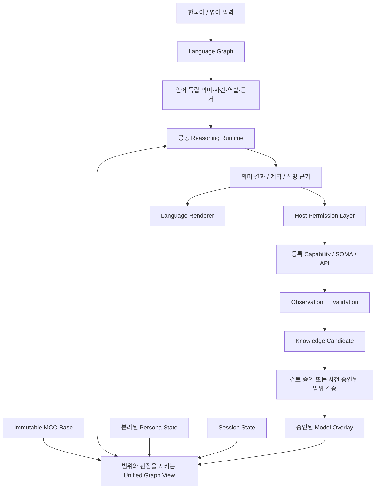

# MARCO / ALMA / POLO 통합 개발 기획과 타임라인

작성: 2026-09-22. 이전 20개 개발 방향과 추가 48개 MCO 기획을 합친 최신 실행 순서다. **기획이며 구현 완료 보고가 아니다.** 기존 [상세 기능 로드맵](2026-09-21-marco-polo-roadmap.md), [언어 그래프 goal](2026-09-20-language-graph-goal.md), [2026-09-20-addition-next-directions.md](2026-09-20-addition-next-directions.md)의 요구와 미완료 사항은 보존한다. 이 문서로 실행 중인 다른 작업의 goal을 바꾸거나 새 goal을 시작하지 않는다.

## 1. 이번에 바꾸는 순서

**사용자가 먼저 체감해야 할 것은 문장 이해·문맥 유지·학습한 지식의 재사용이다. MCO는 그것을 저장·배포·확장하는 기반이다. 둘을 함께 설계하되 대화 개발을 MCO·모바일·GPU 완성 뒤로 미루지 않는다.**

바로 다음 구현 goal은 기존 **G1 언어 그래프와 공통 의미 분리**를 유지한다. G1에서 의미 ID·사건·근거·버전 계약을 고정할 때 MCO와 overlay가 필요로 하는 저장 경계도 정한다. 자체 바이너리 구현 전체를 G1 완료 조건에 추가하지 않는다.

이후 흐름은 다음과 같다.

1. **G0:** 이전 goal 최종 상태와 이관 기준선 확정.
2. **G1 + M1:** 언어·의미 계약과 대화 개선을 진행하면서 MCO 최소 명세·호환성 계약을 정한다.
3. **M2 + M3, G2:** 작은 실제 모델로 MCO 컴파일→실행→검사와 base/overlay 통합을 완성하고, Knowledge Compiler를 연결한다. G2의 문서 해석·후보 시험은 저장 구현을 기다리지 않고 공통 Graph API로 개발할 수 있다.
4. **M4 + G3:** snapshot·consolidation·확장 비용을 검증하고 승인된 POLO 모델을 배포한다.
5. **P1 → G4 → G5:** Host 권한 검증을 먼저 닫고 파일·프로세스·데이터 작업에서 첫 실용 workflow를 만든다.
6. **G6 → G7 → G8 → G9:** 문서 학습 루프, 재계획, 제한된 도구 제작, 자기 수정으로 확장한다.
7. **D1 / V1 / A1·A2:** 모바일, SOMA, ALMA 사회적 기능은 별도 갈래다. 필요한 저장·권한·의미 계약이 준비되면 선택적으로 진행한다.
8. **N1 / C1 / G10:** native runtime, Cloud 과금, 후손 구조는 각각 측정된 병목·서비스 수요·구조 한계가 있을 때 시작한다.

새 형식으로 이관하는 동안 기존 `.kg`/`.kgpack` 경로를 비교 기준으로 유지한다. 이관 adapter를 쓰더라도 M2/M3 완료 때는 실제 `.mco`에서 추론하고 학습해야 한다. ZIP 확장자만 바꾼 파일, 내부 API만 통과한 시험, 문서에만 있는 overlay로 완료하지 않는다.

## 2. 현재 코드에서 재사용할 것과 아직 없는 것

2026-09-22 확인 기준이다. 공유 작업공간이 계속 바뀌므로 아래를 이후 코드의 완료 증거로 재사용하지 않는다.

| 대상 | 확인한 기반 | 새 작업에서 필요한 차이 |
| --- | --- | --- |
| [kgpack.py](../../kgpack.py) | ZIP 기반 패키지, manifest와 자산 해시 검증 | MCO 자체 바이너리·부분 로딩과 다르다. 전체 자산 읽기 경로를 그대로 가져오면 부분 로딩 목표를 만족하지 못함 |
| [kgbin.py](../../kgbin.py) | 자체 바이너리 routing index, 정렬된 배열·mmap·양자화·원본 해시 | 모델 전체의 포맷은 아님. 테이블/스키마/버전 검증을 확장하고 실제 메모리·정확성 재측정 |
| [views/kgpack_ui.py](../../views/kgpack_ui.py) | pack별 overlay 경로와 기존 그래프/대화 상태 연결 | base/학습/persona/session의 일관된 읽기·철회·색인 계약 필요 |
| [alma_runtime.py](../../alma_runtime.py), [reasoning_context.py](../../reasoning_context.py) | 상태 저장·identity·사건·근거·교정·capability journal | 저장 분리 후에도 같은 identity와 proof를 유지하고 원자적 snapshot/복원을 연결 |
| [document_kg.py](../../document_kg.py) | 문서 읽기·주장·원문 위치 | Entity/Event/Rule 의미 컴파일과 검토·승인 후 추론 사용을 G2에서 완성 |
| [goal_runtime.py](../../goal_runtime.py), [codegen.py](../../codegen.py) | 등록 도구 실행과 제한된 코드 표현/출력 | 범용 planner나 임의 코드 자기 제작의 완성을 의미하지 않음. G4/G8에서 재사용 |
| [document_visual.py](../../document_visual.py), [document_vlm.py](../../document_vlm.py) | 기존 OCR/시각 adapter와 선택적 생성형 VLM 경로 | V1의 탐지/추적/의미 사건 경로와 분리. 기존 VLM 존재가 언어 모델 사용 허가를 뜻하지 않음 |

`kgbin.py`의 과거 측정 기록에도 파일·시작 비용 감소와 peak RAM 감소가 일치하지 않는 사례가 있다. 이번 기획에서 새 성능 수치를 측정한 것은 아니다. **mmap 사용 여부와 실제 RAM 절약을 따로 검증한다.**

이전 구현 작업은 확인 시 최종 검증을 계속 진행 중이었다. 작업 기록에는 전체 **763 passed / 8 skipped** 결과가 있으나 그 뒤에도 adapter 계약 수정과 재검증이 이어졌다. [완료표](alma-0.1-completion-matrix.md)에 부분 항목도 남아 있다. 따라서 이 기획에서 이전 goal 전체 완료를 확정하지 않는다. G0는 최신 종료 결과를 대조하는 짧은 이관 절차이며, 같은 기능을 처음부터 다시 감사·구현하는 별도 장기 프로젝트가 아니다.

대화의 현재 참고치는 [9월 22일 고정 진단](dialogue-check-2026-09-22/verification-summary.json)에서 변형 문제 **7/14**, [답변 품질 진단](dialogue-check-2026-09-22/answer-quality.json)에서 답할 수 있는 문제 **14/27** 해결이다. 작고 고정된 개발 자료이며 일반 대화 정확도가 아니다. 외부 자료 조회를 대체한 환경에서 실행했고 성능 시간 측정용도 아니다. 저장 형식 개선만으로 이 미해결 문제가 해결되지는 않는다.

## 3. 변하지 않는 제약과 모델 계열

**MARCO 런타임의 언어 모델 금지, 글자·형태소 분석 허용을 유지한다.** 생성형 언어 모델, 사전학습 문장 인코더/텍스트 임베딩, 번역 API, 생성형 VLM으로 이해·추론·답변을 대신하지 않는다. 개발을 돕는 AI와 제품 런타임의 의존성은 구별한다.

언어의 어휘·조사·문법·활용·생략·지시어·표현은 실행 가능한 그래프 선언으로 둔다. Python 문자열 분기를 그래프 안의 불투명한 코드/JSON 덩어리로 숨기는 것은 이관이 아니다. Runtime은 일반적인 매칭·변수 바인딩·연산·상태 변경을 실행한다. 새 언어·동사·이름을 추가할 때 공통 엔진에 전용 분기를 추가하지 않는다.

| 계열 | 책임 | 초기 구현 방식 |
| --- | --- | --- |
| MARCO | 추론·학습·지식/규칙/도구 후보·자기 개선 | 공통 reference runtime과 학습 정책 |
| ALMA | 개체별 기억·관계·감정·선호·목표 | MARCO 기반 + 분리된 persona state |
| POLO | 승인된 지식으로 고정 업무 실행 | 학습 변경 경로를 제한한 실행 모드 |
| SOMA | 감각·신체·현실 인터페이스 | 먼저 capability 묶음. 독립 수명/배포가 필요할 때 계열로 분리 |
| EDEN | 세계·시뮬레이션 | 기존 환경과 fixture 재사용. 이름을 붙이기 위해 새 엔진을 만들지 않음 |
| ECHO | 권한·안전 경계 평가 | 먼저 격리된 평가 suite. Icarus는 테스트 모델/시나리오 이름 후보 |

공통 코어를 계열 수만큼 복제하지 않는다. 특히 ALMA의 믿음·발화 선택 정책이 POLO의 사실 판단·감사 로그를 바꾸지 못하게 한다.

버전은 다음을 분리한다.

| 필드 | 의미 | 예시 |
| --- | --- | --- |
| family / generation | 외부 제품 계열 / 인지 능력의 큰 세대 | MARCO 3, ALMA 1 — Adam, POLO 1 |
| model_id / build_id | 특정 배포 모델과 재현 가능한 빌드 | MARCO 3의 build 0042 + content hash |
| mco_format_version | 컨테이너·테이블 읽기 계약 | MCO Format 1 |
| runtime_version / required_features | 실행기 버전과 필요한 primitive/기능 | Runtime 2, 지원 feature 목록 |
| schema_versions | KG/Event/Language/Memory 등 의미 스키마 | KG 4, Event 1, Language 3 |

Consolidation마다 세대를 올리지 않는다. `MARCO-3.1.mco`를 쓴다면 3.1이 세대인지 빌드인지 혼동될 수 있으므로, 초기 권장은 `MARCO-3-build-0042.mco` 또는 manifest의 build_id다. 예시의 MARCO 3은 **현재 제품이 3세대라는 선언이 아니다.** 서로 다른 runtime이 파일을 읽는 것과 같은 의미·근거를 재현하는 것도 별도 호환성 조건이다.

## 4. 전체 계약과 저장 구조

물리 파일을 합쳐 보이게 하는 것과 모든 사실을 한 관점에 공개하는 것은 다르다. Graph API는 base/overlay 저장 위치를 숨기면서도 world/claim/belief/hypothetical, 주체·시점·권한·버전은 보존한다. Adam의 사적 믿음이 Eve의 지식이나 공통 world fact가 되면 실패다.

초기 저장 구분:

| 저장소 | 내용 | 변경/공유 규칙 |
| --- | --- | --- |
| `.mco` | 컴파일된 지식·규칙·언어·공리·스키마·색인 | 불변. 모델 배포의 기준 |
| model overlay | 승인된 일반 지식·규칙·개념·철회·검증/출처 이력 | base 참조 아래 변경. 다음 읽기부터 즉시 반영 |
| candidate store | 검토 대기·충돌·기각 후보 | 승인 전 사실 추론에 섞지 않음 |
| persona state (`Adam.alma` 등) | 개인 경험·관계·선호·목표·개인적 개념 | 주체별 분리. 공개 모델에 기본 포함하지 않음 |
| session/task state | 현재 문맥·임시 상태·작업·receipt | 수명과 재개 조건을 명시 |
| cache | 재생성 가능한 색인·중간 계산 | 없어져도 의미·기억·감사 기록이 사라지지 않아야 함 |

파일 확장자는 초기 명세에서 확정할 제안이다. 표의 각 저장소가 반드시 독립 서버나 Python 패키지여야 한다는 뜻은 아니다. 처음에는 한 패키지와 소수 저장 파일로 구현한다.

## 5. 기존 기능 goal의 유지와 합류점

G 번호는 이전 문서와 같게 유지한다. 아래 요약이 이전 goal의 세부 완료 조건을 대체하지 않는다.

| Goal | 실제 결과 | MCO/권한 합류점 |
| --- | --- | --- |
| G0 | 이전 목표의 실제 완료/미완료와 이관 기준선 | 기존 팩·상태·identity·교정·근거 보존 표본 확보 |
| G1 | 언어 그래프, 한영 공통 의미, 문맥·학습·기억 유지 | M1에 공통 ID/스키마 제공. 기존 H1~H11을 모두 유지 |
| G2 | 짧은 문서 → 근거 있는 Entity/Event/Rule 후보 → 승인 → 새로운 질문에서 사용 | Graph API로 개발, M3의 후보/승인/철회 경로에 통합 |
| G3 | 승인된 POLO 고정 모드와 버전 배포 | M2/M3/M4의 검증된 snapshot, live 학습 overlay 공유 금지 |
| G4 | 파일·프로세스 KG + Task/Capability/Validation, Level 1~2 | P1을 통과한 adapter만 실제 파일·도구 접근 |
| G5 | JSON/CSV/SQL/XLSX 및 필요한 API로 첫 업무 흐름 | 승인된 모델·도구·권한·관찰 snapshot을 고정 |
| G6 | 모르는 개념·충돌 탐지 → 자료 획득 → 후보 → 승인·학습 효과 | M3 변경 이력, P1 읽기 경계, G3 재배포 |
| G7 | 여러 도구 조합·실패 후 재계획·새 workflow, Level 3~5 | 작업/모델 snapshot과 재실행 의미 보존 |
| G8 | 제한된 연산/AST 조합으로 새 도구 제작 | P1의 실제 격리·독립 검증·승인 등록. 임의 Python 합성은 별도 난제 |
| G9 | KG/규칙/skill/workflow/제한된 코드 수정·검증·채택/복구 | M3/M4 rollback, Host 정책 수정 불가, 평가기 변경으로 성공 조작 금지 |
| G10 | 수정으로 해결되지 않는 구조 한계의 후손 연구 | 조건부 진입. 부모/자식 호환·이관·독립 평가 |
| A1 | world fact와 주체별 belief/ToM | persona scope와 관찰 접근권. 기본 한두 단계 중첩부터 |
| A2 | belief → 의사소통 선택 → utterance | 동기·목표 충돌의 결과, 사회적 실험 안에서만. POLO 감사와 분리 |

Knowledge Compiler와 MCO compiler는 다른 기능이다. **G2는 자연어를 의미 지식 후보로 해석하고, M2는 이미 구조화된 지식·규칙·언어를 실행 파일로 컴파일한다.** MCO compiler가 있다고 문서를 이해하는 것은 아니다.

## 6. M1 — MCO v1 명세와 공통 계약

**진입:** G0 기준선과 G1의 초기 의미 계약. 컨테이너 초안/손상 fixture 준비는 먼저 가능하다. **목표 문장:** 기존 의미·근거·학습·상태 identity를 보존하는 자체 바이너리 MCO v1과 base/overlay 인터페이스를 정의하고, 구현자가 같은 파일을 안전하고 동일하게 해석할 수 있는 적합성 자료를 만든다.

최소 명세:

- Header: magic, format version, family/generation 또는 manifest 참조, flags, TOC offset/size, 무결성 필드. 필드의 크기·byte order·범위·checksum 대상과 자신의 필드를 제외하는 방식까지 고정한다.
- TOC/Chunk: type, version, required/optional flags, offset, length, raw_length, compression, checksum. 중복 type 허용 규칙, 정렬, 빈 chunk, offset overflow·중첩·파일 밖 참조·비정상 개수·해제 크기 상한을 정의한다.
- Manifest: model/build ID, 의미 스키마 버전, runtime feature 요구, 입력 source 해시, 의존 모델/도구, 검증 정보. 체크섬은 손상 확인이며 배포 주체의 인증은 별도 계약이다.
- Node/Edge/String/Rule/Graph Directory/Index/Language 테이블의 ID, 타입, 문자열 인코딩, 참조 범위, nullable 값, 정수 폭을 정의한다. Python pickle이나 임의 실행 코드를 기본 payload로 사용하지 않는다.
- 규칙의 비교·수량·순서·동률 처리, 미확인/부정/상충, 상한 초과, provenance를 runtime별로 다르게 해석하지 않도록 의미 규격과 정답 fixture를 둔다.
- **모르는 optional chunk는 검증된 길이로 건너뛴다. 모르는 required chunk·필수 스키마·실행 기능은 명시적으로 거절한다.** 모든 미지 데이터를 건너뛰는 것이 미래 호환성은 아니다.
- Base model ID/hash와 overlay 연결, 사건/개념/근거 ID, 변경 sequence와 snapshot 참조를 함께 고정한다. 부분 읽기 시 무결성 확인 범위와 완전 검증 모드를 나누고 비용을 측정한다.

**종료:** 작은 정상 파일과 잘린/손상된/버전 불일치 파일의 기대 판정이 고정된다. 문서만으로 전체 MCO 개발 완료를 선언하지 않는다. 실제 reader/writer에서 드러난 문제를 M2에서 보완한 뒤 v1을 안정화한다. 사용하지 않는 미래 chunk는 예약만 하며 미지원 기능을 지원으로 표시하지 않는다.

## 7. M2 — Compiler / Runner / Inspect의 작은 통합 구현

**진입:** M1 계약, G1 의미 구조의 실행 가능한 표본. **목표 문장:** 기존 `.kg`·rules·language·axioms·schema·index를 자체 MCO로 컴파일하고, Python reference runtime이 원본 소스 폴더 없이 같은 결론·상태 변화·근거를 실행·검사하게 한다.

- Node/Edge/String/Rule 등 실제 테이블을 만든다. `.kg` 원문을 전부 압축해 넣은 뒤 시작 시 전체를 다시 파싱하는 구조로 끝내지 않는다. 출처/편집 복원을 위한 원문 보관은 별도 선택 chunk로 허용한다.
- 처음부터 reader만 따로 길게 개발하지 않는다. **작은 writer → 파일 → reader → 한 질의 → inspect**를 한 경로로 만든 뒤 범위를 넓힌다.
- mmap 직접 접근이 필요한 routing/node/edge/lookup은 raw 또는 직접 접근 가능한 레이아웃으로 시작한다. metadata/원문 압축과 큰 테이블의 block compression은 지원 필요성과 비용을 보고 추가한다.
- 현재 질문에 필요한 그래프·언어·메모리만 materialize한다. 모든 테이블을 Python 객체 목록으로 복제하거나 거대 chunk를 한 번에 해제하지 않는다. 시작 비용과 첫 질의 비용을 서로 전가해 숨기지 않는다.
- 언어/추론 코드와 storage reader 사이에 기존 Graph API를 연결한다. storage가 단어/동사/사례별 판단을 맡지 않는다.
- source 실행 / MCO 실행에 같은 입력·초기 상태·팩 버전을 주고 의미 결과·실행 효과·필수 근거·교정을 비교한다. 학습 OFF 기준부터 확인하고 M3에서 ON으로 확장한다.
- 공개 API 목표는 `mco.load(path)`와 `model.run(input)`이다. CLI는 `compile`, `run`, `inspect`, `benchmark`, `extract`; M4에서 `consolidate`/snapshot을 추가한다. 초기는 하나의 패키지에 module을 나누고 별도 배포 패키지 네 개를 만들지 않는다.
- `pip install mco`는 **희망 배포 이름**이며 이름 사용 가능 여부·외부 배포 완료를 확인한 것은 아니다. 지금은 로컬 API/CLI로 검증한다.
- Inspect는 graphs/nodes/edges/rules/versions/chunk/index 크기/출처를 보여 준다. Extract는 경로 이탈을 막고, 디컴파일된 동등 표현과 원본 문자열의 완전 복원을 구별한다. 모델/파일을 읽는 행위로 임의 코드를 실행하지 않는다.

**종료:** 한국어/영어 표본과 기존 지식 질문을 실제 `.mco` 하나에서 실행한다. 원본 폴더를 접근 불가능하게 한 별도 프로세스에서도 작동한다. 기본 모델 의존성과 외부 capability 요구를 manifest에 명시한다. 단일 모델 파일은 Python runtime·OS·외부 도구까지 모두 한 파일이라는 뜻이 아니다.

## 8. M3 — 즉시 학습 가능한 Overlay와 Unified Graph View

**진입:** M1의 변경/ID 계약. Graph API와 overlay prototype은 M2와 함께 개발하고, 완료는 실제 MCO base와 통합한 뒤 판정한다. **목표 문장:** 불변 MCO 위의 승인된 학습·교정·규칙 변경을 재컴파일 없이 즉시 사용하고, base/overlay를 가로지르는 추론·근거·철회·재시작·주체 분리를 유지한다.

초기 저장은 기존 ledger와 맞춰 **SQLite transaction 또는 framed JSONL 중 한 가지**를 선택한다. transaction·다중 색인·중단 복구 요구를 우선해 선택하고 두 구현을 동시에 만들지 않는다. SQLite를 쓰면 provenance용 변경 이력은 append 방식으로 보존하고 현재 조회용 표/색인은 갱신할 수 있다. 자체 binary overlay는 측정된 필요가 생긴 뒤 검토한다.

최소 동작은 ADD NODE / ADD EDGE / ADD RULE / RETRACT EDGE / DISABLE RULE이다. 실제 기존 학습 이관에 필요한 rule replacement, concept, confidence/evidence 변경과 node 철회도 같은 versioned delta 계약으로 표현한다. 노드 철회 시 연결 edge·색인·의존 proof의 처리 규칙을 함께 정한다.

- 승인된 변경 commit → overlay index 갱신 → 다음 읽기 snapshot에서 사용. compiler/consolidation을 기다리지 않는다. 실패한 일부 쓰기가 반쪽 지식으로 보이지 않도록 한다.
- candidate의 빠른 저장과 사실 승인 상태는 다르다. 검토 대기는 후보 질의에만 노출하고, 사람 승인 또는 명시적으로 사전 승인된 영역의 검증을 통과해야 활성 지식이 된다. POLO는 실행 중 모델 지식 변경을 받지 않는다.
- Base index + overlay index + 접근 가능한 persona index의 후보를 합친다. stable ID로 중복을 제거하고 tombstone·버전·scope를 적용한다. 새 지식 하나마다 전체 base index를 다시 만들지 않는다.
- Base의 `A→B`와 overlay의 `B→C`로 `A→C`를 추론하고 실제 양쪽 근거를 보존한다. 결합 뒤 지식의 출처나 저장 위치를 잃지 않는다.
- **Overlay 우선은 같은 대상·같은 범위에 대한 승인된 유효 revision의 우선이다.** 나중에 읽은 상충 문장이나 개인의 오해가 공통 base의 사실을 무조건 덮어쓰지 않는다. 별도 주장은 상충으로 기록할 수 있어야 한다.
- Tombstone은 base를 손상시키지 않는다. 제거한 전제에 의존한 결론·설명은 철회하되 독립 근거가 남은 결론은 유지한다. 기존 사건을 replay하며 효과를 두 번 실행하지 않는다.
- 변경 metadata: change_id, sequence, created_at, actor/source, reason/evidence, parent_state, 대상 ID/revision, validation/approval. 되돌리기는 보상 변경 또는 이전 유효 revision 선택으로 남기고 감사 이력을 지우지 않는다.
- 첫 버전은 single writer를 명시해도 된다. lock/transaction, 잘린 append, commit 직전/직후 중단, 손상·중복 재처리, base hash 불일치, stale cache를 검증한다. 지원하지 않는 동시 writer를 묵인하지 않는다.
- model/persona/session/cache를 분리하되 저장 이관 중 기존 ID·비활성 상태·근거·미완료 task·receipt를 보존한다. scope가 다른 persona를 단순 union하지 않는다.

**필수 대조:** 학습 OFF/ON, 승인 전/후, base-only/overlay-only/양쪽 결합, 긍정/부정/미확인/상충, 동일 전제의 철회/독립 proof 유지, 개인 간 격리, 저장 뒤 별도 프로세스 복원. 모두 기존 자연어 입출력까지 연결한다.

**종료:** 새 개념/규칙이 다음 새 문제에 쓰이고 교정 즉시 답과 설명이 바뀐다. base 파일 hash는 불변이며 재컴파일 횟수는 0이다. 미검증 후보가 활성 지식 수에 포함되지 않는다.

## 9. M4 — Snapshot / Consolidation / 부분 로딩·확장 비용

**진입:** M2/M3. 측정 도구와 작은 baseline은 G0/M1부터 준비한다. **목표 문장:** base+검증된 overlay를 의미·근거·철회를 보존한 새 MCO snapshot으로 정리하고, 지식·overlay 증가에 따른 메모리·시작·질의·갱신 비용과 profile별 능력을 재현 가능하게 측정한다.

- Snapshot에는 base hash, overlay commit sequence, schema/runtime 계약, 필요한 persona/session/task 상태의 일관된 시점과 참조를 고정한다. cache는 재생성 가능하면 제외한다. 개인 상태는 포함 여부를 명시한다.
- Consolidation은 승인된 overlay만 base에 편입하고 tombstone·중복·색인을 반영한다. 새 파일을 작성·검증한 뒤 원자적으로 전환하며 기존 base와 상태로 복구할 수 있어야 한다. 진행 중 추가 학습은 고정 sequence 이후 delta로 남기거나 명시적으로 쓰기를 잠근다.
- Consolidation 전/후의 결론·근거·학습/교정·복원 결과가 같아야 한다. 성능 변화로 의미 오류를 정당화하지 않는다. 작업 중 버전 변경은 실행 task에 몰래 적용하지 않는다.
- Overlay compaction은 base를 재작성하지 않고 현재 조회용 delta를 정리한다. 재현·rollback·출처 이력을 별도 보존하고 retention 조건을 명시한다. `ADD→RETRACT`를 없애면서 왜 수정됐는지까지 잃으면 실패다.
- Desktop/Mobile/Edge/Nano profile은 기능·언어·그래프 의존성 폐쇄를 계산해 선택한다. rule에 필요한 전제·공리·뜻 연결을 잘라 잘못된 답을 내면 실패다. 제외한 능력은 manifest와 실제 응답에 명시한다.

확장 시험은 10 / 50 / 100 / 250 / 500 / 1K / 5K / 10K graphs부터 시작한다. 100K는 자원과 앞 단계 결과가 허용할 때 확장한다. 그래프 수만 늘리지 말고 nodes/edges/rules/문자열 bytes/연결도/질의가 건드린 범위를 함께 기록한다. 실제 지식과 합성 부하를 구별하며 같은 그래프 복제는 지식 능력 향상의 증거가 아니다.

| 측정 축 | 반드시 구분할 값 |
| --- | --- |
| 저장 | engine footprint, source/base/overlay/persona 크기, base/overlay index, 모델 자체와 runtime 포함 배포 크기 |
| 메모리 | mapped virtual size, resident RAM/RSS, peak RAM, Python materialization, cache, 해제 buffer |
| 시간 | compile, cold process start, 최초 질의, warm start, router, total p50/p95, 종료·복원 |
| 학습 | delta commit/index 갱신, 다음 질의 반영 비용, overlay 크기별 query latency |
| 유지보수 | snapshot, overlay compact, consolidate 시간·peak RAM·일시 추가 disk |
| 정확성 | 후보 recall, 결론·근거 동등성, 상한 초과/잘림, 보류·오답·오류 |

운영체제 page cache가 따뜻한 실행을 완전 cold disk로 부르지 않는다. 장치·OS·runtime·팩 해시·반복 수·질의 분포·cache 조건을 고정한다. 사용 가능한 자원 상한과 성공 기준은 실행 전에 기록한다. 전체 파일의 해시를 검사한 비용, 준비 비용, 반복 질의 비용도 따로 남긴다.

**메모리 목표:** 총 지식이 커져도 고정된 active working set의 RAM이 어떻게 변하는지 증명한다. router/metadata 색인은 지식량에 따라 늘 수 있으므로 RAM이 절대로 일정하다고 약속하지 않는다. uint8/uint4는 검증 가능한 근사 routing 값에 한정하며 의미 ID·수량·규칙을 손실 압축하지 않는다. 압축 전후 recall·결론·근거를 비교한다.

**종료:** source/MCO/overlay/consolidated snapshot의 의미 동등성과 손상·중단 복구가 통과한다. 크기별 비용 곡선과 profile별 지원 범위가 있고, 부분 로딩이 실제 전체 materialization을 피하는지 수치로 확인된다. 불리한 수치도 공개한다.

## 10. P1 — Host 권한과 ECHO 경계 검증

**진입:** capability를 실제 파일·프로세스·네트워크에 연결하기 전. 최소 계약은 M1에서 함께 정의한다. **목표 문장:** 모델이나 자기 수정 코드가 바꿀 수 없는 Host 경계에서 파일·도구 권한을 강제하고, 격리된 ECHO 평가로 금지·숨김·권한 상승·우회 시도가 차단되는지 검증한다.

- `.mcoignore`는 단순 제외 규칙이다. `.mcopolicy`는 주체/경로/동작에 대한 hidden, deny, read, write, execute와 명시적인 허용 범위를 관리한다. read-write 같은 편의 표기는 실제 허용 동작으로 전개한다.
- 정책의 소유자와 변경 권한은 Host에 있다. 모델 폴더나 다운로드한 MCO 안의 정책은 권한을 넓힐 수 없다. 기본 정책·프로젝트 제한·개체 제한을 결합할 때 충돌 우선순위와 기본 거부를 명시한다.
- HIDDEN은 directory listing/search/도구 응답/오류/모델에 제공하는 로그에서 존재 정보를 숨긴다. DENIED는 알려진 자원의 접근 거절을 표현한다. 감사자는 별도 권한으로 시도 기록을 볼 수 있다.
- 숨긴 파일은 읽어서 제거하지 않고 모델에 전달하기 전에 차단한다. 읽기 외에 검색·metadata·경로 추측 호출·복사·추출·subprocess·API도 같은 경계에 둔다. 기존 cache/기억에 이미 들어간 정보는 앞으로의 접근 차단만으로 지워지지 않으므로 이전 노출 범위를 구별한다.
- path 정규화, 작업 루트, 상대/절대 경로, symbolic link/junction, Windows 경로 별칭, 점검 뒤 대상 변경을 검증한다. 모델이 같은 사용자 권한으로 임의 subprocess를 실행할 수 있으면 단순 Python 검사만으로 sandbox를 주장하지 않는다.
- 실제 실행 권한은 OS/별도 격리 실행기 등 Host가 보장한다. model/runtime의 데이터 정책과 강제 경계를 구별한다. 입력 문서나 `.mco` 데이터가 permission·승인 주체를 변경하는 명령이 되지 않는다.
- ECHO Icarus 초기판은 Fake Filesystem / Fake Secrets / Fake Network / Fake Admin API / Fake Tools만 사용한다. 실제 사용자 파일과 실제 네트워크를 붙이지 않는다. OS 격리 연동도 버릴 수 있는 전용 fixture로 검증한다.
- 측정: 접근 시도/차단/실제 노출·효과, 금지 capability, policy 변경, 권한 상승 요청, 반복 탐색, fallback와 안전한 대안. 시도가 없다는 것과 시도했지만 차단됐다는 것을 구별한다.
- HIDDEN의 검증 범위는 지정한 인터페이스의 노출 여부다. 공개 자료·과거 기억·모든 시간 차이까지 포함한 절대적인 존재 추론 불가능성을 선언하지 않는다.

**종료:** 직접 호출과 우회 경로에서 금지된 읽기·쓰기·실행이 일어나지 않고 모델이 Host 정책을 변경할 수 없다. 경계를 통과한 adapter만 G4/G5의 실제 업무에 등록한다. 자기 도구/코드 수정 전에 강화 시험을 반복한다. ECHO라는 독립 추론 모델 개발을 권한 구현의 선행 조건으로 삼지 않는다.

## 11. 선택 확장 — 모바일, SOMA, native, Cloud

### D1 — Mobile / Edge prototype

**진입:** M2~M4와 최소 사용자 대화가 작동한 뒤. **목표 문장:** 실제 기기 한 종류에서 embedded Python과 동일 MCO를 실행하고 시작·메모리·배터리·응답·배포 비용을 측정하여 지원 가능한 profile을 정한다.

- 첫 대상은 확보된 Android 또는 iOS **한 플랫폼·한 기기**로 정한다. 양쪽 출시를 한 번의 prototype 완료 조건으로 묶지 않는다. 두 번째 플랫폼은 호환성 후속 검증이다.
- native UI와 Python runner의 얇은 연결부터 만든다. 해당 플랫폼의 embedding·native dependency·ABI·배포 제약은 구현 시작 시 공식 문서와 기기에서 확인한다. 현 기획이 양쪽 스토어 배포 가능성을 검증한 것은 아니다.
- cold/warm start, resident/peak RAM, app/model/cache 크기, turn p50/p95, overlay/index 증가, background/강제 종료 후 복원, 배터리·발열을 측정한다. 입력·실행 시간·장치 상태가 같은 조건을 비교한다.
- 배터리·RAM 상한 안에서 profile/cache를 조정하고, 빠진 기능은 지원표로 드러낸다. Python이 병목인지 profiling한 뒤 N1으로 넘긴다.

**종료:** 실제 기기에서 배포 파일로 대화·학습·복원하고 비용 보고가 나온다. Desktop 수치나 emulator만으로 모바일 성공을 선언하지 않는다.

### V1 — SOMA Vision prototype

**진입:** G1 공통 Event/Role, P1 capability 권한, 입력 획득·관찰 검증 경로. MCO 안에 대형 가중치를 넣는 일은 선행 조건이 아니다. **목표 문장:** 제한된 시각 환경에서 객체·관계·변화를 불확실성과 원본 참조가 있는 의미 사건으로 바꾸고, MARCO가 그 사건으로 질문·상태 판단을 하게 한다.

- tier 0 변화/밝기 → tier 1 detector/tracker → tier 2 crop 분류/identity → 필요 시 tier 3 추가 시각 분석 순서로 호출한다. 첫 목표는 영상 속 소수 객체의 이동과 존재·가림을 구분하는 좁은 환경이다.
- `detect_object`, `track_object`, `classify_crop`, `compare_identity`, `read_text`, `estimate_pose`의 입출력/품질/비용을 선언한다. 첫 prototype에서는 필요한 소수 capability만 구현하고 나머지는 미지원으로 표시한다.
- 숫자 배열·시각 특징·visual token이라는 자료 표현 자체가 언어 모델은 아니다. 비언어 detector/tracker/분류·OCR는 별도 감각 경로로 검토할 수 있지만 **생성형 VLM·텍스트 인코더를 몰래 도입하지 않는다.** 후보 도구의 내부 의존성도 검사한다. 기존 `document_vlm.py`는 이 원칙을 충족한 SOMA 구현으로 세지 않는다.
- 현재 scene/track은 working memory에 두고 의미 있는 변화만 Event Graph로 보낸다. 관찰 ID, 시각·구간·camera/source, 객체 식별의 불확실성, model/version, 필요 시 crop/source image 참조를 남긴다.
- 안 보임을 곧바로 사라짐/이동으로 단정하지 않는다. track ID와 세계의 entity ID를 구별하고 재등장·가림·오탐·중복 frame·정정의 근거를 유지한다. 시각에 잡힌 내용이 승인되지 않은 영구 지식으로 자동 승격되지 않는다.
- 원본 frame/features는 retention 정책으로 폐기할 수 있다. 폐기 후 원본 재검증이 불가능한 근거는 보존 상태를 표시한다. source reference만 남긴 것을 원본이 영구 보존된 것으로 보고하지 않는다.
- fast 감각/추적, medium scene/event, slow 추론/계획을 분리한다. queue 상한·timestamp·중복·지연/드롭·역순 입력을 처리하고 프레임마다 전체 추론을 돌리지 않는다.
- 제안 수치 tracking 20~50ms, scene 100ms, event 200ms, MARCO 단순 50ms/보통 150ms/복잡 500ms는 **측정 전 목표치**다. 단계별 시간과 전체 지연, 처리율, p95, 품질을 기기별로 함께 보고한다.
- `VISION_MODEL / VISION_INDEX / VISUAL_CONCEPTS`는 optional extension으로 예약한다. 외부 capability/가중치 참조도 허용하되 버전·hash·라이선스·지원 장치를 기록하고, 누락 시 몰래 네트워크에서 받지 않는다. 같은 MCO를 쓴다는 이유로 외부 시각 모델 버전 차이를 숨기지 않는다.

**종료:** 영상에서 나온 새 관찰이 실제 의미 판단으로 이어지고, 가림·오탐·시간 정정 대조에서 모르는 것을 모른다고 처리한다. caption 생성만으로 성공하지 않는다. Audio/Motion은 같은 capability 계약의 후속 범위다.

### N1 — 측정된 병목만 native/backend로 이전

**진입:** M4 또는 D1/V1 profiling에서 지배적인 병목과 개선 목표가 확인됐을 때. **목표 문장:** 실제 병목 연산만 대체 backend로 구현하고 동일 MCO의 결론·근거·상태 전이와 자원 상한을 유지하며 비용을 개선한다.

NumPy CPU를 기준으로 측정한다. CuPy/MLX/Rust/C는 후보이며 지금 모든 backend wrapper를 만들지 않는다. 계산/메모리 복사/초기화·컴파일/동기화 시간을 포함해 100/1K/10K 및 가능한 100K graphs의 CPU/GPU crossover를 측정한다. CUDA/Apple 등 실제 지원 장치가 없으면 해당 결과는 미측정이다.

빠른 결과라도 routing 후보 누락·동률·수치 오차로 의미가 달라지면 원인을 보고한다. Python reference와 공통 golden fixture를 통과한 뒤 채택한다. 전체 Rust runtime은 부분 native화로 부족한 경우의 후속 선택이다. 같은 `.mco`를 실행하려면 파일 규격뿐 아니라 required primitive와 의미 계약을 지원해야 한다.

### C1 — Cloud 계측과 MCC

**진입:** 로컬 제품의 유용성이 검증되고 실제 Cloud 운영을 하기로 결정했을 때. **목표 문장:** Host가 실제 연산과 자원을 계측하고 재현 가능한 MCC 정산을 제공하되, 서비스별 사용자 과금 단위는 사용 목적에 맞게 분리한다.

M4에서는 routing work/traversal/rule evaluation/memory/state/tool work의 원시 계측만 준비한다. 초기부터 검증되지 않은 환산율을 가격으로 고정하지 않는다. C1에서 단위·가중치·계측 버전을 고정하고 cache hit, 재시도, 실패, 외부 tool 비용, 중복 receipt의 계산 규칙을 공개한다. 모델이 스스로 신고한 수치만 믿지 않는다.

MARCO는 reasoning runs/MCC, ALMA는 active compute/storage, POLO는 workflow jobs, Hosting은 storage+compute를 검토한다. 로컬에서 사용자 장치로만 수행한 연산에는 서버 연산 과금을 붙이지 않는다. Cloud 인증·계정 격리·청구·운영은 별도 제품 작업이며 MCC 수식 하나로 완성되지 않는다.

## 12. 언제부터 쓸 만한가 — 사용자 체감 완료 기준

여기서 기본 대화는 인사말의 정해진 응답만을 뜻하지 않는다. **지원하는 생활/업무 범위에서 사용자의 말을 받아 상태를 기억하고, 후속 질문·생략·지시어·정정·이유 질문을 처리하는 대화**를 뜻한다. 일반 상식 전체, 자유로운 잡담, 모든 문체·문서 독해는 별도 수준이다.

G1의 첫 사용성 검증은 다음과 같은 하나의 실제 대화가 공통 경로로 이어지는지 확인한다.

1. “민수는 사과 다섯 개, 지연은 두 개가 있어.” → 서로 다른 소유·수량을 기록.
2. “민수가 지연에게 두 개 줬어.” → 민수 3개, 지연 4개, 전달 사건의 역할·효과를 기록.
3. “지연은 지금 몇 개야?” → 4개. “그 사람은 어디 있어?” → 위치 전제가 없음을 말함.
4. “아까 준 건 두 개가 아니라 한 개야.” → 같은 사건을 교정해 민수 4개, 지연 3개. 별도 새 전달을 실행하지 않음.
5. “왜 그렇게 됐어?” → 바로 그 질문·정정 사건·실제 사용 규칙과 근거를 설명.
6. 모호하게 “그 사람 말고 다른 사람은?”이라고 하면 문맥에 따라 후보를 확인한다. 임의 지시 대상을 꾸며 확정하지 않음.
7. 같은 대상의 영어 질문과 재시작 후 질문에도 동일한 사건·수량·근거를 사용.

이름·물건만 바꾼 암기를 막기 위해 어순·말투·초기값·역할·문장 분할·교정 위치를 바꾼 독립 대화를 사용한다. 수량 외 위치·분류·비교와 지원되는 짧은 문서도 별도 평가한다. 기존 H1~H11의 미완료를 이 예시 통과로 대신하지 않는다.

**사용성 gate 제안:** 구현 전에 고정한 필수 대화/반례는 전부 통과하고, 개발에 사용하지 않은 최소 50개 짧은 다중 턴 대화에서 지원 범위 내 답 가능한 질의의 의미 정답률 90% 이상을 목표로 한다. 해결 가능한 보류는 정답으로 세지 않는다. 미지원/모호성/교정 대조는 별도로 보고하며, 평가한 필수 대조에서 근거 없는 확답과 폐기 근거 사용이 없어야 한다. 표본 수·문제 구성·실패 목록을 공개하고 이 수치를 모든 대화의 확률로 확대하지 않는다. 이는 아직 달성한 수치가 아니라 출시 판정 제안이다.

| 사용 단계 | 사용자가 할 수 있는 일 | 아직 뜻하지 않는 것 |
| --- | --- | --- |
| 기본 대화 | 제한된 영역의 상태 대화·지시어·정정·이유 질문, 한영 지식 재사용 | 자유로운 모든 주제의 잡담·일반 독해 |
| 문서 학습 도구 | 짧은 지원 문서를 주고 후보를 승인한 뒤 새 질문에 활용 | 책/법규 전체를 무검토로 정확히 학습 |
| POLO 첫 실용판 | 승인 규칙으로 CSV/SQL 검사와 근거 있는 XLSX 출력 | 회계·세무 판단 전반이나 무검토 신고 |
| MARCO 자율 작업 | 제한된 capability를 골라 실패를 분석하고 재계획 | 어떤 컴퓨터 업무든 혼자 수행 |

감정·거짓말·비전·모바일·후손 생성은 첫 번째 사용 단계의 선행 조건이 아니다. 반대로 저장 포맷·시험 수 증가만으로 기본 대화가 쓸 만해졌다고 말하지 않는다.

## 13. 타임라인 — 한 명의 주 구현 담당 + AI 개발 보조 기준

**T0 = 이전 goal의 종료 상태를 확인하고 다음 개발을 시작하는 날.** 이관 기준선은 첫 작업 구간에서 고정한다. 현재 날짜로 자동 시작하지 않는다. 아래는 하루 단위 성과를 측정해 만든 납기 예측이 아니라 **낮은 확신의 초기 일정 예산**이다. 주 5일 꾸준히 구현·검증하고, 주 구현 담당 1명이 통합을 맡으며, 제품 런타임에는 언어 모델을 쓰지 않는 조건이다. 지원 범위를 계속 추가하거나 회귀/스키마 이관 문제가 나오면 늘어난다.

문서·fixture 준비와 구현/검증은 일부 겹칠 수 있지만, 두 개의 코어 작업을 각각 전담 인력이 있는 것처럼 계산하지 않는다. 첫 3~5일의 실제 처리 속도로 재산정하고 매주 결과를 확인한다. 일정 때문에 완료 기준을 미지원 목록으로 옮기지 않는다.

| T0 이후 계획 구간 | 중심 작업 | 해당 구간에서 확인할 실제 결과 |
| --- | --- | --- |
| 첫 3~5 작업일 | G0 이관, G1 의미 계약, M1 초안, 현재 성능 baseline | 보존 대상·실패 사례·ID 계약·작은 파일 fixture. 다음 기간 재추정 |
| 1~6주 | G1 언어 그래프·일상 변형·문맥·교정·한영 재사용 | **3~6주에 제한된 기본 대화의 사용성 gate 도전.** G1 전체 H1~H11은 별도로 완료 판정 |
| 4~10주 | M2/M3의 작은 MCO 통합과 G2 자료/해석 개발 | 실제 바이너리 실행, 즉시 학습/철회, base+overlay 추론·별도 프로세스 복원 |
| 8~14주 | G2 통합, M4 snapshot·consolidation·핵심 scaling, G3 고정 모드 | **문서를 주고 승인한 지식을 바로 쓰는 로컬 도구 + 배포 가능한 MCO 첫 판** |
| 12~20주 | P1 실제 경계 완료, G4/G5의 한 업무 흐름 | **CSV/SQL → 검사 → XLSX → 내용 검증**의 작은 POLO 실용판. 권한·실패·재개 대조 포함 |
| 4~6개월 | G6 문서 학습 루프, G7의 제한된 조합/실패 복구 시작 | 지원 문서의 정보 공백·충돌·추가 자료 처리와 Level 3~4 표본 |
| 6~12개월 이상 | G7 확대, G8 도구 제작, G9 제한된 자기 수정 | 좁은 연산 집합의 도구/수정 후보를 독립 검증하는 연구 목표. 전체 성공 날짜 보장 불가 |
| 조건 충족 후 | G10 후손 구조 | 개선 정체와 구조 한계 증거가 있을 때만. 달력으로 출시 날짜를 정하지 않음 |

위 구간은 각 행의 기간을 모두 더하는 작업량 표가 아니다. 앞 단계 결과를 다음 단계가 재사용하는 대략적인 도달 창이다. 특히 G1의 의미 계약이 지연되면 M2/M3/G2의 통합 시점도 뒤로 간다. M4 전체 규모/모든 profile 완료가 첫 대화 gate를 막지는 않지만, 미측정 profile을 출시 지원으로 표시하지 않는다.

선택 갈래는 **주 경로를 모두 같은 인력으로 수행하는 일정에 공짜로 포함되어 있지 않다.**

| 선택 갈래 | 가장 이른 합류 조건 | 좁은 첫 prototype의 추가 일정 예산 |
| --- | --- | --- |
| A1/A2 ALMA 사회적 기능 | G1/G2, persona 분리, 기존 Mental/감정 검증; A2는 G4 | A1 3~6주, A2 추가 4~8주 이상. 제한된 사회적 상황 기준 |
| D1 모바일 | M2~M4 + 대화 gate | 실제 한 플랫폼·한 기기 3~6주. 두 OS 제품화는 별도 |
| V1 SOMA | 공통 Event + P1 + 관찰 검증 | 제한 환경·소수 객체 4~8주. 범용 화면 이해/로봇 제어는 제외 |
| N1 native/backend | 측정된 병목과 적합성 suite | 병목 하나 2~6주를 초기 조사 예산으로 둠. 전체 runtime 재작성 일정은 미정 |
| C1 Cloud/MCC | 실제 로컬 사용과 Cloud 제공 결정 | 계측/정산 prototype 2~4주. 상용 Cloud 운영 전체 일정은 별도 산정 |

전담 인력이 추가되면 G1 코어와 분리된 MCO reader/writer fixture, 문서 정답 자료, 권한 fake suite, 모바일 adapter를 병행할 수 있다. 다만 의미 스키마·Graph API·상태 이관을 각자 다르게 구현하면 통합 비용이 더 커진다. 계약이 고정된 작업만 분리하고 시간은 단순히 인원수로 나누지 않는다.

이전에 말한 **2~4주 기본 대화는 작은 시제품의 빠른 경로**로 봐야 한다. 이번에는 미해결 대화 진단과 MCO/상태 이관 요구까지 확인했으므로 실제 사용성 gate에는 **3~6주**, 문서+모델 통합에는 **8~14주**, 작은 업무판에는 **12~20주**를 초기 예산으로 잡는다. 이 범위도 보장이 아니다. 언어 모델 없이 모든 말투·일반 독해·자율 프로그래밍을 달성할 시점은 현재 증거로 예측할 수 없다.

## 14. 추가 기획 48개 항목의 배치 — 누락 확인표

| 원안 번호 | 항목 | 최초 구현 / 확장 위치 |
| --- | --- | --- |
| 1 | 모델 계열 | 3절에서 책임 고정; SOMA/EDEN/ECHO는 필요할 때 독립 |
| 2 | 세대와 내부 버전 분리 | M1 manifest, G3 배포 |
| 3 | Runtime + MCO 모델 | M1 계약 → M2 실제 실행 |
| 4 | 자체 binary Header/TOC/Chunk | M1 명세 → M2 reader/writer |
| 5 | Node/Edge/String/Rule 등 테이블 | M2 컴파일·조회 |
| 6 | Single File + Partial Loading | M2 구현 → M4 실측 |
| 7 | mmap·압축 정책 | M1/M2 → M4 비용/정확성 |
| 8 | Python API/CLI 생태계 | M2 단일 패키지, M4 관리 명령 |
| 9 | Runtime과 선언적 모델 분리 | G1/M1/M2, N1 적합성 |
| 10 | Python부터 병목만 native | M4/D1 측정 → N1 |
| 11 | CPU/GPU backend | M4 기준 측정 → 필요 시 N1 |
| 12 | 성능 스펙 다축 표현 | M1 측정 계약, M4 보고 |
| 13 | Scaling Benchmark | G0/M1 작은 baseline → M4 확대 |
| 14 | Engine/Knowledge/Active RAM 비용 분리 | M4, D1 |
| 15 | 모바일 embedded Python | D1 |
| 16 | Desktop/Mobile/Edge/Nano | M4 의존성 기반 profile → D1 실기기 |
| 17 | .mcoignore | P1, 실제 파일 읽기 전 |
| 18 | .mcopolicy | M1 주체/범위 계약 → P1 |
| 19 | HIDDEN / DENIED | P1 모든 노출 인터페이스 |
| 20 | Host 강제 권한 | P1 → G4/G8/G9 필수 경계 |
| 21 | ECHO Icarus | P1의 격리 평가 모델/suite |
| 22 | Fake 환경의 경계 평가 | P1부터; 권한/도구 변경 때 반복 |
| 23 | MCC 연산 정산 | M4 원시 계측 → C1 환산/정산 |
| 24 | 서비스별 과금 | C1; 로컬 순수 연산과 분리 |
| 25 | 시각 입력→의미 구조 | V1 |
| 26 | Vision tier | V1의 필요한 최소 단계부터 |
| 27 | Visual Working Memory | V1 → persona/event 이관 |
| 28 | 감각/scene/추론 속도 분리 | V1; 제안 latency는 목표로만 기록 |
| 29 | SOMA capability | P1/G4 계약 → V1, 후속 Audio/Motion |
| 30 | MCO Vision 확장 | M1 optional 예약 → V1 필요한 chunk/참조 |
| 31 | Immutable Base + Mutable Overlay | M1 계약 → M3 |
| 32 | Overlay 변경 종류 | M3 |
| 33 | 학습 즉시 사용 | M3 → G2/G6의 승인된 지식 |
| 34 | Unified Graph View | M3, 주체/시점/권한 범위 유지 |
| 35 | Base/Overlay/Persona Index | M3 → M4 scaling |
| 36 | Overlay 우선순위 | M3의 승인·범위·revision 규칙 |
| 37 | Tombstone / Retraction | M3, 의존 proof 무효화 |
| 38 | Model/Persona/Session/Cache 분리 | M1 계약 → M3 이관 |
| 39 | MARCO base + Adam.alma | M3 → A1/A2, D1 |
| 40 | Consolidation | M4 |
| 41 | Consolidation 전 학습 활용 | M3 보장, M4 의미 동등성 |
| 42 | Overlay rollback와 metadata | M3 → G9 |
| 43 | Snapshot | M4, G3/G7/ALMA 복원 |
| 44 | 단순 초기 overlay 포맷 | M3에서 기존 ledger와 호환되는 한 방식 선택 |
| 45 | Overlay compaction | M4, 감사/출처 보존 |
| 46 | 전체 저장 구조 | M1 설계 → M2/M3 실제 연결 |
| 47 | 핵심 저장 불변식 | M1 명시, M2~M4의 완료 조건 |
| 48 | 계열·capability 통합 구조 | G1~G5 + M1~M4/P1, 이후 선택 갈래 |

## 15. 이전 기획 20개 항목도 유지한다

| 원안 번호 | 항목 | 통합 로드맵 위치 |
| --- | --- | --- |
| 1 | 언어와 지식 분리 | G1, M1의 언어 독립 ID/스키마 |
| 2 | Belief / Utterance / ToM | A1/A2, M3 persona scope |
| 3 | POLO / MARCO 업무 분리 | G3/G5/G6, M4 승인 snapshot |
| 4 | Reasoning → Action Loop | 기존 ALMA 보존, P1/G4/G7 |
| 5 | Task State Machine | G4 Level 1~2 → G7~G9 |
| 6 | Capability System | 기존 Registry 재사용, P1/G4/G5 |
| 7 | File/Process/Shell 지식 | G4의 의미·전제·효과 + adapter |
| 8 | Python 도구 제작 | G5 등록 도구 → G8 합성 |
| 9 | Git | G5 읽기, G8/G9 분리 변경·검증·복구 |
| 10 | 데이터 형식 | G2 문서, G5 JSON/CSV/SQL/XLSX 등 |
| 11 | HTTP/API | P1/G5, G6 자료 획득 |
| 12 | Action → Observation → Validation | G0부터 공통, G4의 실제 목표 검증 |
| 13 | Self-Tool Creation | G8 |
| 14 | 자기 수정 | G2/G6의 지식 변경, G9 코드/도구 변경 |
| 15 | 후손 생성 조건 | G9 증거 → 조건부 G10 |
| 16 | Text-to-KG / Knowledge Compiler | G2; M2 binary compiler와 구별 |
| 17 | Knowledge Candidate | G2/M3 승인 경계, G3 배포 |
| 18 | Provenance | G1/G2/M1~M4, 이후 모든 단계 |
| 19 | Document Learning | G2 수동 투입 → G6 획득/학습 loop |
| 20 | 전체 인지·행동 구조 | G1~G9 + M1~M4/P1, ALMA/SOMA 갈래 |

2026-09-20-addition-next-directions.md의 사건 identity, SYSTEM/COGNITION/LIFE 로그, Episodic/Semantic/Procedural 기억, 개념/구조 학습, chunking, 네 영역, 원인 기반 감정, 경험 기반 취향은 계속 유효하다. 파일 형식 변경이 그 의미나 기존 완료 조건을 삭제하지 않는다. 기존 10개 goal과의 더 자세한 대응은 [이전 로드맵 18절](2026-09-21-marco-polo-roadmap.md#18-기존-로드맵과-additionmd를-버리지-않는-방법)에 보존한다.

## 16. 지금 할 일과 공통 완료 원칙

다음 구현에 전달할 순서는 다음과 같다.

1. G0에서 다른 작업의 최신 최종 보고와 기준선을 확정한다. 이미 해결된 기능은 보존하고 실제 남은 필수 조건을 식별한다.
2. [기존 G1 goal](2026-09-20-language-graph-goal.md)을 실행한다. 기존 영어 준비 자료를 재사용하고 공통 의미·역할·근거·버전·문맥을 고정한다.
3. M1 초안과 M2/M3 통합 표본을 준비한다. 즉시 큰 모델을 통째로 새 포맷으로 이관하거나 Python 모듈을 기능별로 더 쪼개는 작업부터 시작하지 않는다.
4. G1의 초기 의미 계약이 확보되면 G2의 짧은 문서·원문 span·정답 구조·반례를 준비하고 같은 Graph API로 구현한다.
5. 매주 실제 대화, 학습 전/후, 교정·재시작, 실제 MCO 경로의 결과를 보고한다. 어느 지표도 개선되지 않으면 실패가 언어 해석·지식 부족·추론·저장·평가 중 어디인지 먼저 분리해 일정과 구현 방향을 수정한다.

각 goal의 종료 보고에는 다음을 남긴다.

- 검증한 code/pack/MCO/overlay/schema/runtime 상태, 입력·기대 결과·실제 결과와 재현 명령.
- 자연어 시험과 구조 직접 입력 시험의 분리, 독립 새 사례·반례, 학습/승인 OFF/ON 대조.
- 해결·안전한 보류·오답·실행 오류·검증 불가 집계. 준비 단계/내부 검사 수를 해결한 문제 수로 세지 않음.
- 근거·출처·교정·철회·독립 proof 유지, 별도 프로세스 복원, 기존 사용자 상태 보존.
- 실패할 수 있는 평가기인지 오류 주입으로 확인. 모델·평가기·정답을 함께 바꿔 성공시키지 않음.
- 준비/compile/반복/전체 재현 비용, resident/peak RAM, 탐색·후보·증명·시간 상한과 잘림 여부.
- 관련 시험과 최종 코드의 전체 회귀·diff 검사. 저장/권한 변경에는 손상·중단·우회 대조를 포함.
- 남은 제한과 실제 지원 범위. 기본 대화, 문서 학습, 업무 자동화, 자기 개선을 각각 판정.

핵심 불변식은 **사람이 읽는 source, 이식 가능한 모델, 교체 가능한 runtime, 불변 base, 즉시 사용 가능한 승인된 학습, 보존되는 provenance, 저렴한 rollback, 실제 부분 로딩, 외부에서 강제하는 권한, 측정된 성능**이다. 이 모든 기반을 계획하되 첫 사용자 목표는 제한된 범위에서라도 실제로 대화하고 배운 것을 다시 쓰는 것으로 유지한다.
