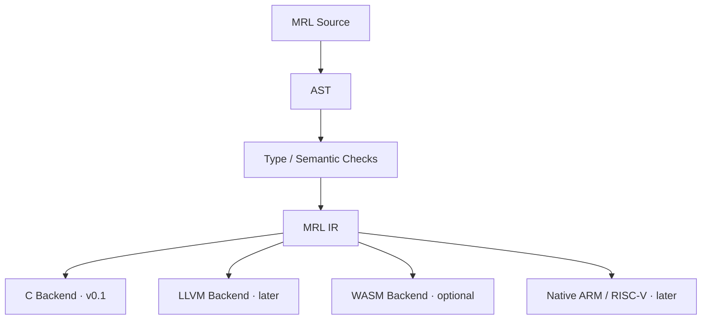

# MRL Branch Handoff Guide

> **Marco Runtime Language — 별도 브랜치 인수인계 및 작업 경계 문서**

---

> [!NOTE]
> **문서 상태** · Handoff / Design Boundary v0.1  
> **기준 저장소** · `DoTaeIn/Marco`  
> **기준일** · 2026-09-27  
> **언어명** · Marco Runtime Language (**MRL**)  
> **소스 확장자** · `.mrl`

> [!IMPORTANT]
> ## 목적
> Marco 본체 개발과 MRL 언어 개발을 **분리**한다.  
> Marco 담당자는 기존 프로젝트를 계속 발전시키고, MRL 담당자는 **별도 브랜치**에서 언어·컴파일러·런타임을 개발한다.  
> 두 작업은 **호환 계약 + Golden Test**로만 연결한다.

---

## 핵심 원칙

- **MRL은 “새 범용 언어”가 아니다.**  
  Marco의 기존 의미·그래프·근거 모델을 더 직접적으로 표현하기 위한 **최소 시스템 언어**다.
- v0.1의 성공은 기능 수가 아니라, 현재 Python 구현의 작은 **vertical slice**를 동일하게 재현하고 **최소 한 가지 측정 가능한 이점**을 증명하는 것이다.
- MRL 담당자는 Marco 본체의 의미 규칙을 임의로 재설계하지 않는다. 의미 변경이 필요하면 **별도 interface / semantic proposal**로 분리한다.
- **C는 첫 backend일 뿐**이며 MRL semantics를 정의하지 않는다.
- MRL의 존재 이유는 “문법이 예뻐서”가 아니라, Marco에서 반복되는 **Graph / Relation / Evidence / Proof / Epistemic State / Bounded Search**를 언어 계약으로 끌어올리는 데 있다.

---

# 1. 역할 분리와 브랜치 소유권

> [!CAUTION]
> ## 브랜치 분리 원칙
> Marco 기능 개발과 MRL 언어 개발은 서로의 작업 속도를 막지 않는다.  
> **MRL 브랜치는 실험 브랜치**이며, `main`의 런타임 동작을 직접 바꾸지 않는다.

권장 브랜치:

```text
feature/mrl-runtime-language
```

또는 별도 `git worktree`.

| 영역 | Marco 담당 | MRL 담당 |
|---|---:|---:|
| Marco 기능 / 정확도 | **소유** | 변경 금지 |
| Python 기준 구현 | **소유** | Golden oracle로 사용 |
| MRL 문법 / 타입 / 컴파일러 | 검토 | **소유** |
| MRL IR / C backend | 검토 | **소유** |
| Graph-native runtime | 호환 검증 | **소유** |
| 공용 인터페이스 변경 | 합의 필요 | 합의 필요 |
| `main` merge | **최종 승인** | PR 제출 |

### 반드시 지킬 경계

- MRL 브랜치에서 `engine.py`, `graph_inference.py`, `semantic_parser.py`의 **의미를 바꾸지 않는다**.
- 필요한 기준 데이터는 **복사본 / fixture**로 가져온다.
- `main` 코드를 MRL 구현 편의를 위해 변형하지 않는다.
- Marco 쪽 새 기능이 MRL에 필요하면 **“언어 기능 요구사항”**으로 기록한다.
- 요구사항이 생겼다고 자동으로 MRL scope에 넣지 않는다.

---

# 2. 현재 Marco에서 MRL이 보존해야 할 기준선

MRL은 추상적인 언어 실험이 아니다.  
현재 저장소가 이미 수행하는 행동을 **보존하는 것**이 출발점이다.

### Compatibility baseline

- `engine.py`  
  도메인 지식을 파일에 두고, 관계 역할과 BFS / 경로 탐색으로 판단하는 엔진 경계.
- `graph_inference.py`  
  bounded Horn closure, deterministic proof selection, provenance bundle, graph / join limit.
- `semantic_parser.py`  
  후보 의미를 바로 신뢰하지 않고 **evidence span / type / relation / query**를 검증한 후 `accepted`로 올리는 trust boundary.
- `relational_semantics.py`  
  언어팩 선언을 읽어 관계 / 역할 / 수량 / 생략 / 수선 등을 구성하는 의미 해석층.
- `state_engine.py`  
  검증되지 않은 상태에서는 `unknown`을 유지하고, 선언된 연산만 수행하는 상태 전이층.
- `encoder.py` / `kgbin.py`  
  numeric arrays, compact integer types, quantization, contiguous storage, mmap 등 작은 기기를 위한 실제 최적화.

> [!IMPORTANT]
> MRL의 존재 이유는 Python 문법을 바꾸는 것이 아니다.  
> 위 파일들에서 반복되는 **“그래프·관계·근거·상태·한계”**를 언어 / 런타임 계약으로 올리는 것이다.

---

# 3. MRL v0.1의 성공 기준과 중단 기준

MRL은 “완성된 언어”를 목표로 하지 않는다.  
**검증 가능한 실험**이어야 한다.

### 성공 기준

- 동일 입력에 대해 Python 기준 구현과 **의미 결과가 일치**한다.
- 그래프 탐색과 proof 선택이 **결정론적**이다.
- 명시적 budget을 초과하지 않는다.
- 최소 하나 이상의 측정 가능한 장점을 보여야 한다.
  - source LOC 감소
  - RAM 감소
  - 파일 / binary 크기 감소
  - startup 감소
  - 타입 / 근거 오류 compile-time 검출
  - proof trace 명시성 향상
- C backend를 사용하더라도 MRL semantics는 C가 아니라 **MRL spec**이 정의한다.

### 중단 기준

> [!WARNING]
> 기준 vertical slice에서 **측정 가능한 이득이 없다면 언어 범위를 키우지 않는다.**  
> 먼저 stop / review 한다.

### 첫 번째 권장 vertical slice

```text
facts + rules
    ↓
bounded closure / traversal
    ↓
proof / provenance
    ↓
known / no-path / incomplete result

Python baseline
      ↕ golden compare
MRL implementation
```

---

# 4. 반드시 구현해야 하는 MRL Kernel

| 영역 | v0.1 필수 요건 |
|---|---|
| **Systems foundation** | 정적 타입, 고정 크기 숫자, `struct` / `enum`, `arr/list/map`, `Result`, 자동 메모리, `unsafe + ptr`, C ABI |
| **Graph-native** | `graph`, compact node/edge handle, `relation`, `Path`, `find/find_all`, directed / undirected |
| **Search** | BFS, DFS, Dijkstra, A*, deterministic tie-break, depth/path/expansion budget |
| **Marco-native** | Evidence, Path≠Proof, epistemic state, Candidate+Constraint, provenance/trace, correction/supersession, reasoning budget |
| **Numeric** | contiguous numeric arrays, vector similarity/ranking/distance/normalize, quantization-friendly fixed-width types |
| **Toolchain** | backend-neutral MRL IR, C backend first, tests + Golden comparison against Python |

---

# 5. 절대 범위를 넓히지 말 것

> [!WARNING]
> ## Scope Guard
> 아래 기능을 이유로 “언어는 너무 크다”고 판단하지 않는다.  
> **이 기능들은 v0.1에 만들지 않는다.**

- class / inheritance
- async / await / coroutine
- macro system
- package manager
- JIT
- reflection
- GUI / web framework
- 고급 user-defined generics
- 새 debugger / IDE 자체 구현
- 범용 stdlib 전체
- 새 VM을 먼저 만드는 작업

---

# 6. 확정된 문법·타입 계약

## Primitive

```text
si = si32
ui = ui32
f  = f32

si8 / si16 / si32 / si64
ui8 / ui16 / ui32 / ui64
f16 / f32 / f64

ch = Unicode scalar value
s  = immutable UTF-8 string
b  = boolean
```

## 변수 / 상수

```text
x = 10          # declaration #
x := 20         # reassignment #

dec MAX = 100   # constant #
```

## Optional

```text
T?
none
```

원칙:

```text
none != unknown
```

## Collections

```text
arr<T, N>    # fixed length, value type #
list<T>      # dynamic, reference type #
map<K, V>    # dynamic, reference type #
```

### 길이

```text
arr.len
list.len
map.len
path.len
s.len
```

`.len()` 또는 `.length`로 바꾸지 않는다.

## 함수

```text
fn add(a: si, b: si) -> si {
    return a + b
}
```

반환값이 없으면 `void`를 쓰지 않는다.

```text
fn log(msg: s) {
    print(msg)
}
```

## 제어문

```text
if (x > 10) {
}

for (i in 0..10) {
}

while (running) {
}
```

조건 괄호는 유지한다.

## 오류 처리

예상 가능한 실패:

```text
Result<T, E>
Ok(value)
Err(error)
```

비정상 런타임 실패:

```text
try
catch
finally
throw
```

---

# 7. Graph / Relation 계약

```text
relation Logic {
    Supports {
        polarity: positive
        evidence: optional
        traverse: forward
    }

    Proves {
        polarity: positive
        evidence: required
        traverse: forward
    }

    Contradicts {
        polarity: negative
        evidence: required
        traverse: block
    }
}

graph knowledge {
    node: Concept
    relation: Logic
}
```

### Relation metadata

```text
polarity:
    positive
    negative
    neutral

evidence:
    none
    optional
    required

traverse:
    forward
    reverse
    both
    block
```

### 반드시 지킬 규칙

- `relation`은 일반 `enum`으로 낮추지 않는다.
- relation metadata를 compiler / runtime가 이해해야 한다.
- graph 기본은 **directed**.
- **undirected**도 지원한다.
- edge 기본 `weight`는 없다.
- 비용이 필요하면 edge payload에 둔다.
- static/base graph는 **CSR 계열**을 우선한다.
- dynamic overlay는 **pooled adjacency / forward-star 계열**을 우선한다.
- node handle은 작은 integer + **generation counter**로 stale handle을 검출한다.

---

# 8. Search 계약

```text
result = knowledge.find(a, b) {
    relation in [Logic.Supports, Logic.Proves]
    depth <= 8
    method: bfs
}

paths = knowledge.find_all(a, b) {
    max_paths: 256
}
```

### API

- `find()` → 첫 유효 경로 하나
- `find_all()` → 여러 경로

### 지원 method

```text
auto
bfs
dfs
dijkstra
astar
```

Dijkstra / A* 비용은 edge payload 표현으로 명시한다.

```text
result = roads.find(start, goal) {
    method: dijkstra
    cost: edge.distance
}
```

```text
result = roads.find(start, goal) {
    method: astar
    cost: edge.distance
    heuristic: estimate(node, goal)
}
```

### Deterministic tie-break

```text
1. 총 비용 / 깊이
2. relation ID
3. node ID
4. edge insertion order
```

### 기본 `find_all` budget

```text
max_paths:      256
max_depth:       64
max_expansions: 100000
```

### Search failure

```text
NoPath
DepthLimit
BudgetExceeded
InvalidNode
```

이들은 **Result failure**이며 exception이 아니다.

---

# 9. Marco-native 기능 — 반드시 들어가야 하는 이유

## Evidence

현재 `semantic_parser.py`에서 evidence는 단순 metadata가 아니다.

```text
start
end
text
```

가 실제 원문 span과 일치하는지 검증하는 **trust boundary**다.

MRL에서는 evidence를 단순 `dict` convention으로 끝내지 않는다.

---

## Path ≠ Proof

```text
Path
```

은 연결된 길.

```text
Proof
```

는 다음을 만족한 정당화된 길:

- relation 조건
- evidence 조건
- contradiction 조건
- rule 조건

현재 `graph_inference.py`의 `closure / proof / closure_with_provenance` 분리를 언어 차원에서도 보존한다.

---

## Epistemic State

최소 다음 상태를 표현할 수 있어야 한다.

```text
known
unknown
ambiguous
contradicted
withdrawn
```

특히:

```text
none != unknown
```

을 유지한다.

---

## Candidate + Constraint

G5의 핵심 구조:

```text
Candidate Meaning Graphs
        ↓
constraints
state consistency
reasoning consistency
        ↓
Interpretation
```

이를 매번 `list/dict/flag`로 재구현하지 않는다.

---

## Trace / Provenance

최소 다음을 보존할 수 있어야 한다.

- premise fact IDs
- rule version
- bindings
- alternate supports
- parent proof links

“왜?”는 별도 디버깅 기능이 아니라 **reasoning output의 일부**가 되어야 한다.

---

## Correction / Supersession

새 사실이 과거 사실을 무조건 덮는 구조만 지원하면 안 된다.

필요 개념:

```text
replace
withdraw
supersede
```

---

## Reasoning Budget

Graph budget과 별도로 다음을 묶는 reasoning 계약이 필요하다.

```text
candidates
proofs
depth
expansions
```

---

# 10. 메모리·GC·임베디드 계약

- 기본 메모리 관리는 자동.
- 컴파일러가 증명 가능하면 `static / stack / arena`로 낮춘다.
- 동적 수명만 GC heap 사용.
- v0.1 reference GC는 **mark-and-sweep**.
- heap 75%에서 automatic trigger.
- 수동 호출:

```text
gc.collect()
```

- 언어 semantics는 특정 GC 알고리즘에 종속되지 않는다.
- embedded / realtime에서는 incremental 또는 bounded incremental로 교체 가능해야 한다.
- `s`는 immutable UTF-8 reference type.
- `arr`는 fixed-length value type.
- 일반 코드 out-of-bounds는 `IndexError`.
- raw pointer / bounds bypass는 `unsafe` 안에서만 허용.
- C backend에서도 object layout을 **C ABI 우연에 맡기지 않는다**.
- MRL layout 규칙을 문서화하고 backend가 구현한다.

---

# 11. Numeric Layer 계약

> [!TIP]
> **NumPy를 복제하지 않는다.**  
> Marco가 실제 사용하는 배열·벡터·랭킹·압축 연산만 작고 직접적인 numerical layer로 제공한다.

### 필수 후보

- contiguous numeric arrays
- `dot`
- `norm`
- `cosine`
- `distance`
- `similarity`
- `rank`
- `top-k`
- `normalize`
- matrix / vector multiply
- quantization-friendly `ui8/ui16/f16/f32`
- mmap / buffer-friendly raw layout

### Backend 예

```text
x86 / Desktop -> SIMD / BLAS
ARM64          -> NEON
MCU            -> scalar loop / CMSIS-DSP
```

---

# 12. 컴파일러 아키텍처 — C는 첫 backend일 뿐



### 반드시 지킬 원칙

- C AST로 바로 직행하지 않는다.
- **backend-neutral MRL IR**을 둔다.
- C backend는 portability / reference backend로 유지할 수 있다.
- 다음 semantics는 C가 아니라 MRL spec이 정의한다.
  - integer overflow
  - GC
  - string
  - graph handle
  - exception
  - relation semantics
- self-hosting compiler는 장기 목표이며 v0.1 scope가 아니다.

---

# 13. 언어팩 선언 DSL의 위치

작은 선언형 language-pack DSL은 **MRL 전체를 대체하지 않는다.**

MRL toolchain 안의 별도 선언층으로 둘 수 있다.

```text
form      : sentence -> meaning
rule      : meaning  -> meaning
say       : meaning  -> sentence
test      : declarative regression case
relation  : semantic relation metadata
```

### Build-time 검사 후보

- `say → form` semantic round-trip
- `evidence: required` 누락 검출
- unknown response coverage
- pack regression tests

초기에는:

```text
DSL → current JSON tables
```

나중에는:

```text
DSL → embedded C tables
```

로 확장 가능.

---

# 14. 개발 단계와 산출물

| 단계 | 완료 조건 |
|---|---|
| **M0 — Contract freeze** | 이 문서와 language spec을 기준으로 grammar / IR / runtime 범위를 동결. 기능 추가 금지 |
| **M1 — Frontend** | lexer / parser / AST + primitive, fn, struct, enum, collections, Result |
| **M2 — MRL IR + C backend** | backend-neutral IR 생성, C emission, native build smoke test |
| **M3 — Graph core** | relation / graph / handles / add / remove / CSR + overlay |
| **M4 — Search** | find / find_all + BFS / DFS / Dijkstra / A* + deterministic budget |
| **M5 — Marco vertical slice** | `graph_inference` bounded closure / proof slice를 MRL로 포팅하고 Golden compare |
| **M6 — Marco-native** | Evidence / Proof / Epistemic / Trace / ReasoningBudget |
| **M7 — Numeric subset** | Marco가 현재 실제 사용하는 vector / index 연산만 이식 |

---

# 15. 테스트와 Golden Contract

모든 MRL feature는 최소 다음 테스트를 가져야 한다.

- parser unit test
- typechecker unit test
- runtime unit test
- deterministic graph result test
- budget exhaustion test
- Python ↔ MRL semantic equivalence test

### 비교 원칙

Proof / provenance 비교는 출력 문자열이 아니라 구조를 비교한다.

```text
fact
rule
parents
bindings
evidence
```

Embedded target은 최소 다음을 기록한다.

```text
static memory report
binary size
startup
RAM peak
```

MRL이 기존 Marco의 **wrong=0 / hold 정책**을 깨는 방향으로 추측해서는 안 된다.

### Required benchmark report per milestone

```text
semantic equivalence: pass / fail
source LOC: Python vs MRL
generated C LOC: informational only
binary size
static / peak RAM
startup
latency
determinism
proof equivalence
compile-time invariant catches
```

---

# 16. `main`과의 통합 / 머지 규칙

- MRL 브랜치의 중간 구현을 `main`에 조기 merge하지 않는다.
- `main`에는 필요한 경우 문서 / fixture / interface shim만 작은 PR로 분리한다.
- MRL 변경이 Marco semantics 변경을 요구하면 먼저 **semantic change proposal** 문서를 작성한다.
- Marco 담당자가 승인하기 전 semantic change를 적용하지 않는다.
- 첫 실제 merge 후보는 Python 결과와 동등성이 증명된 **독립 library / tooling** 형태다.
- 기존 `.kg`와 language-pack assets를 강제로 새 포맷으로 migration하지 않는다.
- MRL 안정화 전까지 Python 구현을 삭제하지 않는다.
- Python은 **reference oracle**로 유지한다.

---

# 17. 금지 사항 — 반드시 지킬 것

> [!CAUTION]
> 아래 항목은 구현 편의를 이유로 임의 변경하면 안 된다.

- “더 예쁘다”는 이유로 확정 문법을 변경하지 않는다.
- `=` 선언 / `:=` 재대입 / `dec` 상수 / `.len` property / `.mrl` 확장자를 바꾸지 않는다.
- `relation`을 enum으로 합치지 않는다.
- edge에 기본 `weight`를 추가하지 않는다.
- `NoPath`를 exception으로 바꾸지 않는다.
- graph를 단순 `Graph<T>` library class 하나로 축소하지 않는다.
- evidence / proof / unknown을 string flag / dict convention으로만 구현하지 않는다.
- C backend 편의를 위해 MRL semantics를 C semantics에 맞추지 않는다.
- Marco `main` 코드를 언어 구현 편의를 위해 대규모 refactor하지 않는다.
- 성능을 증명하기 전 native backend / JIT / 새 VM 개발로 확장하지 않는다.

---

# 18. 인수인계 체크리스트

- [ ] 이 문서를 읽고 MRL의 목표가 “범용 새 언어”가 아님을 이해했다.
- [ ] 작업 브랜치 / worktree가 `main`과 분리돼 있다.
- [ ] Python Marco 구현을 reference oracle로 유지한다.
- [ ] MRL IR을 backend-neutral하게 설계한다.
- [ ] C backend는 첫 backend일 뿐이며 semantics를 정의하지 않는다.
- [ ] Graph / Relation / Search가 compiler/runtime에서 first-class임을 유지한다.
- [ ] Evidence / Proof / Epistemic / Trace는 Marco-native 필수 요건으로 남긴다.
- [ ] 첫 vertical slice와 Golden fixtures를 구현 전에 고정한다.
- [ ] 각 milestone마다 측정 보고서를 남긴다.
- [ ] 이득이 없으면 scope를 늘리지 않고 stop / review 한다.

---

# 19. 새 담당자가 첫날 해야 할 일

1. MRL 브랜치 / worktree 생성 후 `main` 기준 commit SHA를 기록한다.
2. `graph_inference.py`의 closure / proof / provenance 동작을 Golden fixture 5~10개로 고정한다.
3. 최소 grammar + AST + MRL IR skeleton을 만든다.
4. C backend는 graph 없이도 primitive smoke test부터 통과시킨다.
5. 언어 기능을 추가할 때마다 PR 설명에 아래 질문의 답을 적는다.

> **“이 기능이 Marco의 어느 현재 코드 / 불변조건을 대체하는가?”**

6. M5 vertical slice 전에는 Marco 본체를 포팅하려 하지 않는다.

---

# 부록 A. 현재 확정 문법 요약

```text
# comment #

x = 10              # declare #
x := 20             # reassign #
dec MAX = 100       # constant #

fn add(a: si, b: si) -> si {
    return a + b
}

if (x > 0) {
}

for (i in 0..10) {
}

while (running) {
}

struct Point {
    x: f32
    y: f32
}

enum State {
    Known
    Unknown
}

match (state) {
    State.Known {
    }

    _ {
    }
}

items: list<si> = [1, 2, 3]
items.add(4)

users: map<ui32, User>
user = users.get(id)

unsafe {
    p: ptr<ui32> = address(0x40000000)
    p.write(123)
}
```

---

# 부록 B. 첫 Graph Smoke Test

```text
struct Concept {
    name: s
}

relation Logic {
    Supports {
        polarity: positive
        evidence: optional
        traverse: forward
    }
}

graph knowledge {
    node: Concept
    relation: Logic
}

fn main() {
    apple = knowledge.add(
        Concept(name = "apple")
    )

    fruit = knowledge.add(
        Concept(name = "fruit")
    )

    knowledge.add(
        apple,
        fruit,
        Logic.Supports
    )

    result = knowledge.find(apple, fruit) {
        relation in [Logic.Supports]
        depth <= 8
        method: bfs
    }

    match (result) {
        Ok(path) {
            print(path.len)
        }

        Err(error) {
            print(error)
        }
    }
}
```

---

## 최종 한 줄

> **MRL은 Python을 다시 만드는 프로젝트가 아니다.**  
> Marco가 이미 수동으로 구현하고 있는 Graph / Relation / Evidence / Proof / Epistemic / Bounded Search를 **더 작고 명시적이며 검증 가능한 실행 계약**으로 옮기는 프로젝트다.
