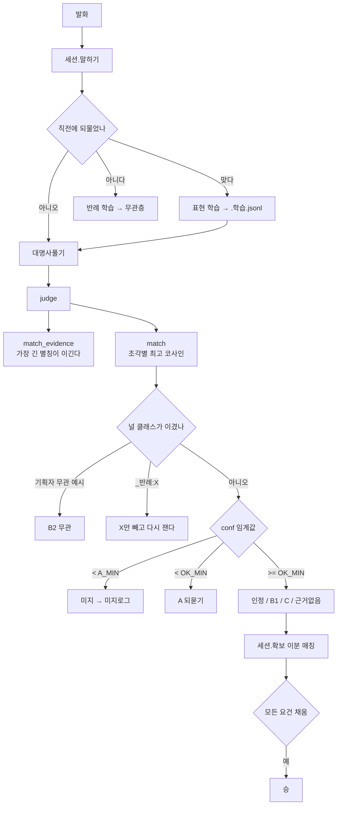

# 개발자 문서

코드를 고치려는 사람을 위한 문서입니다.
그래프만 만들 거라면 [그래프_README.md](그래프_README.md)를,
왜 이렇게 설계했는지는 [설계.md](설계.md)를 보세요.

---

## 0. 식별자가 한국어입니다

이 저장소는 함수·변수·딕셔너리 키가 전부 한국어입니다. 도메인이 한국법이고
그래프 파일도 한국어라, 코드와 데이터의 어휘를 하나로 맞춘 결과입니다.
읽기 전에 이 표만 알면 됩니다.

| 코드 | 뜻 | 영어로 치면 |
|---|---|---|
| `공통층` | 여러 사건이 공유하는 법리·개념 | shared concept layer |
| `사례층` | 이 사건만의 증거와 사실 | episode layer |
| `무관층` | "이 재판 얘기가 아니다" 판별용 예시 | null class |
| `증거` | 사례층 중 `증명` 엣지를 내보내는 노드 | evidence |
| `요건` | 목표로 `충족` 엣지를 직접 가진 노드 | requirement |
| `목표` | 도달하려는 결론 하나 | goal |
| `판정` | 발화 하나에 대한 엔진의 분류 | verdict band |
| `말하기` / `대답` | 세션에 발화를 넣고 응답을 받는다 | turn |
| `자책` | 자기 논증으로 자기 요건을 무너뜨림 | self-defeat |

관계는 셋뿐입니다. `증명`(증거→사실), `충족`(사실/개념→상위 요건), `부정`(무너뜨림).
전진 관계는 `POS = ("증명", "충족")`, 역방향은 `NEG = ("부정",)`입니다.

---

## 1. 파일 지도

```text
인코더.py    문장 → 정규화 벡터. 신경망은 여기 한 곳뿐이다 (함수 5개)
engine.py    논증·판정·학습·진단·회귀. 도메인 지식 0줄 (함수 60 + 세션 클래스)
설명.py      판정하지 않고 발췌를 조립하는 설명 엔진 (함수 20)
짓기.py      문서 폴더 → 설명그래프 JSON (함수 17)
수집/        법제처 API 수집기 (법령·판례)
보기/        웹 UI와 지식 그래프 시각화
```

의존 방향은 한 방향입니다. `인코더.py`는 아무것도 import 하지 않고,
나머지 셋이 `인코더`를 import 합니다. `engine.py`는 `설명/짓기`를 모릅니다.

무거운 import(`sentence_transformers`)는 `인코더._model()` 안에서 처음 쓸 때만
일어납니다. 그래서 `import engine` 자체는 가볍고, 벡터가 필요 없는 도구
(시각화 등)는 모델을 올리지 않고 돌 수 있습니다.

---

## 2. 그래프 하나의 모양

`load()`가 돌려주는 딕셔너리가 이 프로젝트의 유일한 핵심 자료구조입니다.

```python
{
  "역할": "검사",                    # 상대역 이름. 대사 출력에 쓰인다
  "목표": "정당방위",                 # 도달하려는 결론 노드 하나
  "공통층": {"상당성": ["상당한 이유가 있습니다", ...]},   # 노드 → 말 예시
  "사례층": {"CCTV": ["시시티비", ...], "흉기소지": [...]},
  "무관층": {"_타죄명:절도": [...], "_반례:적법행위": [...]},
  "엣지":  [["CCTV", "증명", "흉기소지"], ...],
  "adj":   {"CCTV": [("증명", "흉기소지")], ...},          # 엣지의 인접 리스트
  "증거":  ["CCTV", ...],            # 사례층 중 증명 엣지를 내보내는 노드
  "vec":   {"상당성": ndarray(n, 768)},                    # 노드별 예시 벡터 행렬
  "임계값": {"A_MIN": 0.50, "OK_MIN": 0.60},
  "대사":  {"B2": "...", "인정": "...", ...},
  "수치조건": {"혈중알코올농도": {"단위": "%", "최소": 0.03}},
  "개념엣지": [["과도", "상위", "흉기"]],                    # 어휘 확장 전용
  "_미지로그": "그래프/graph.미지.log",
  "_학습로그": "그래프/graph.학습.jsonl",
}
```

**`load()`가 `kg읽기()`와 다른 점**을 꼭 알아야 합니다. 도구를 만들 때 여기서
가장 많이 틀립니다.

| | `kg읽기` | `load` |
|---|---|---|
| `포함:` 해석 | 안 함 | 함 |
| 관련 없는 개념 거르기 | 안 함 | 함 (`_관련개념`) |
| 학습 파일 덧칠 | 안 함 | 함 |
| `adj` / `증거` / `vec` | 없음 | 있음 |

사건 `.kg`는 `포함:`으로 법리를 빌려오므로, `kg읽기`만 쓰면 **공통층이 0개**로
보입니다. 벡터 없이 `load`와 같은 모양이 필요하면
`보기/지식그래프_시각화.py`의 `실린그래프()`를 참고하세요.

---

## 3. 발화 하나가 흐르는 길



핵심 함수는 넷입니다.

- **`match(text, candidates, graph)`** — 발화를 조각내어 각 후보 노드의 예시
  벡터와 최대 코사인을 잽니다. 반환 `(노드, 점수)`.
- **`judge(graph, text, 연속A=0)`** — 판정 밴드를 정합니다. 세션 상태를 안 봅니다.
- **`세션.말하기(text)`** — 학습·대명사·판정·요건 배정을 묶은 한 턴.
- **`세션.확보()`** — 증거를 요건에 최대 이분 매칭으로 배정합니다.
  **증거 하나는 요건 하나만 채웁니다.** 이걸 모르면 "닿는데 왜 안 채워지지"에 빠집니다.

### 판정 밴드

| 판정 | 뜻 |
|---|---|
| `인정` | 증거가 있고 그 증거가 그 주장을 증명한다 |
| `근거없음` | 주장은 알아들었으나 증거를 대지 않았다 |
| `C` | 증거를 댔으나 그 증거가 그 주장을 증명하지 않는다 |
| `B1` | 쟁점은 그래프에 있으나 증거가 닿을 수 없다 |
| `B2` | 이 재판과 무관하다는 **적극적 증거**가 있다 |
| `미지` | 아무것도 충분히 안 걸렸다. "모른다"이지 "무관하다"가 아니다 |
| `A` | 애매하다. 되묻는다 |
| `목표주장` | 결론을 그냥 주장했다 |

`B2`와 `미지`를 뭉개지 마세요. 이 구분이 무환각의 정직한 형태입니다.
그래프에 없는 유효한 논증에 "관련 없습니다"라고 단언하면 그게 거짓말입니다.

---

## 4. 고치기 전에 알아야 할 불변식

`python engine.py --check`가 지키는 것들입니다. 깨면 자체 검사가 잡습니다.

1. **엔진에 도메인 지식이 없다.** `engine.py`에 법률 용어를 하드코딩하지 마세요.
   역할·목표·대사는 전부 `.kg`에서 옵니다.
2. **원본 `.kg`는 런타임에 수정되지 않는다.** 학습은 전부 옆 파일
   (`.학습.jsonl` / `.엣지.jsonl` / `.미지.log`)에 쌓이고, 지우면 원상복구됩니다.
3. **새 노드·엣지를 자동으로 만들지 않는다.** 되묻기 학습은 노드의 *부르는 법*만
   늘립니다. 뜻은 안 변합니다.
4. **제안은 원문에 근거가 있을 때만 낸다.** 근거가 없으면 후보를 내지 않고
   "자료에 근거가 없다"고 말합니다.
5. **방향(`증명`/`충족`/`부정`)은 기계가 정하지 않는다.** 후보만 냅니다.
6. **전진 경로는 `POS`만 탄다.** `부정`을 타고 목표에 닿는 것은 근거가 아니라
   반론입니다. `reachable()`의 기본값이 `POS`인 이유입니다.

---

## 5. 자주 건드리는 확장 지점

| 하고 싶은 일 | 볼 곳 |
|---|---|
| 새 CLI 명령 | `engine.py` 맨 아래 `if __name__ == "__main__"` 의 `elif` 사슬 |
| 판정 밴드 추가·변경 | `judge()` — 밴드마다 `대사` 키가 하나씩 필요 |
| 매칭 방식 변경 | `match()` (개념·사실) / `match_evidence()` (증거, 문자열 포함) |
| 인코더 교체 | `인코더.py`의 `MODEL`. 바꾸면 `.vec_*.npz` 캐시가 자동 무효화됨 |
| 신경망 빼기 | `KG_ENCODER=문자` — 문자 n-gram. 모델도 토큰도 없음. **임계값을 `--tune`으로 다시 재야 합니다** |
| 그래프 문법 추가 | `kg읽기()`의 구역 분기. 머리말 키는 화이트리스트다 |
| 사건 md 문법 | `사건읽기()` → `사건컴파일()` |
| 새 성장 도구 | `제안` / `엣지제안` / `의미관계제안` / `조문제안` 을 본떠 만드세요 |
| 새 도메인의 관계 표지 | `_의미표지` 표에 정규식 한 줄. 아래 참고 |
| 시각화 | `보기/지식그래프_시각화.py` — 파이썬이 HTML 한 장을 뱉습니다 |
| 대화 맥락 | `설명.py` 의 `대화기억` — 창이 아니라 감쇠. 파일로 저장됩니다 |
| 절차 답변 | `절차읽기` / `절차찾기` / `절차답` — 문서의 순서를 그대로 들고 옵니다 |
| 오타 처리 | `_자모거리` / `오타고침` — 자모 하나 차이면 되묻습니다 |
| 잡담 거절 | `_모르는말` — 걸린 노드를 빼고 원문에 없는 말이 남으면 딴 얘기 |
| 여러 그래프 | `그래프색인` / `그래프고르기` / `그래프불러오기` (최근 2개만 유지) |
| 새 언어 | `말투/<이름>.json` 하나. `KG_LANG` 으로 고릅니다 |

### 관계 표지를 늘릴 때

`_의미표지` 는 (관계이름, 정규식) 목록입니다. 정규식이 두 조각을 잡으면
각각 가장 가까운 노드에 붙고, 그 관계의 후보가 됩니다.

**표지는 도메인마다 다릅니다.** 서술형 문서와 법령이 전혀 다른 문법을 씁니다.

| | 형법 380개 조문에서 |
|---|---|
| `넣고` (요리) | 1% |
| `~해야` (요리) | 3% |
| `~에 처한다` (법령) | **60%** |
| `전항/제N항` (법령) | **32%** |
| `할 수 있다` (법령) | 13% |

한 도메인당 대여섯 줄이면 되고, 관계 이름이 서로 달라 한 표에 섞어도 됩니다.

**표지를 늘리기 전에 노드부터 보세요.** 표지가 60% 걸려도 관계의 *끝점*이
그래프 노드로 없으면 후보가 안 나옵니다. 실제로 `graph.kg`(정당방위 법리)에
형법 원문을 물리면 6건뿐인데, 죄명·형벌을 노드로 둔 그래프에 물리면
`상해 -죄형-> 징역` 이 바로 걸립니다. 이 프로젝트에서 관계 추출이 막힌
경우는 세 번 다 표지가 아니라 **노드 어휘가 원문을 안 덮어서**였습니다.

### 새 도메인을 추가할 때

코드는 건드리지 않습니다. `그래프/graph_템플릿.kg`를 복사해 채우고
`python engine.py --diagnose 내것.kg`가 "문제 없음"을 낼 때까지 고칩니다.
자세한 절차는 [그래프_README.md](그래프_README.md)에 있습니다.

---

## 6. 개발 흐름

```bash
python engine.py --check      # 엔진 자체 검사 (판례 회귀 6건 포함)
python 짓기.py   --check
python 설명.py   --check
python engine.py --regress    # 판례 회귀만 따로
```

**PR 전에 위 넷이 전부 통과해야 합니다.** `--check`는 회귀 세트를 포함하므로
그래프를 고쳤다면 승패가 안 바뀌었는지 자동으로 확인됩니다.

엣지를 하나 제안하고 싶다면, 원본에 쓰기 전에 회귀로 채점하세요.

```bash
python engine.py --regress 사건_회귀.json 상호투쟁 충족 방위의사
```

원본 `.kg`를 수정하지 않고 임시로 얹어 6건의 승패를 비교합니다.
기대와 어긋나면 종료코드 `1`입니다.

### 검사에 무엇을 추가할까

새 로직에는 **깨지면 실패하는 가장 작은 것 하나**를 남기세요. 프레임워크 없이
`_selfcheck()`에 `assert` 한 줄이면 충분합니다. 이 저장소의 검사들은 대부분
실제로 겪은 버그에서 나왔고, 주석에 그 사연이 적혀 있습니다.

```python
# 가장 긴 증거 별칭이 이긴다. 짧은 이름이 긴 이름의 부분문자열일 때
# 먼저 걸리는 쪽을 쓰면 그 증거가 증명하지 않는 주장이 되어 C 로 떨어진다.
assert match_evidence("피해 근로자 진술을 보면", _사건)[0] == "피해근로자진술"
```

---

## 7. 데이터 파일 규약

| 파일 | 누가 쓰나 | 지우면 |
|---|---|---|
| `*.kg` | 사람 (또는 `--case` 컴파일) | 그래프가 사라짐 |
| `*.미지.log` | 엔진 (자동) | 노드 후보 이력이 사라짐 |
| `*.학습.jsonl` | 엔진 (되묻기 확인/부인) | 학습 전으로 돌아감 |
| `*.엣지.jsonl` | 사람 (`--label`) | 방향 라벨이 사라짐 |
| `.vec_*.npz` | 엔진 (벡터 캐시) | 다시 계산됨. 커밋하지 않음 |
| `대화.json` | 사람 (`--대화`) | 대화 맥락·오타 기록이 사라짐 |
| `자료/웹/*.txt` | `수집/위키.py` | 다시 받으면 됨 |
| `사건_회귀.json` | 사람 | 회귀 채점 기준이 사라짐 |

`*.kg`에서 **자동 생성된 것**(`--case` 결과)은 머리말에 그렇게 적혀 있습니다.
그건 고치지 말고 짝이 되는 `.md`를 고친 뒤 다시 컴파일하세요.

---

## 8. 기여하기 좋은 곳

어려운 순서가 아니라 **막힌 정도** 순서입니다.

1. **판례를 사건 md로 옮기기** — 지금 가장 값이 큽니다. 회귀 문항이 1개 늘고,
   그만큼 엣지 자동 검증이 세집니다. 법을 알면 코드를 몰라도 됩니다.
   [사건_템플릿.md](사건_템플릿.md)와 기존 사건 6건을 보세요.
2. **엣지 방향 라벨** — `--label`로 쌓습니다. 헷갈리는 것부터 물어서
   무작위보다 3배 적은 라벨로 같은 성능이 납니다. 500개(그래프 16개)가 목표선입니다.
   지금 6개입니다.
3. **노드 어휘를 원문에 맞추기** — 관계 추출이 막힌 경우는 전부 여기가
   원인이었습니다. `--suggest`/`--mine`이 후보를 내주니 확인만 하면 됩니다.
   이걸 먼저 해야 `--relations`와 `--edges`가 삽니다.
4. **새 도메인 그래프** — 코드 수정 없이 됩니다. 결론 노드가 있고 증거가
   고유명사이고 관계를 `증명/충족/부정`으로 쓸 수 있으면 맞는 문제입니다.
5. **회귀 채점을 예민하게** — 지금은 승패가 뒤집힐 때만 잡습니다.
   막힌 요건 수를 점수로 쓰면 부분적 악영향도 걸립니다.
6. **다른 언어 인코더** — `인코더.py`의 `MODEL` 한 줄이지만, 임계값
   (`A_MIN`/`OK_MIN`)을 다시 재야 합니다. `--tune`이 그 도구입니다.

---

## 9. 자주 겪는 함정

- **"요건에 닿는데 안 채워져요."** 증거 하나는 요건 하나만 채웁니다.
  `--diagnose`가 `[치명] 증거를 다 나눠줘도 요건 N칸이 빈다`로 알려줍니다.
- **"사건 그래프에 법리가 없어요."** `kg읽기` 말고 `load`를 쓰세요.
- **"짧은 증거명이 잘못 걸려요."** 가장 긴 별칭이 이깁니다. 그래도 헷갈리면
  별칭을 더 구체적으로 적으세요.
- **"임계값을 바꿨더니 다 깨져요."** `--tune`으로 먼저 재세요.
  발화 샘플 파일(`발화_샘플.json`)로 적중률과 누출을 같이 봅니다.
- **"벡터가 이상해요."** `.vec_*.npz`를 지우고 다시 돌리세요.
  캐시 키는 모델 이름 + 그래프 내용 해시입니다.
- **"`--relations`가 후보를 안 내요."** 표지보다 노드를 먼저 의심하세요.
  관계의 *끝점*이 그래프 노드로 없으면 표지가 걸려도 후보가 안 나옵니다.
- **Windows 콘솔에서 한글이 깨질 때** — `PYTHONIOENCODING=utf-8`을 주세요.
